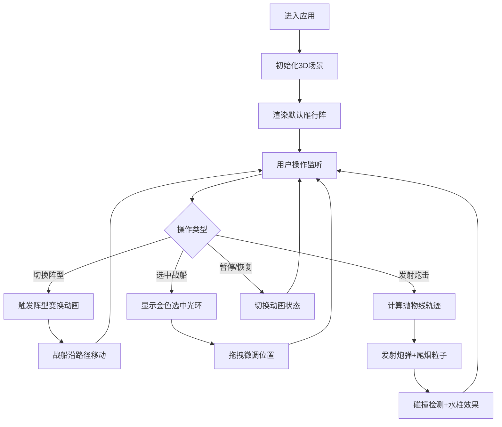

## 1. 产品概述
古代水师战船3D交互可视化应用，为水师将领提供直观的阵型模拟与炮击演练平台。
- 核心价值：解决水师将领难以直观模拟不同阵型优缺点和炮击覆盖范围的问题
- 目标用户：水师指挥官、军事爱好者、历史研究者

## 2. 核心功能

### 2.1 用户角色
| 角色 | 注册方式 | 核心权限 |
|------|----------|----------|
| 指挥者 | 无需注册 | 阵型切换、战船操控、炮击演练、暂停/恢复 |

### 2.2 功能模块
1. **3D海战场景**：海面动画、战船编队、风向显示、粒子效果
2. **阵型控制系统**：雁行阵、鱼鳞阵、偃月阵切换，平滑移动动画
3. **战船交互系统**：点击选中、拖拽微调、血量显示、选中光环
4. **炮击演练系统**：炮弹发射、抛物线轨迹、尾烟粒子、水柱效果
5. **信息面板**：阵型名称、总火力值、被击中概率预估
6. **控制系统**：暂停/恢复按钮、键盘快捷键

### 2.3 页面详情
| 页面名称 | 模块名称 | 功能描述 |
|---------|----------|----------|
| 主场景页 | 3D渲染区域 | 渲染海面、战船、炮弹、粒子特效，处理相机控制 |
| 主场景页 | 左侧阵型卡片 | 三种阵型切换按钮，毛玻璃效果，选中态金色边框 |
| 主场景页 | 右侧信息面板 | 显示当前阵型名称、总火力值、被击中概率百分比条 |
| 主场景页 | 右下角控制区 | 暂停/恢复按钮、风力指示器、发射按钮 |

## 3. 核心流程
用户进入应用后，默认展示雁行阵编队。可点击左侧卡片切换阵型，战船将沿虚线路径平滑移动到新位置。点击单艘战船可选中并拖拽微调位置。点击发射按钮触发炮击演练，所有战船朝随机目标发射炮弹，展示炮击覆盖范围。按空格键或点击按钮可暂停/恢复所有动画。

## 4. 用户界面设计

### 4.1 设计风格
- **主色调**：暗蓝色海战风格，背景渐变#1a2a3a到#3a5a7a，海面#0a2a4a
- **强调色**：金色#ffd700（选中状态、边框），船体棕色#8b5a2b
- **按钮风格**：毛玻璃半透明面板，模糊度10px，底色#ffffff30，圆角8px
- **字体**：使用Cinzel Display作为标题字体（古典战争风格），Noto Sans SC作为正文字体
- **布局风格**：三栏式布局，左侧25%阵型卡片，中间60%3D场景，右侧15%信息面板
- **动效风格**：平滑过渡0.3s，脉冲动画1.2s周期，阵型切换0.5s平滑移动

### 4.2 页面设计概述
| 页面名称 | 模块名称 | UI元素 |
|---------|----------|--------|
| 主场景页 | 3D场景 | 正弦波海面动画、战船编队、抛物线炮弹、尾烟/水柱粒子、风向罗盘 |
| 主场景页 | 左侧阵型栏 | 三张毛玻璃卡片，含阵型名称、示意图标，选中放大1.05倍+金色边框 |
| 主场景页 | 右侧信息栏 | 半透明面板，阵型名称标题，总火力值数字，被击中概率进度条 |
| 主场景页 | 控制区 | 发射按钮（红色渐变）、暂停按钮、风力等级显示（0-10级） |

### 4.3 响应性
- 桌面端优先设计，最小宽度1024px
- 三栏固定比例布局：左侧25%、中间60%、右侧15%
- 窗口缩放时保持比例，内容居中对齐
- 3D画布自适应容器大小

### 4.4 3D场景指导
- **环境**：暗蓝色渐变天空，雾效增强纵深感，海面带白色波浪反光线条
- **光照**：主光源平行光模拟日光，环境光补充暗部，点光源突出选中战船
- **相机**：透视相机，初始位置俯视角(0, 15, 20)，看向场景中心，支持轨道控制缩放
- **构图**：战船编队居中，海面占据下半部分，天空背景上半部分
- **交互**：鼠标悬停高亮战船，点击选中显示光环，拖拽移动位置，滚轮缩放场景
- **后处理**：Bloom泛光效果增强金色光环和炮口火焰，SSAO提升空间感
- **性能**：实例化渲染战船，对象池管理炮弹和粒子，目标帧率60FPS，最低30FPS
