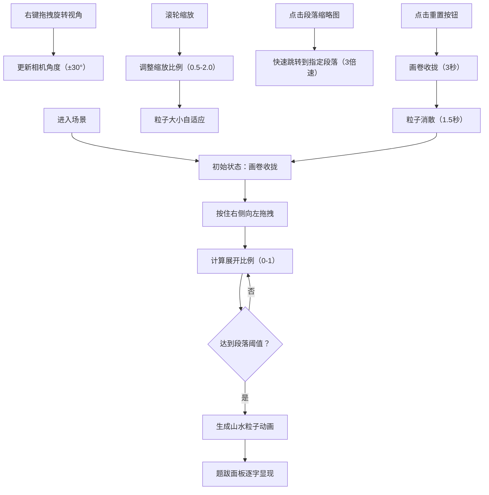

## 1. 产品概述
本应用构建一个基于浏览器的明代文华殿虚拟场景，让用户以典藏官身份沉浸式赏析《千里江山图》长卷，通过3D交互实现画卷逐段展开、山水粒子动画与题跋同步展示。
- 解决传统书画展示受物理空间限制的问题，提供沉浸式数字化赏析体验
- 目标用户为书画爱好者、文化研究者及教育工作者，弘扬中华传统书画艺术

## 2. 核心功能

### 2.2 功能模块
1. **画卷交互组件**：卷轴拖拽展开、收拢动画、段落跳转
2. **3D山水粒子系统**：逐段生成山水粒子动画、动态地貌变化、粒子物理运动
3. **题跋展示面板**：竖排文字逐字显现、墨迹晕开动画、段落状态区分
4. **场景视角控制**：鼠标右键旋转、滚轮缩放、粒子大小自适应
5. **辅助交互**：重置按钮、段落缩略图导航、烛光阴影氛围

### 2.3 页面详情
| 页面名称 | 模块名称 | 功能描述 |
|-----------|-------------|---------------------|
| 主场景页 | 展卷案场景 | 虚拟明代书房环境，深色木质纹理背景，3D展卷案承载画卷 |
| 主场景页 | 画卷交互 | 鼠标拖拽展开画卷，左右轴头联动，灵敏度0.5%/像素 |
| 主场景页 | 3D粒子山水 | 每10%展开段落生成对应地貌粒子（丘陵/山峰/江面），聚合动画2秒 |
| 主场景页 | 题跋面板 | 右侧280px固定宽度，楷体竖排文字，逐字墨迹动画0.8秒 |
| 主场景页 | 视角控制 | 右键旋转±30°，滚轮缩放0.5-2.0倍，粒子大小随缩放自适应 |
| 主场景页 | 导航控制 | 左下角铜质重置按钮，右侧10个段落缩略图跳转 |

## 3. 核心流程
用户进入应用后，首先看到展卷案上收拢的画卷。按住画卷右侧向左拖拽，画卷逐步展开，每展开10%段落，对应山水粒子从光点聚合为山峦或水波，同时右侧题跋面板逐字显现对应段落文字。用户可右键旋转视角、滚轮缩放观察细节，或点击段落缩略图快速跳转。点击重置按钮，画卷匀速收拢，粒子消散，题跋清空。

## 4. 界面设计

### 4.1 设计风格
- **主色调**：深木色背景#3a2a1a，铜色边框#b89a6a，墨色文字#2a1a0a
- **辅色调**：绢本底色#d9c9b9，轴头玉质#e0d4b8，粒子绿#4a7c59/蓝#3a6b8a/褐#8b6f47
- **按钮风格**：左下角圆形铜质按钮#c49a6c，点击内凹动画0.2秒
- **字体**：楷体（KaiTi, STKaiti），竖排文字从上至下，从右至左
- **布局风格**：对称式古代书房布局，中间60%宽度展卷案，右侧固定题跋面板
- **装饰元素**：铜色细线描边，烛光摇曳阴影动画，木质纹理质感

### 4.2 页面设计概览
| 页面名称 | 模块名称 | UI元素 |
|-----------|-------------|-------------|
| 主场景页 | 展卷案 | CSS 3D变换构建，桌面#7a5a3a，案腿#4a2e1b，高度30px |
| 主场景页 | 画卷 | 横向卷轴，绢本底色，玉质轴头，木质纹理径向渐变 |
| 主场景页 | 粒子系统 | Three.js InstancedMesh，绿蓝褐三色粒子，聚合/浮动/流动动画 |
| 主场景页 | 题跋面板 | 右侧固定280px，楷体竖排，墨迹晕开动画，淡墨区分已阅 |
| 主场景页 | 缩略图导航 | 10个圆形小图，直径20px，颜色从#4a7c59渐变到#3a6b8a |
| 主场景页 | 重置按钮 | 左下角圆形铜质，直径40px，点击内凹动画 |

### 4.3 响应式设计
- 桌面端优先设计，展卷案宽度占页面60%
- 支持窗口大小自适应，保持场景比例
- 鼠标拖拽交互针对桌面端优化

### 4.4 3D场景指导
- **环境氛围**：深色木质书房，右上角虚拟烛光光源，阴影左右摆动（幅度5px，周期3秒）
- **光照设置**：主光源模拟烛光（暖黄色，位置右上角），环境光补充场景亮度
- **相机设置**：初始仰角15°，围绕画卷中心旋转，角度限制±30°，缩放范围0.5-2.0倍
- **构图焦点**：画卷为视觉中心，粒子山水悬浮于画卷上方5单位高度
- **交互动画**：粒子聚合2秒，山峦浮动（幅度0.3，周期4秒），水波流动（速度0.2单位/秒）
- **后处理效果**：轻微泛光效果增强粒子质感，阴影柔和处理
- **性能优化**：使用InstancedMesh优化粒子渲染，保持45FPS以上
