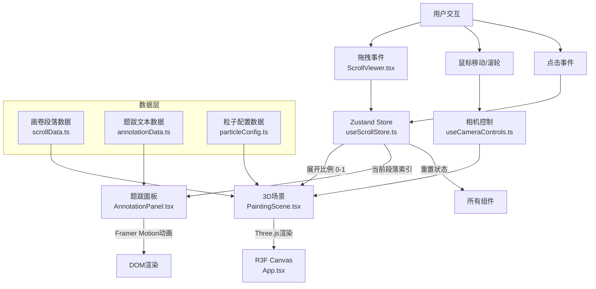

## 1. 架构设计



## 2. 技术描述

* **前端框架**：React 18 + TypeScript

* **构建工具**：Vite 5 + @vitejs/plugin-react

* **3D引擎**：Three.js + @react-three/fiber + @react-three/drei

* **动画库**：Framer Motion

* **状态管理**：Zustand

* **样式方案**：CSS Modules / 内联样式（Three.js部分）

* **性能优化**：Three.js InstancedMesh 粒子渲染

## 3. 文件结构与调用关系

```
src/
├── App.tsx                          # 主组件，R3F Canvas容器，状态机管理
│   ├── 调用 ScrollViewer.tsx
│   ├── 调用 PaintingScene.tsx
│   └── 调用 AnnotationPanel.tsx
│
├── components/
│   ├── ScrollViewer.tsx             # 画卷拖拽交互组件
│   │   ├── 使用 framer-motion useDrag
│   │   └── 更新 Zustand Store 展开比例
│   │
│   ├── PaintingScene.tsx            # Three.js 3D场景组件
│   │   ├── 从 Store 读取展开比例
│   │   ├── 渲染卷轴模型（CylinderGeometry + BoxGeometry）
│   │   └── 粒子山水动画（InstancedMesh）
│   │
│   ├── AnnotationPanel.tsx          # 题跋文字展示面板
│   │   ├── 从 Store 读取段落索引
│   │   └── 使用 framer-motion 逐字动画
│   │
│   ├── ScrollAxis.tsx               # 卷轴模型组件（被 PaintingScene 调用）
│   ├── ParticleSystem.tsx           # 粒子系统组件（被 PaintingScene 调用）
│   └── ParagraphThumbnails.tsx      # 段落缩略图导航组件
│
├── store/
│   └── useScrollStore.ts            # Zustand 状态管理
│       ├── 状态：scrollProgress, currentParagraph, isResetting
│       └── 操作：setProgress, reset, jumpToParagraph
│
├── data/
│   ├── scrollData.ts                # 画卷段落配置
│   ├── annotationData.ts            # 题跋文本数据（10段）
│   └── particleConfig.ts            # 粒子配置参数
│
├── hooks/
│   ├── useCameraControls.ts         # 相机视角控制Hook
│   └── useParticleAnimation.ts      # 粒子动画Hook
│
└── utils/
    └── threeHelpers.ts              # Three.js 辅助函数
```

**数据流向**：

1. 用户拖拽 → ScrollViewer.tsx → 计算展开比例 → Zustand Store
2. Store 更新 → PaintingScene.tsx → 驱动粒子生成/消散
3. Store 更新 → AnnotationPanel.tsx → 触发题跋逐字动画
4. 相机控制 → PaintingScene.tsx → 更新Three.js相机矩阵

## 4. 核心数据模型

### 4.1 画卷段落数据

```typescript
interface ScrollParagraph {
  id: number;
  startProgress: number;  // 0.0 - 1.0
  endProgress: number;
  terrainType: 'hills' | 'peaks' | 'river';
  particleCount: number;
  dominantColor: string;
}
```

### 4.2 题跋数据

```typescript
interface Annotation {
  id: number;
  paragraphId: number;
  text: string;  // 20-40字中文
  author: string;
  seal?: string;
}
```

### 4.3 粒子状态

```typescript
interface ParticleState {
  id: number;
  position: [number, number, number];
  targetPosition: [number, number, number];
  color: string;
  size: number;
  phase: 'scattered' | 'aggregating' | 'idle' | 'dissipating';
}
```

### 4.4 Store 状态

```typescript
interface ScrollState {
  scrollProgress: number;      // 0.0 - 1.0
  currentParagraph: number;    // 0 - 9
  isDragging: boolean;
  isResetting: boolean;
  isJumping: boolean;
  cameraZoom: number;          // 0.5 - 2.0
  cameraRotation: number;      // -30° - 30°
  
  setProgress: (progress: number) => void;
  reset: () => void;
  jumpToParagraph: (index: number) => void;
  setDragging: (dragging: boolean) => void;
  setCameraZoom: (zoom: number) => void;
  setCameraRotation: (rotation: number) => void;
}
```

## 5. 关键实现要点

### 5.1 性能优化

* **粒子渲染**：使用 `THREE.InstancedMesh` 替代单个 Mesh，单次 draw call 渲染所有粒子

* **动画帧率**：使用 `useFrame` 的 `delta` 参数进行帧率无关的动画计算

* **状态更新**：Zustand 选择性订阅，避免不必要的重渲染

* **粒子池化**：预分配粒子对象池，避免频繁 GC

### 5.2 动画实现

* **画卷展开**：Framer Motion `useDrag` + CSS transform 控制卷轴位置

* **粒子聚合**：使用线性插值（LERP）从散乱位置过渡到目标地形位置

* **墨迹晕开**：Framer Motion `animate` 控制 opacity 和 scale

* **烛光阴影**：CSS `@keyframes` 动画控制 `box-shadow` 位置

### 5.3 交互细节

* **拖拽灵敏度**：每像素移动对应 0.5% 展开比例（即 0.005 / pixel）

* **段落阈值**：每 10% 展开比例触发新段落（0.1, 0.2, ..., 1.0）

* **相机限制**：旋转角度 clamp 到 \[-30°, 30°]，仰角固定 15°

* **缩放联动**：粒子大小 = 基础大小 × 缩放比例 × 1.2

## 6. 依赖包版本

| 包名                   | 版本       | 用途               |
| -------------------- | -------- | ---------------- |
| react                | ^18.2.0  | UI框架             |
| react-dom            | ^18.2.0  | DOM渲染            |
| typescript           | ^5.4.0   | 类型系统             |
| vite                 | ^5.2.0   | 构建工具             |
| @vitejs/plugin-react | ^4.2.0   | React支持          |
| three                | ^0.162.0 | 3D引擎             |
| @react-three/fiber   | ^8.15.0  | React Three.js绑定 |
| @react-three/drei    | ^9.99.0  | R3F工具集           |
| framer-motion        | ^11.0.0  | 动画库              |
| zustand              | ^4.5.0   | 状态管理             |

