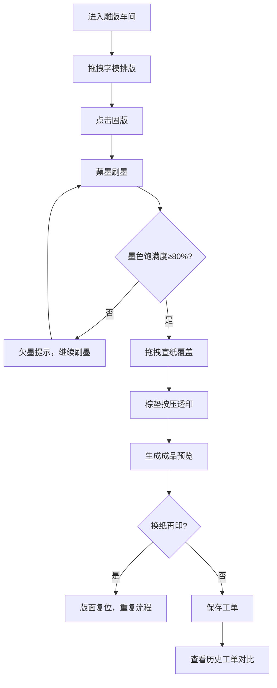

## 1. 产品概述

本应用是一个模拟明代杭州书坊雕版印刷工艺流程的全栈Web应用，让用户在虚拟环境中体验从活字排版、刷墨、覆纸到揭印成页的完整印刷过程。

- 主要目的：解决传统活字印刷流程中字模排版、墨色均匀度和纸张受墨渗透深度难以在印刷前直观预判和反复调整参数对比的问题
- 目标用户：传统文化爱好者、印刷史研究者、教育工作者及对古法技艺感兴趣的普通用户
- 产品价值：以数字化方式复刻传统技艺，提供沉浸式、可重复的印刷工艺学习与实验平台

## 2. 核心功能

### 2.1 用户角色

| 角色 | 注册方式 | 核心权限 |
|------|----------|----------|
| 普通用户 | 无需注册，匿名使用 | 完整印刷流程操作、保存/查看/删除历史工单、对比印刷成品 |

### 2.2 功能模块

1. **首页（雕版印刷车间）**：虚拟工坊场景、活字架、排版区、刷墨交互、覆纸按压、成品预览
2. **历史工单列表页**：工单列表展示、印刷参数对比、工单删除操作

### 2.3 页面详情

| 页面名称 | 模块名称 | 功能描述 |
|---------|---------|----------|
| 首页 | 虚拟工坊场景 | 明代杭州书坊风格3D场景，青砖地面、木质房梁、油灯、梨木案桌 |
| 首页 | 活字架 | 3层20格字模陈列，支持拖拽字模到排版区 |
| 首页 | 排版区 | 12x12方格面板，字模自动吸附对齐，固版后变色及纹理动画 |
| 首页 | 刷墨交互 | 蘸墨、拖拽刷墨、墨色均匀度进度条、欠墨提示 |
| 首页 | 覆纸按压 | 宣纸拖拽覆盖、定位夹紧、棕垫按压、透印效果 |
| 首页 | 成品预览 | 竖排诗句展示、仿古裂纹、缩略图陈列、参数评分 |
| 历史工单页 | 工单列表 | 展示历史排版方案及印刷参数，支持删除操作 |

## 3. 核心流程

用户进入虚拟雕版车间 → 从活字架拖拽字模到12x12排版区 → 点击固版按钮 → 从墨缸蘸墨刷墨 → 拖拽宣纸覆盖 → 用棕垫按压透印 → 揭印生成成品预览 → 可换纸再印或保存工单 → 查看历史工单对比

## 4. 用户界面设计

### 4.1 设计风格

- 主色调：深褐色#5d3a1a、梨木色#a67c52、米黄色#f5e6d3、深棕色#4a2e1b、铜金色#c49a6c
- 按钮风格：木质纹理，圆角8px，悬停时轻微上浮（0.3s ease-out）
- 字体：全局使用楷体（KaiTi, STKaiti, serif），大标题加粗
- 布局风格：仿明代书坊场景，中央排版区为焦点，左侧活字架、右侧墨缸与预览区、上方卷纸架
- 动效风格：平滑过渡、微交互反馈，如字模入槽咔嗒、纸张飘动、按压渐变

### 4.2 页面设计概述

| 页面名称 | 模块名称 | UI元素 |
|---------|---------|--------|
| 首页 | 工坊场景 | 青砖地面#8b9a8b、木质房梁#5d3a1a、油灯灯光效果、梨木案桌#a67c52 |
| 首页 | 活字架 | 3层20格网格，铜金色字模#c49a6c，反刻阳文楷书，拖拽缩放+0.3s ease-out |
| 首页 | 排版区 | 12x12方格#f5e6d3背景，深色凹槽#6b4e3a，固版后字模变深褐#4a2e1b，0.5s木板纹理动画 |
| 首页 | 刷墨区 | 黑色半透明渐变墨缸，圆柱形棕毛刷#8b4513，墨色进度条，欠墨时暗红#8b0000，满墨时墨绿#2d5a27 |
| 首页 | 覆纸区 | 半透明白色宣纸，飘动动画，定位木条#7a5a3a夹紧高亮，方形棕垫#4a2e1b，半透明压痕 |
| 首页 | 成品预览 | 竖排诗句，SVG仿古裂纹#d9c9b9，缩略图网格（大屏4列，小屏2列），淡入动画 |
| 历史工单页 | 工单列表 | 卡片式布局，印刷参数展示，删除按钮，列表项淡入动画 |

### 4.3 响应式设计

- 桌面端（≥1200px）：成品缩略图一行4张，场景完整展示
- 平板端（768px-1199px）：成品缩略图一行3张，活字架可折叠
- 移动端（<768px）：成品缩略图一行2张，纵向堆叠布局，触摸优化拖拽

### 4.4 场景交互细节

- 拖拽字模时生成半透明拖影跟随鼠标，松开时吸附到最近方格
- 刷墨时鼠标平行移动，墨色轨迹光泽黑#1a1a1a，帧率≥50fps
- 按压时鼠标速度控制压痕深度：慢速深压痕，快速浅压痕
- 透印效果：墨迹2秒内从无到有逐渐显现
- 所有交互反馈音效：木塞入槽咔嗒声、纸张铺展沙沙声、定位夹紧咔嗒声
