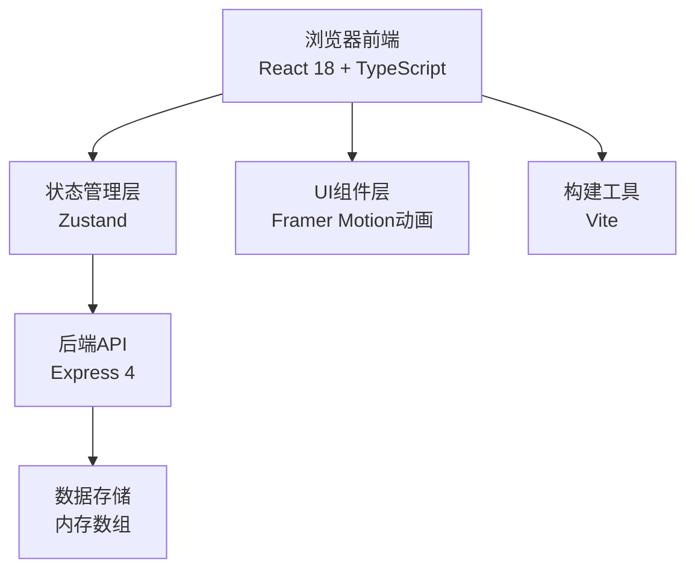
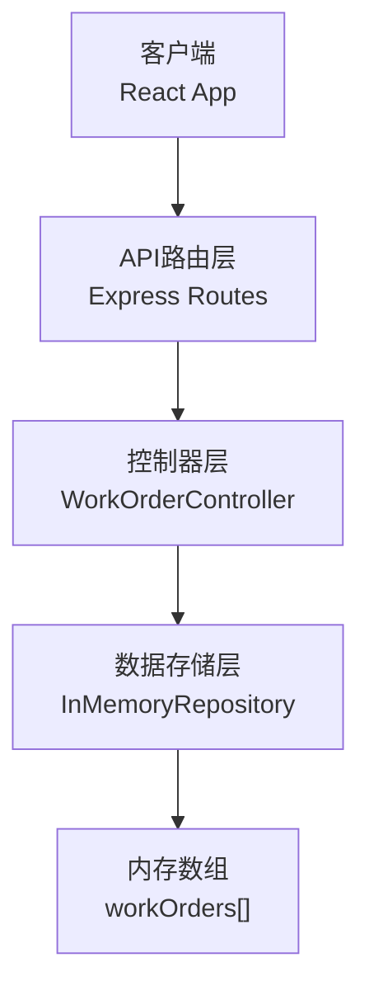
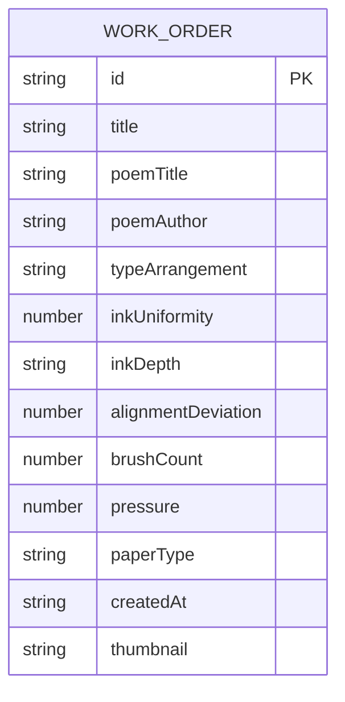

## 1. 架构设计



## 2. 技术描述

- 前端框架：React 18 + TypeScript 5
- 构建工具：Vite 5 + @vitejs/plugin-react
- 状态管理：Zustand 4
- 动画库：Framer Motion 11
- 后端服务：Express 4
- 数据存储：内存数组（开发阶段）
- 样式方案：CSS Modules + CSS Variables
- 字体：KaiTi, STKaiti, serif（楷体）

## 3. 路由定义

| 路由 | 页面/功能 |
|------|-----------|
| / | 雕版印刷车间首页 - 完整印刷流程 |
| /work-orders | 历史工单列表页 - 查看/删除历史工单 |

## 4. API 定义

### 4.1 TypeScript 类型定义

```typescript
// 字模类型
interface TypeCharacter {
  id: string;
  character: string;
  row: number;
  col: number;
  isPlaced: boolean;
  isInked: boolean;
  inkLevel: number; // 0-100
}

// 工单类型
interface WorkOrder {
  id: string;
  title: string;
  poemTitle: string;
  poemAuthor: string;
  typeArrangement: (string | null)[][]; // 12x12
  inkUniformity: number; // 0-100 评分
  inkDepth: 'A' | 'B' | 'C' | 'D'; // 透墨深度评级
  alignmentDeviation: number; // 版面对齐偏差值 0-10
  brushCount: number; // 刷墨次数
  pressure: number; // 平均按压力度 0-100
  paperType: string;
  createdAt: string;
  thumbnail: string; // base64 缩略图
}

// 印刷状态
interface PrintingState {
  phase: 'typesetting' | 'inking' | 'laying' | 'pressing' | 'finished';
  typeGrid: (TypeCharacter | null)[][]; // 12x12
  inkProgress: number; // 0-100
  isPaperLaid: boolean;
  pressMarks: PressMark[];
  workOrders: WorkOrder[];
  selectedCharacter: TypeCharacter | null;
}

interface PressMark {
  x: number;
  y: number;
  depth: number; // 0-100
  size: number;
}
```

### 4.2 API 接口

#### GET /api/workOrders
- 描述：获取历史工单列表
- 响应：`{ success: boolean; data: WorkOrder[] }`

#### POST /api/workOrders
- 描述：保存新工单
- 请求体：`Omit<WorkOrder, 'id' | 'createdAt'>`
- 响应：`{ success: boolean; data: WorkOrder }`

#### DELETE /api/workOrders/:id
- 描述：删除指定工单
- 响应：`{ success: boolean; message: string }`

## 5. 服务器架构图



## 6. 数据模型

### 6.1 实体关系图



### 6.2 项目文件结构

```
.
├── package.json
├── vite.config.js
├── tsconfig.json
├── index.html
├── src/
│   ├── App.tsx
│   ├── main.tsx
│   ├── store/
│   │   └── printingStore.ts
│   ├── components/
│   │   ├── TypeCase.tsx
│   │   ├── PrintingPress.tsx
│   │   ├── WorkShopScene.tsx
│   │   ├── InkPot.tsx
│   │   ├── Brush.tsx
│   │   ├── PaperRoll.tsx
│   │   ├── PressPad.tsx
│   │   ├── PreviewPanel.tsx
│   │   └── WorkOrderList.tsx
│   ├── types/
│   │   └── index.ts
│   ├── utils/
│   │   ├── audio.ts
│   │   ├── crackPattern.ts
│   │   └── scoring.ts
│   └── styles/
│       ├── globals.css
│       └── variables.css
└── server/
    └── index.ts
```

## 7. 性能优化策略

### 7.1 刷墨性能（≥50fps）
- 使用 Canvas 2D 绘制刷墨轨迹，避免 DOM 重排
- requestAnimationFrame 批量更新渲染
- 离屏 Canvas 预渲染墨色纹理
- 节流鼠标移动事件（每16ms处理一次）

### 7.2 预览渲染（≤200ms）
- 预计算 SVG 裂纹路径模板
- 使用 CSS transform 替代 top/left 定位
- 缩略图使用 base64 缓存
- 列表虚拟滚动（超过20项时启用）

### 7.3 动画性能
- Framer Motion 使用 will-change 提示
-  transform 和 opacity 属性动画，避免触发布局
- 低性能设备降级动画效果

## 8. 关键技术实现点

1. **拖拽系统**：原生 mousedown/mousemove/mouseup 事件，自定义拖拽拖影
2. **吸附算法**：计算鼠标位置与最近方格中心距离，自动对齐
3. **刷墨算法**：基于鼠标移动距离和速度计算墨色覆盖量，Canvas 渲染
4. **按压透印**：根据鼠标移动速度计算压痕深度，使用径向渐变实现半透明压痕
5. **透印动画**：CSS transition + opacity 分层实现墨迹渐显
6. **SVG 裂纹**：程序化生成不规则裂纹路径，使用 Perlin 噪声算法
7. **评分算法**：基于刷墨均匀度方差、按压深度分布、排版对齐度计算评分
8. **音频反馈**：Web Audio API 合成音效，无需外部音频文件
