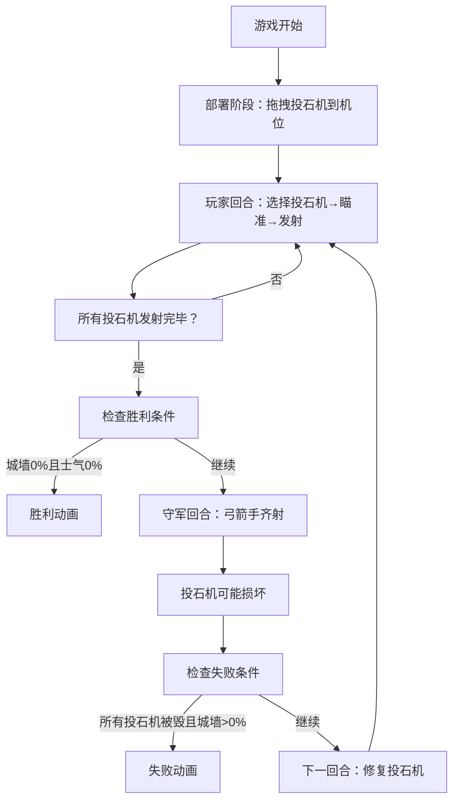
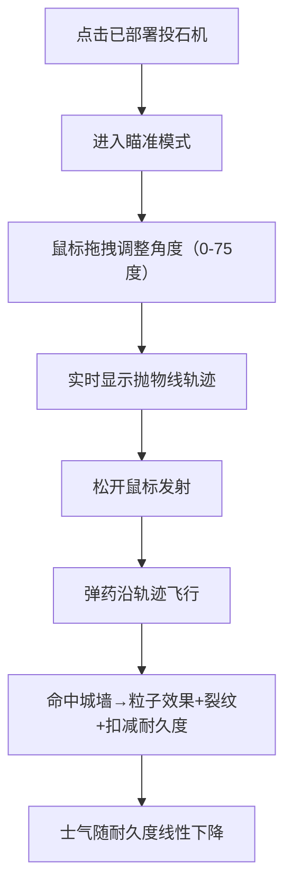

## 1. 产品概述

基于浏览器的古代投石机攻防策略模拟游戏，玩家扮演三国时期攻城军司马，在城垣战场部署投石机阵、调整抛射角度与弹药类型，与守军展开回合制炮击对决。

- **核心玩法**：拖拽部署投石机 → 瞄准发射 → 观察城墙耐久度与士气变化 → 应对守军反击 → 达成胜利条件
- **目标用户**：喜欢策略模拟和古代战争题材的玩家
- **市场价值**：提供沉浸式的古代攻城战术体验，结合物理抛物线玩法与回合制策略

## 2. 核心功能

### 2.1 用户角色
| 角色 | 注册方式 | 核心权限 |
|------|----------|----------|
| 攻城军司马 | 无需注册，直接进入游戏 | 部署投石机、调整角度、选择弹药、发射攻击、修复受损器械 |

### 2.2 功能模块
1. **战场主界面**：秋日荒野战场、城墙防御工事、投石机部署机位、兵器架
2. **部署系统**：拖拽三种投石机（轻型/中型/重型）到固定机位，齿轮卡合音效反馈
3. **瞄准发射系统**：抛物线角度调整（0-75度）、轨迹预览、弹药类型选择（石弹/火油罐）
4. **战斗反馈系统**：城墙裂纹动画、耐久度计算、士气系统、粒子爆破效果
5. **回合制系统**：玩家回合（所有投石机各发射一次）→ 守军回合（弓箭手齐射）→ 投石机损坏与修复
6. **胜负判定系统**：胜利/失败动画与界面展示

### 2.3 页面详情
| 页面名称 | 模块名称 | 功能描述 |
|---------|----------|----------|
| 战场主页面 | 兵器架模块 | 展示三种投石机，支持拖拽操作，显示投石机属性 |
| 战场主页面 | 城墙模块 | 显示城墙耐久度、裂纹效果、守军旗帜、弓箭手动画 |
| 战场主页面 | 投石机位模块 | 三个固定机位，支持部署、瞄准、发射、修复操作 |
| 战场主页面 | HUD模块 | 显示城墙耐久度百分比条、守军士气值、弹药库存、当前回合数 |
| 战场主页面 | 粒子效果模块 | 石弹碎石四溅、火油罐火焰扩散、箭矢齐射动画 |

## 3. 核心流程

### 3.1 游戏主流程

### 3.2 发射流程

## 4. 用户界面设计

### 4.1 设计风格
- **主色调**：秋日荒野风格，天空灰蓝`#6b8e9a`，山峦渐变`#5a7a6b`，城墙青灰`#7a7a7a`，地面黄褐`#9a7a5a`，兵器架深褐`#5a3a2a`，旗帜暗红`#8b3a3a`
- **按钮风格**：木质纹理按钮，深棕色边框，悬停时有轻微阴影和缩放效果
- **字体**：使用具有古典风格的衬线字体，标题大气磅礴，正文清晰可读
- **布局风格**：左侧兵器架，中间战场，右侧城墙，顶部HUD状态栏
- **视觉细节**：城墙砖纹、雉堞凹凸、枯草颗粒纹理、齿轮卡合动画

### 4.2 页面设计概述
| 页面名称 | 模块名称 | UI元素 |
|---------|----------|--------|
| 战场主页面 | 背景层 | 天空渐变、远山剪影、地面纹理、枯草颗粒 |
| 战场主页面 | 城墙层 | 青灰色砖墙、深灰勾缝线、雉堞结构、裂纹效果（三级）、城头旗帜 |
| 战场主页面 | 投石机层 | 轻型（双轮小尾）、中型（井架配重）、重型（三角底座绞盘），CSS绘制 |
| 战场主页面 | 兵器架层 | 深褐色木质结构、投石机卡片、属性标签、弹药车 |
| 战场主页面 | HUD层 | 耐久度百分比条（红色渐变）、士气值（黄色渐变）、弹药库存、回合数 |
| 战场主页面 | 动画层 | 抛物线轨迹（白色虚线）、粒子爆破、箭矢飞行、胜利/失败横幅 |

### 4.3 响应式
- **桌面优先**：主要面向桌面浏览器，固定1280x720战场区域
- **自适应**：根据窗口大小等比例缩放战场，保持画面比例
- **操作优化**：鼠标拖拽流畅，点击区域足够大，确保操作精准

### 4.4 性能要求
- **帧率**：动画帧率保持在50fps以上
- **延迟**：抛物线计算与碰撞检测延迟不超过16ms
- **粒子数量**：不超过300个粒子，避免浏览器卡顿
