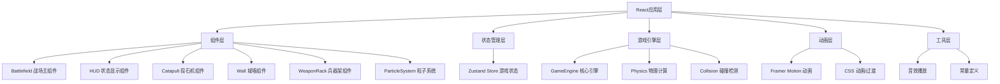

## 1. 架构设计



## 2. 技术描述

- **前端框架**：React@18 + TypeScript@5
- **构建工具**：Vite@5 + @vitejs/plugin-react@4
- **状态管理**：Zustand@4
- **动画库**：Framer Motion@11
- **样式方案**：CSS Modules + 内联样式（动态样式）
- **初始化方式**：手动创建项目结构与配置文件

## 3. 目录结构

```
src/
├── main.tsx              # React根组件
├── game/
│   ├── GameEngine.ts     # 核心游戏引擎
│   ├── types.ts          # 类型定义
│   ├── constants.ts      # 游戏常量
│   └── physics.ts        # 物理计算工具
├── components/
│   ├── Battlefield.tsx   # 战场主组件
│   ├── HUD.tsx           # 状态显示组件
│   ├── WeaponRack.tsx    # 兵器架组件
│   ├── Catapult.tsx      # 投石机组件
│   ├── Wall.tsx          # 城墙组件
│   └── ParticleSystem.tsx # 粒子系统组件
├── store/
│   └── useGameStore.ts   # Zustand状态管理
└── utils/
    └── sound.ts          # 音效工具
```

## 4. 数据模型

### 4.1 核心类型定义

```typescript
// 投石机类型
type CatapultType = 'light' | 'medium' | 'heavy';

// 弹药类型
type AmmoType = 'stone' | 'fire';

// 游戏阶段
type GamePhase = 'deploy' | 'playerTurn' | 'enemyTurn' | 'victory' | 'defeat';

// 投石机状态
interface Catapult {
  id: string;
  type: CatapultType;
  position: { x: number; y: number };
  slotIndex: number | null;
  health: number;
  maxHealth: number;
  isDamaged: boolean;
  hasFired: boolean;
  angle: number;
  ammoType: AmmoType;
}

// 城墙状态
interface Wall {
  durability: number;
  maxDurability: number;
  morale: number;
  maxMorale: number;
  crackLevel: number[]; // 每段城墙的裂纹等级 0-3
}

// 粒子状态
interface Particle {
  id: string;
  x: number;
  y: number;
  vx: number;
  vy: number;
  type: 'stone' | 'fire' | 'arrow';
  life: number;
  maxLife: number;
}

// 游戏状态
interface GameState {
  phase: GamePhase;
  turn: number;
  catapults: Catapult[];
  wall: Wall;
  ammo: { stone: number; fire: number };
  particles: Particle[];
  deployedSlots: (string | null)[];
  selectedCatapult: string | null;
  isAiming: boolean;
  trajectoryPoints: { x: number; y: number }[];
}
```

### 4.2 投石机属性常量

| 类型 | 射程 | 装填时间 | 伤害 | 血量 |
|------|------|----------|------|------|
| 轻型抛石车 | 200-400px | 1回合 | 15 | 60 |
| 中型配重式 | 300-550px | 1回合 | 25 | 80 |
| 重型回回炮 | 400-700px | 1回合 | 40 | 100 |

### 4.3 弹药属性

| 弹药类型 | 伤害加成 | 效果 |
|----------|----------|------|
| 石弹 | 1.0x | 土黄色碎石粒子 |
| 火油罐 | 1.2x | 橙红色火焰粒子，持续灼烧 |

## 5. 核心算法

### 5.1 抛物线物理计算

```typescript
// 计算抛物线上的点
function calculateTrajectory(
  startX: number,
  startY: number,
  angle: number, // 弧度
  velocity: number,
  gravity: number,
  steps: number
): { x: number; y: number }[] {
  const points = [];
  const vx = velocity * Math.cos(angle);
  const vy = -velocity * Math.sin(angle);
  
  for (let i = 0; i <= steps; i++) {
    const t = (i / steps) * (2 * vy / gravity);
    const x = startX + vx * t;
    const y = startY + vy * t + 0.5 * gravity * t * t;
    points.push({ x, y });
    if (y >= groundY) break;
  }
  return points;
}
```

### 5.2 碰撞检测

```typescript
// 检测弹药是否命中城墙
function checkWallCollision(
  projectileX: number,
  projectileY: number,
  wallBounds: { x: number; y: number; width: number; height: number }
): boolean {
  return (
    projectileX >= wallBounds.x &&
    projectileX <= wallBounds.x + wallBounds.width &&
    projectileY >= wallBounds.y &&
    projectileY <= wallBounds.y + wallBounds.height
  );
}
```

### 5.3 士气计算

```typescript
// 士气随耐久度线性下降
function calculateMorale(durability: number, maxDurability: number): number {
  const ratio = durability / maxDurability;
  return Math.max(0, Math.min(100, ratio * 100));
}
```

## 6. 性能优化策略

1. **requestAnimationFrame**：所有动画使用RAF，确保帧率稳定
2. **对象池**：粒子系统使用对象池复用，避免频繁GC
3. **CSS硬件加速**：使用transform和opacity动画，触发GPU加速
4. **节流计算**：抛物线轨迹每2帧计算一次，减少CPU负担
5. **粒子上限**：同时存在的粒子不超过300个，超出时销毁最早的粒子
6. **事件委托**：战场交互使用事件委托，减少事件监听器数量
