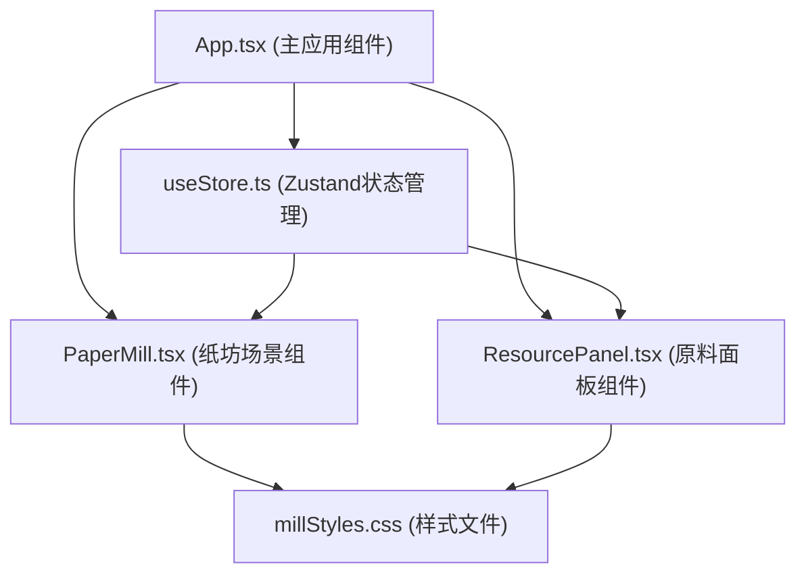

## 1. 架构设计

本项目为纯前端单页应用，采用React + TypeScript + Vite技术栈，使用Zustand进行状态管理，Framer Motion处理复杂动画。



## 2. 技术描述

* **前端框架**: React\@18 + TypeScript\@5

* **构建工具**: Vite\@5

* **状态管理**: Zustand\@4

* **动画库**: Framer Motion\@11

* **样式方案**: 原生CSS + CSS Variables

* **初始化方式**: Vite React TypeScript 模板

## 3. 目录结构

```
├── src/
│   ├── components/
│   │   ├── PaperMill.tsx        # 纸坊场景主组件
│   │   └── ResourcePanel.tsx    # 原料选择面板组件
│   ├── store/
│   │   └── useStore.ts          # Zustand状态管理
│   ├── styles/
│   │   └── millStyles.css       # 全局样式和动画
│   ├── App.tsx                  # 主应用组件
│   └── main.tsx                 # 应用入口
├── index.html                   # HTML入口
├── package.json                 # 项目依赖
├── vite.config.js               # Vite配置
└── tsconfig.json                # TypeScript配置
```

## 4. 状态管理设计

使用Zustand管理造纸全过程的状态：

| 状态字段              | 类型      | 说明          | 初始值                                      |
| ----------------- | ------- | ----------- | ---------------------------------------- |
| pulpConcentration | number  | 纸浆浓度(%)     | 10                                       |
| paperThickness    | number  | 纸张厚度(丝)     | 0                                        |
| uniformity        | number  | 匀度指数(0-100) | 0                                        |
| pressingProgress  | number  | 压榨进度(0-100) | 0                                        |
| dryingProgress    | number  | 晾晒进度(0-100) | 0                                        |
| currentStep       | string  | 当前工序步骤      | 'idle'                                   |
| rawMaterials      | object  | 各原料添加量      | { hemp: 0, bark: 0, vine: 0, bamboo: 0 } |
| paperColor        | string  | 纸张最终颜色      | '#f5e6d3'                                |
| isPressing        | boolean | 是否正在压榨      | false                                    |
| isDrying          | boolean | 是否正在晾晒      | false                                    |
| splashParticles   | array   | 水花粒子数据      | \[]                                      |

### 状态更新方法：

* `addRawMaterial(type: string)`: 添加原料，更新浓度和颜色

* `setPaperThickness(thickness: number)`: 设置抄纸厚度

* `setUniformity(uniformity: number)`: 设置匀度指数

* `startPressing()`: 开始压榨，进度动画

* `startDrying()`: 开始晾晒，进度动画

* `resetProcess()`: 重置整个流程

* `createSplash(x: number, y: number)`: 创建水花粒子效果

* `setCurrentStep(step: string)`: 设置当前工序步骤

## 5. 核心组件设计

### PaperMill.tsx (纸坊场景组件)

* **职责**: 渲染整个纸坊场景，处理抄纸、压榨、晾晒的交互逻辑

* **核心功能**:

  * CSS绘制工棚、纸浆槽、竹帘、压榨案、晾纸架

  * 处理鼠标滑动抄纸交互

  * 处理拖拽到压榨案和晾纸架的交互

  * 渲染水花粒子效果

  * 监听状态变化，更新UI显示

### ResourcePanel.tsx (原料面板组件)

* **职责**: 展示四种原料袋，处理拖拽交互

* **核心功能**:

  * 渲染麻、树皮、藤、竹四种原料袋

  * 实现HTML5 Drag and Drop API

  * 悬停放大效果

  * 拖拽时的视觉反馈

## 6. 动画实现方案

| 动画效果   | 实现方式                             | 持续时间 |
| ------ | -------------------------------- | ---- |
| 纸浆搅拌旋涡 | CSS @keyframes + linear-gradient | 无限循环 |
| 水花飞溅   | Framer Motion + 粒子数组             | 0.3s |
| 悬停放大   | CSS transition + transform       | 0.2s |
| 抄纸纸浆浮现 | CSS transition + opacity         | 0.5s |
| 压板下压   | Framer Motion animate            | 1s   |
| 晾晒进度   | Framer Motion motion-value       | 8s   |
| 纸张状态过渡 | CSS transition                   | 0.5s |
| 纸张边缘微卷 | CSS transform + border-radius    | 0.5s |

## 7. 性能优化策略

1. **动画性能**: 优先使用`transform`和`opacity`属性，避免触发重排重绘
2. **拖拽优化**: 使用`will-change: transform`提升拖拽性能
3. **粒子效果**: 限制最大粒子数量(最多20个)，使用`requestAnimationFrame`
4. **状态更新**: Zustand状态采用选择器订阅，避免不必要的重渲染
5. **组件拆分**: 按职责拆分组件，每个组件<200行
6. **防抖节流**: 鼠标移动事件使用节流，限制更新频率
7. **硬件加速**: 对动画元素使用`transform: translateZ(0)`开启GPU加速

## 8. 响应式断点

| 断点                  | 布局方式          |
| ------------------- | ------------- |
| < 768px (手机)        | 纵向堆叠，操作区可上下滑动 |
| 768px - 1024px (平板) | flex换行，自适应布局  |
| > 1024px (桌面)       | 横向三栏布局        |

