## 1. 产品概述

唐代敦煌石窟壁画补绘与光照模拟三维交互应用，让用户体验古代画师在昏暗洞窟中借助油灯补绘飞天壁画的过程。通过沉浸式的光影交互与手绘补绘，重现敦煌艺术创作场景。

- 核心价值：以游戏化交互方式展示敦煌壁画修复技艺，融合艺术教育与沉浸式体验
- 目标用户：艺术爱好者、文化学习者、博物馆参观者

## 2. 核心特性

### 2.1 用户角色

| 角色 | 注册方式 | 核心权限 |
|------|----------|----------|
| 体验用户 | 无需注册 | 完整体验三维洞窟场景、油灯光照控制、壁画补绘功能 |

### 2.2 功能模块

1. **三维洞窟场景**：昏暗洞窟环境，中央壁画，地面与背景质感
2. **油灯光照系统**：鼠标控制光源移动，圆锥形光锥，半径可调
3. **粉本吸附系统**：右侧拖拽线稿叠层，自动对齐壁画边缘
4. **补绘系统**：赭石色线条绘制，矿物颜料色块填充
5. **色盘系统**：左侧四种传统矿物颜料选择
6. **状态面板**：实时显示光源坐标、光锥半径、补绘进度

### 2.3 页面详情

| 页面名称 | 模块名称 | 功能描述 |
|----------|----------|----------|
| 主场景页 | 三维洞窟渲染 | Three.js渲染洞窟环境、壁画、飞天图案、残损区域 |
| 主场景页 | 光照控制系统 | 鼠标拖拽移动光源，滚轮调整光锥半径 |
| 主场景页 | 粉本拖拽吸附 | 右侧面板拖拽线稿，<0.5单位自动吸附对齐 |
| 主场景页 | SVG补绘层 | 叠加在3D画布上的透明绘制层，支持贝塞尔曲线描线与圆形填色 |
| 主场景页 | 矿物色盘 | 石青、石绿、朱砂、藤黄四种颜料选择 |
| 主场景页 | 状态信息面板 | 光源坐标、半径、补绘面积占比实时显示 |

## 3. 核心流程

```mermaid
flowchart LR
    A["进入洞窟场景"] --> B["鼠标移动控制油灯"]
    B --> C["光照扫过残损壁画"]
    C --> D["寻找可辨识轮廓线"]
    D --> E["从右侧拖拽粉本"]
    E --> F["粉本自动吸附对齐"]
    F --> G["调整粉本透明度"]
    G --> H["绘制赭石色线条"]
    H --> I["选择矿物颜料"]
    I --> J["点击填充色块"]
    J --> K["查看补绘进度"]
    K --> L["可撤销操作(最多10步)"]
```

## 4. 用户界面设计

### 4.1 设计风格

- **主色调**：洞窟背景 `#1a1a1a`，地面 `#3a2a1a`，壁画底色 `#d9c9b9`，残损区域 `#b0a090`
- **强调色**：油灯光锥 `#f5c542` 渐变透明，线条赭石色 `#8b5e3c`
- **颜料色**：石青 `#4a7db5`、石绿 `#4a9b5a`、朱砂 `#c0392b`、藤黄 `#e8c76a`
- **字体**：等宽字体显示坐标数据，主体采用古朴雅致的中文字体
- **交互反馈**：所有点击/拖拽有0.2s柔和过渡动画，色盘悬停放大1.2倍带光晕

### 4.2 页面设计概览

| 页面名称 | 模块名称 | UI元素 |
|----------|----------|--------|
| 主场景页 | 洞窟场景 | 暗色调洞窟，中央壁画占60%，暖黄色光锥渐变，半透明毛玻璃下方面板 |
| 主场景页 | 左侧色盘 | 垂直排列4个圆形色块(直径30px，间距10px)，悬停放大动画 |
| 主场景页 | 右侧粉本 | 虚线边框可拖拽线稿面板，透明度滑块控制 |
| 主场景页 | 下方面板 | 半透明毛玻璃(模糊10px，背景rgba(0,0,0,0.6))，浅灰色字体 |

### 4.3 响应式

- **桌面端**：色盘垂直排列在左，粉本面板在右，下方面板横跨
- **移动端(<768px)**：色盘改为横向排列，粉本变为可折叠面板，布局自适应

### 4.4 3D场景设计

- **环境**：昏暗洞窟，环境光强度0.1，营造神秘氛围
- **光照**：聚光灯模拟油灯，位置随鼠标移动，光锥半径50-200px可调
- **相机**：透视相机，初始位置壁画前3单位处
- **壁画**：飞天散花图，中央40%区域颜料剥落呈灰白色
- **后处理**：光锥半透明渐变效果，局部光照清晰区域与昏暗区域对比

## 5. 性能要求

- 光照计算帧率 ≥ 40fps
- 补绘操作延迟 < 100ms
- 历史撤销响应时间 < 50ms
