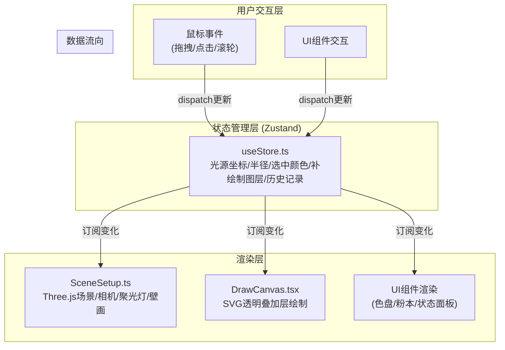
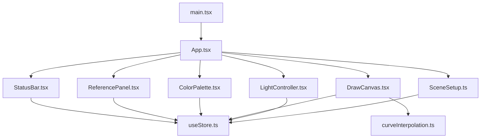
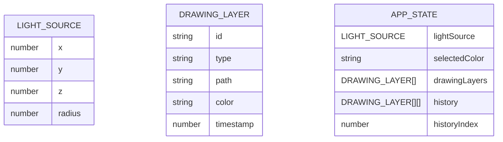

## 1. 架构设计



## 2. 技术说明

- **前端框架**：React@18 + TypeScript@5 + Vite@5
- **3D渲染**：three@0.160 + @react-three/fiber@8 + @react-three/drei@9
- **状态管理**：zustand@4
- **动画库**：framer-motion@10
- **构建工具**：Vite@5 + @vitejs/plugin-react@4

## 3. 目录结构

```
src/
├── scene/
│   └── SceneSetup.ts          # Three.js场景设置与渲染
├── components/
│   ├── LightController.tsx    # 光源交互控制器
│   ├── DrawCanvas.tsx         # SVG补绘层
│   ├── ColorPalette.tsx       # 左侧矿物色盘
│   ├── ReferencePanel.tsx     # 右侧粉本面板
│   └── StatusBar.tsx          # 下方面板信息
├── store/
│   └── useStore.ts            # Zustand全局状态
├── types/
│   └── index.ts               # TypeScript类型定义
├── utils/
│   └── curveInterpolation.ts  # 贝塞尔曲线插值工具
├── App.tsx                    # 主应用组件
├── main.tsx                   # 入口文件
└── index.css                  # 全局样式
```

## 4. 文件调用关系



## 5. 核心数据模型

### 5.1 数据模型定义



### 5.2 TypeScript类型定义

```typescript
interface Point {
  x: number;
  y: number;
}

interface LightSource {
  x: number;
  y: number;
  z: number;
  radius: number;
}

interface DrawingPath {
  id: string;
  type: 'stroke' | 'fill';
  path: string;
  color: string;
  timestamp: number;
}

interface ReferenceState {
  isDragging: boolean;
  position: { x: number; y: number };
  opacity: number;
  isSnapped: boolean;
}

interface StoreState {
  lightSource: LightSource;
  selectedColor: string;
  drawingLayers: DrawingPath[];
  history: DrawingPath[][];
  historyIndex: number;
  reference: ReferenceState;
  setLightSource: (source: Partial<LightSource>) => void;
  setSelectedColor: (color: string) => void;
  addDrawingLayer: (layer: DrawingPath) => void;
  undoDrawing: () => void;
  setReferencePosition: (pos: { x: number; y: number }) => void;
  setReferenceOpacity: (opacity: number) => void;
  setReferenceSnapped: (snapped: boolean) => void;
}
```

## 6. 性能优化策略

1. **3D渲染优化**：使用@react-three/fiber的useFrame钩子进行帧更新，避免不必要的重渲染
2. **SVG绘制优化**：使用requestAnimationFrame批量处理绘制点，减少重绘次数
3. **状态订阅优化**：使用zustand的选择器(selector)精确订阅，避免全量重渲染
4. **贝塞尔曲线插值**：每2个采样点生成二次贝塞尔曲线，保证线条平滑的同时控制性能
5. **历史记录管理**：限制历史记录最多10步，使用数组切片操作保证O(1)时间复杂度
