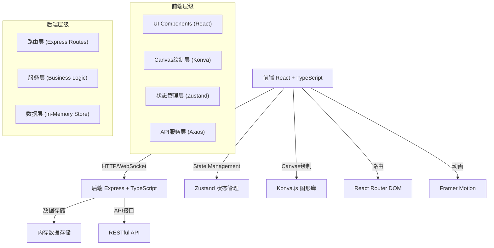
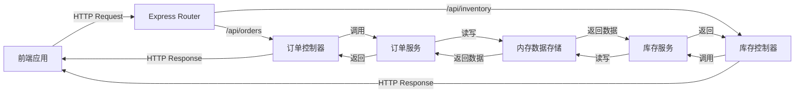
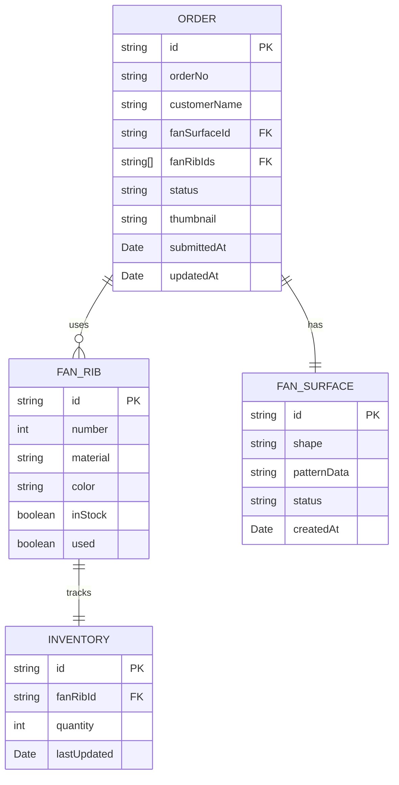

## 1. 架构设计



## 2. 技术描述

- **前端**：React@18 + TypeScript@5 + Vite@5 + @vitejs/plugin-react@4
- **状态管理**：Zustand@4
- **路由**：react-router-dom@6
- **图形绘制**：konva@9 + react-konva@18
- **动画**：framer-motion@11
- **HTTP客户端**：axios@1
- **后端**：Express@4 + TypeScript@5 + ts-node@10
- **开发工具**：concurrently@8（前后端同时运行）
- **数据存储**：内存存储（开发阶段），无需数据库

## 3. 路由定义

| 路由 | 页面 | 用途 |
|-----|------|------|
| / | 主场景 | 扇庄主界面，导航入口 |
| /design | 画扇页面 | 扇面绘制与图案设计 |
| /assemble | 组装页面 | 扇骨拖拽组装 |
| /orders | 订单管理 | 订单列表与状态管理 |

## 4. API 定义

### 4.1 类型定义

```typescript
// 扇面数据
interface FanSurface {
  id: string;
  shape: 'round' | 'fan';
  patternData: string; // base64 图片数据
  status: 'draft' | 'completed' | 'assembled';
  createdAt: Date;
}

// 扇骨数据
interface FanRib {
  id: string;
  number: number;
  material: string;
  color: string;
  inStock: boolean;
  used: boolean;
}

// 订单状态
type OrderStatus = 'pending' | 'in_progress' | 'completed' | 'shipped';

// 订单数据
interface Order {
  id: string;
  orderNo: string;
  customerName: string;
  fanSurfaceId: string;
  fanRibIds: string[];
  status: OrderStatus;
  thumbnail: string;
  submittedAt: Date;
  updatedAt: Date;
}

// 库存数据
interface Inventory {
  fanRibId: string;
  quantity: number;
}
```

### 4.2 接口列表

| Method | Path | 描述 | 请求参数 | 响应 |
|--------|------|------|----------|------|
| GET | /api/orders | 获取订单列表 | page, pageSize | Order[] |
| GET | /api/orders/:id | 获取订单详情 | id | Order |
| POST | /api/orders | 创建订单 | Order | Order |
| PUT | /api/orders/:id | 更新订单状态 | id, status | Order |
| DELETE | /api/orders/:id | 删除订单 | id | boolean |
| GET | /api/inventory/ribs | 获取扇骨库存 | - | FanRib[] |
| PUT | /api/inventory/ribs/:id | 更新扇骨库存 | id, quantity | FanRib |
| POST | /api/inventory/ribs/:id/use | 使用扇骨（扣减库存） | id | FanRib |
| POST | /api/inventory/ribs/:id/restock | 补充扇骨库存 | id, quantity | FanRib |

## 5. 服务器架构图



## 6. 数据模型

### 6.1 ER 图



### 6.2 初始化数据

```typescript
// 初始化12根扇骨数据
const initialFanRibs: FanRib[] = Array.from({ length: 12 }, (_, i) => ({
  id: `rib-${i + 1}`,
  number: i + 1,
  material: '紫竹',
  color: '#a67c52',
  inStock: true,
  used: false,
}));

// 初始化库存
const initialInventory: Inventory[] = initialFanRibs.map(rib => ({
  id: `inv-${rib.id}`,
  fanRibId: rib.id,
  quantity: 5, // 每种编号初始5根
  lastUpdated: new Date(),
}));

// 示例订单
const initialOrders: Order[] = [
  {
    id: 'order-1',
    orderNo: 'SZ20260601001',
    customerName: '唐伯虎',
    fanSurfaceId: 'surface-1',
    fanRibIds: ['rib-1', 'rib-2', 'rib-3'],
    status: 'pending',
    thumbnail: 'data:image/png;base64,...',
    submittedAt: new Date('2026-06-01'),
    updatedAt: new Date('2026-06-01'),
  },
  {
    id: 'order-2',
    orderNo: 'SZ20260602002',
    customerName: '祝枝山',
    fanSurfaceId: 'surface-2',
    fanRibIds: ['rib-4', 'rib-5', 'rib-6'],
    status: 'in_progress',
    thumbnail: 'data:image/png;base64,...',
    submittedAt: new Date('2026-06-02'),
    updatedAt: new Date('2026-06-03'),
  },
];
```
