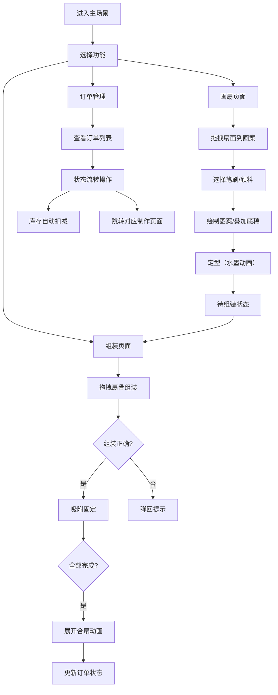

## 1. 产品概述

古代绢扇工坊全栈Web应用，让用户以明代姑苏扇庄掌柜的身份，在虚拟工坊中完成从扇面设计、扇骨组装到订单管理的完整流程。

- 主要用途：模拟传统绢扇制作工艺，提供沉浸式的文化体验与创作平台
- 目标用户：传统文化爱好者、手工艺学习者、创意设计人群
- 产品价值：传承非物质文化遗产，数字化呈现传统工艺的精致与美感

## 2. 核心功能

### 2.1 用户角色

| 角色 | 注册方式 | 核心权限 |
|------|----------|----------|
| 扇庄掌柜 | 无需注册，直接进入 | 扇面设计、扇骨组装、订单管理、库存管理 |

### 2.2 功能模块

1. **主场景页面**：明代风格扇庄环境，导航至三个子页面
2. **画扇页面**：Canvas绘制扇面，支持多种笔刷、颜料、图样叠加
3. **组装页面**：拖拽扇骨组装，判断顺序与精度
4. **订单管理页面**：订单列表展示，状态流转，库存联动

### 2.3 页面详情

| 页面名称 | 模块名称 | 功能描述 |
|---------|----------|----------|
| 主场景 | 扇庄环境 | 木质柜台、成品绢扇展示、多宝格扇骨陈列、页面导航入口 |
| 主场景 | 导航模块 | 三个子页面切换入口，淡入淡出过渡动画 |
| 画扇页面 | 材料架 | 素绢扇面（圆形/折扇）拖拽到画案 |
| 画扇页面 | 画笔工具 | 四种笔刷（细线、泼墨、点染、排笔），实时渲染笔迹 |
| 画扇页面 | 颜料盘 | 五种矿物色系（朱砂、石青、石绿、藤黄、赭石） |
| 画扇页面 | 图样叠加 | 山水、花鸟、人物线稿底稿，支持透明度、缩放、旋转 |
| 画扇页面 | 定型功能 | 水墨晕染动画，状态变为"待组装" |
| 组装页面 | 扇骨库 | 12根编号竹制扇骨，库存状态显示 |
| 组装页面 | 组装交互 | 拖拽到正确点位自动吸附，错误位置弹回提示 |
| 组装页面 | 完成动画 | 扇面展开140°，合扇动画，音效反馈 |
| 订单管理 | 订单列表 | 订单号、客户、缩略图、材质、状态、时间 |
| 订单管理 | 状态流转 | 待制作→制作中→已完成→已发货，提醒弹窗 |
| 订单管理 | 库存联动 | 使用扇骨自动扣减库存，库存不足警告 |
| 订单管理 | 详情查看 | 成品组合图弹窗展示 |

## 3. 核心流程

用户进入主场景，根据需求选择功能模块：
- 新订单到来 → 跳转画扇页面设计扇面 → 定型后进入组装 → 完成组装更新订单状态
- 管理已有订单 → 查看订单列表 → 状态流转操作 → 库存自动更新

## 4. 用户界面设计

### 4.1 设计风格

- **主色调**：木色#6b4e3a + 米黄#f5e6d3 + 青灰#9a8a7a，点缀浅金#e8c76a
- **字体**：明朝体（宋体），体现古典韵味
- **按钮风格**：圆角矩形，木质纹理边框，悬停高亮效果
- **布局风格**：明式家具简约风，对称布局，留白适度
- **图标风格**：Font Awesome简体中文化，线性图标配合古典纹饰

### 4.2 页面设计概述

| 页面名称 | 模块名称 | UI元素 |
|---------|----------|--------|
| 主场景 | 扇庄环境 | 木质柜台#6b4e3a，青砖地面#9a8a7a，墙上成品扇，角落多宝格 |
| 画扇页面 | Canvas区域 | 熟宣纸质感背景（米白噪点），扇面经纬纹理#f5e6d3 |
| 画扇页面 | 工具栏 | 横向流式布局，顶部固定，移动端底部固定 |
| 组装页面 | 扇骨库 | 左侧竖向列表，12根扇骨带编号和木纹#a67c52 |
| 组装页面 | 组装区 | 中央扇面12个连接点位，正确吸附音效，错误红色闪烁 |
| 订单管理 | 订单表格 | 行悬停浅金#e8c76a，点击高亮#d4a017，状态按钮 |
| 订单管理 | 详情弹窗 | 成品组合图，订单完整信息 |

### 4.3 响应式设计

- **设计原则**：桌面优先，移动端适配
- **断点设置**：320px（手机）、768px（平板）、1024px（桌面）
- **移动端适配**：
  - 画扇工具栏改为底部固定栏
  - 组装页面扇骨列表改为竖向可滚动
  - 订单表格改为卡片式布局
- **触摸优化**：增大点击区域，支持触摸手势操作

### 4.4 动画与交互

- **页面切换**：淡入淡出过渡，duration 0.3s
- **画扇交互**：笔迹实时渲染，定型水墨晕染扩散0.5秒
- **组装交互**：
  - 拖拽物理惯性（阻尼0.8）
  - 拖拽时扇骨跟随偏移并旋转2°
  - 到位弹性回弹
  - 错误位置红色闪烁0.3秒
  - 完成后合扇动画（缓缓合拢再展开）
- **音效反馈**：竹扣声、纸页摩擦声
