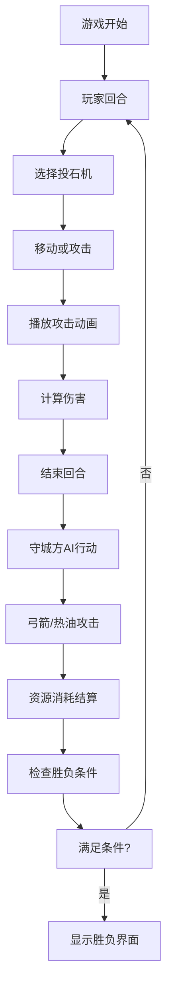

## 1. 产品概述

一款基于浏览器的回合制策略游戏，模拟北宋末年方腊起义军攻打杭州城的投石机攻防战。通过直观的2D俯瞰视角和丰富的动画效果，让玩家体验古代城市攻防战的战术决策乐趣。

- 解决传统单机策略游戏缺乏直观战况反馈、资源调度与战术动作联动不紧密的问题
- 目标用户：历史策略游戏爱好者、回合制游戏玩家

## 2. 核心功能

### 2.1 用户角色

| 角色 | 注册方法 | 核心权限 |
|------|----------|----------|
| 玩家 | 无需注册 | 操作起义军进行攻城作战 |

### 2.2 功能模块

1. **游戏主场景**：宋代杭州城俯瞰地图、城墙、平原网格、双方部队部署
2. **投石机系统**：部署、移动、攻击、抛物线弹道、城墙破损效果
3. **守城方AI**：弓箭反击、热油攻击、自动瞄准
4. **资源管理**：军粮消耗、士气系统、箭矢补给
5. **巷战系统**：城门攻破后的步兵近战、火柴人部队
6. **回合系统**：攻守交替、回合转场动画、胜负判定

### 2.3 页面详情

| 页面名称 | 模块名称 | 功能描述 |
|----------|----------|----------|
| 游戏主界面 | 地图渲染 | 45度斜角俯瞰，城墙占上部40%，平原占下部60% |
| 游戏主界面 | 投石机操作 | 点击地块部署/移动投石机，攻击城墙 |
| 游戏主界面 | 资源面板 | 左侧显示起义军军粮、投石机数量、士气；右侧显示官兵箭矢、城墙耐久 |
| 游戏主界面 | 操作栏 | 底部"回合结束"和"撤回到菜单"按钮 |
| 游戏主界面 | 粒子效果 | 石弹轨迹、箭矢飞行、烟尘、溅射、火焰等动画 |
| 胜利/失败界面 | 结果展示 | 旗帜升起动画、音效播放 |

## 3. 核心流程

玩家进入游戏 → 查看初始部署 → 选择投石机移动或攻击 → 观察弹道和伤害效果 → 点击结束回合 → 观看守城方AI反击 → 消耗资源并检查状态 → 重复直到胜负条件满足 → 显示结果界面

## 4. 用户界面设计

### 4.1 设计风格

- **色彩主题**：宋代工笔画暖色调
  - 城墙砖色：#8b5e3c
  - 城门朱红：#c0392b
  - 平原土黄：#d4a76a
  - 背景浅米色：#f5e6d3
  - 城楼屋顶：#6b8e6b
- **按钮风格**：水彩晕染效果，铜钱形状、卷轴形状
- **字体**：ZCOOL QingKe HuangYou（宋代风格字体）
- **布局**：俯视45度斜角，两侧半透明资源面板，底部木纹操作栏
- **图标**：米粒组成谷堆、箭筒、士气旗幡、砖块耐久度

### 4.2 页面设计概述

| 页面名称 | 模块名称 | UI元素 |
|----------|----------|--------|
| 游戏主界面 | 地图区域 | 城墙（带裂痕效果）、城门、城楼、平原网格（每格10米）、边界杂木林 |
| 游戏主界面 | 投石机 | 可点击选中，移动范围高亮，攻击轨迹半透明虚线 |
| 游戏主界面 | 左侧资源面板 | 军粮谷堆（每堆10粒米）、投石机数量、士气旗幡 |
| 游戏主界面 | 右侧资源面板 | 箭矢筒数（每筒20支）、城墙耐久砖块 |
| 游戏主界面 | 底部操作栏 | 木纹背景，铜钱形回合结束按钮，卷轴形撤回按钮 |
| 游戏主界面 | 地块信息气泡 | 半透明#f5e6d3，圆角，1.5秒后淡出 |
| 回合转场 | 羊皮卷轴动画 | 从右向左滚动，#f5e6d3到#d9c9b9渐变，显示"第N回合" |

### 4.3 响应式设计

- Desktop-first，移动端适配
- 屏幕宽度 < 768px时，两侧资源面板收起为可点击图标
- 军粮图标：稻穗矢量图
- 箭矢图标：箭头矢量图
- 点击图标弹出半透明浮层显示详细数值
- 触摸操作优化：加大点击区域，支持长按操作

### 4.4 性能要求

- 动画帧率 ≥ 30FPS
- 单帧粒子数 ≤ 200个
- 交互响应时间 ≤ 100ms
- 使用CSS动画和GPU加速优化性能
