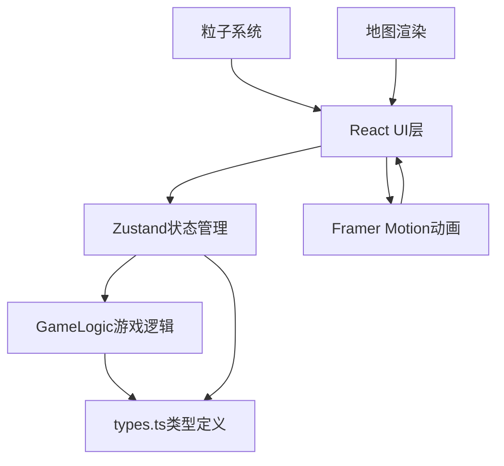

## 1. 架构设计



## 2. 技术描述

- **前端框架**：React 18 + TypeScript 5
- **构建工具**：Vite 5
- **状态管理**：Zustand 4
- **动画库**：Framer Motion 11
- **随机数生成**：seedrandom（确保可复现）
- **样式方案**：CSS Modules + CSS Variables
- **无后端**：纯前端应用，所有逻辑在浏览器端运行

## 3. 项目结构

```
src/
├── types.ts          # 游戏类型定义
├── GameLogic.ts      # 核心游戏逻辑
├── store.ts          # Zustand状态管理
├── GameBoard.tsx     # 主游戏面板
├── components/       # 组件目录
│   ├── CityWall.tsx      # 城墙组件
│   ├── Catapult.tsx      # 投石机组件
│   ├── Projectile.tsx    # 投射物组件
│   ├── Arrow.tsx         # 箭矢组件
│   ├── Soldier.tsx       # 步兵组件
│   ├── Particle.tsx      # 粒子组件
│   ├── ResourcePanel.tsx # 资源面板
│   ├── OperationBar.tsx  # 操作栏
│   ├── TurnTransition.tsx # 回合转场
│   └── Tooltip.tsx       # 地块提示
└── App.tsx           # 应用入口
```

## 4. 核心数据模型

### 4.1 游戏状态类型

```typescript
// 位置坐标
interface Position {
  x: number;  // 网格列
  y: number;  // 网格行
}

// 投石机状态
interface Catapult {
  id: string;
  position: Position;
  health: number;      // 耐久度 0-100
  hasActed: boolean;   // 本回合是否已行动
  isStunned: boolean;  // 是否被热油眩晕
}

// 城墙状态
interface WallSegment {
  id: string;
  position: Position;
  durability: number;  // 耐久度 0-100
  cracks: Crack[];     // 裂痕列表
}

// 裂痕效果
interface Crack {
  id: string;
  size: number;        // 裂痕大小 1-5
  clipPath: string;    // CSS clip-path
}

// 步兵状态
interface Soldier {
  id: string;
  side: 'rebels' | 'imperial';
  position: Position;
  health: number;
  hasMoved: boolean;
}

// 粒子效果
interface Particle {
  id: string;
  type: 'smoke' | 'spatter' | 'dust' | 'arrow' | 'oil';
  position: { x: number; y: number };
  velocity: { x: number; y: number };
  life: number;        // 剩余生命周期
  maxLife: number;     // 总生命周期
  color: string;
  size: number;
}

// 资源状态
interface Resources {
  grain: number;       // 军粮（单位：堆，每堆10粒）
  arrows: number;      // 箭矢（单位：筒，每筒20支）
  morale: number;      // 士气 0-100
  wallDurability: number; // 城墙总耐久 0-100
}

// 游戏阶段
type TurnPhase = 'player' | 'imperial' | 'transition' | 'gameOver';

// 游戏状态
interface GameState {
  turn: number;
  phase: TurnPhase;
  winner: 'rebels' | 'imperial' | null;
  catapults: Catapult[];
  wallSegments: WallSegment[];
  soldiers: Soldier[];
  resources: Resources;
  particles: Particle[];
  selectedCatapult: string | null;
  hoveredTile: Position | null;
  maxCatapults: number;
  gateDestroyed: boolean;
}
```

### 4.2 Action类型

```typescript
type GameAction =
  | { type: 'SELECT_CATAPULT'; id: string | null }
  | { type: 'DEPLOY_CATAPULT'; position: Position }
  | { type: 'MOVE_CATAPULT'; id: string; position: Position }
  | { type: 'ATTACK'; catapultId: string; target: Position }
  | { type: 'END_TURN' }
  | { type: 'IMPERIAL_TURN' }
  | { type: 'HOVER_TILE'; position: Position | null }
  | { type: 'RESET_GAME' };
```

## 5. 核心算法

### 5.1 投石机弹道计算

```
抛物线公式: y = y0 + (x - x0) * tan(θ) - g * (x - x0)² / (2 * v0² * cos²(θ))
- 初始速度 v0 = 根据距离自适应
- 发射角度 θ = 45° (最优角度)
- 重力加速度 g = 9.8 (游戏简化值)
```

### 5.2 伤害计算

```
城墙伤害 = 基础伤害 * (1 - 距离衰减) * 石弹大小系数
距离衰减 = min(距离 / 最大射程, 0.5)
```

### 5.3 士气计算

```
士气变化 = 基础士气 - 军粮不足惩罚 - 投石机损失惩罚
军粮不足惩罚 = max(0, (需求军粮 - 现有军粮) / 需求军粮 * 30)
投石机损失惩罚 = 损失数量 * 5
```

### 5.4 AI决策

1. 优先攻击距离最近的投石机
2. 箭矢不足时减少攻击频率
3. 投石机进入3格范围内使用热油
4. 城门破损时优先防守城门

## 6. 性能优化策略

1. **粒子池化**：复用Particle对象，避免频繁创建销毁
2. **CSS硬件加速**：使用transform和opacity动画
3. **渲染优化**：使用React.memo避免不必要重渲染
4. **动画帧合并**：使用requestAnimationFrame批量更新
5. **状态分片**：Zustand使用selector精确订阅
6. **离屏Canvas**：复杂粒子效果使用Canvas渲染
