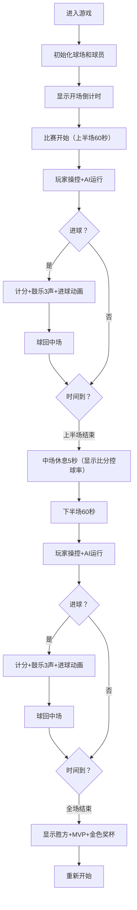

## 1. 产品概述

北宋汴京宣德门前古代马球比赛攻防模拟与鼓乐反馈互动游戏。用户扮演宋代宫廷马球校尉，操控本方球员在球场上骑马运球、传球、抢断和射门，场边鼓声根据场上局势实时变化节奏。

- **核心目的**：重现古代马球运动的紧张刺激，融合体育竞技与传统文化元素
- **目标用户**：游戏爱好者、传统文化爱好者
- **市场价值**：以独特的国风体育游戏形式传播中华传统文化

## 2. 核心 Features

### 2.1 用户角色

| 角色 | 注册方式 | 核心权限 |
|------|----------|----------|
| 玩家 | 无需注册，直接进入游戏 | 操控球员、参与比赛、调整游戏设置 |

### 2.2 功能模块

1. **游戏主场景**：Canvas绘制古代马球场，含球场、球员、马球、仪仗鼓手
2. **球员控制系统**：键盘操控本方球员移动、击球、传球、抢断
3. **AI球员系统**：队友AI自动跑位接应，对方AI防守抢断反击
4. **计分与比赛系统**：进球判定、比分统计、倒计时、上下半场制
5. **鼓乐反馈系统**：根据场上局势调整鼓点BPM，进球时播放特殊音效
6. **HUD界面**：显示比分、倒计时、体力条、控球方、鼓点指示器

### 2.3 页面详情

| 页面名称 | 模块名称 | 功能描述 |
|----------|----------|----------|
| 游戏主页面 | 球场渲染 | Canvas绘制2000x1200px球场，草地渐变、木质围栏、朱红球门 |
| 游戏主页面 | 球员控制 | WASD移动，J击球（蓄力），K传球（绿虚线），L抢断（唰音效） |
| 游戏主页面 | AI系统 | 5v5球员，AI寻路跑位、防守、射门（距球门200px内射门） |
| 游戏主页面 | 计分系统 | 球完全进入球门计1分，进球后球回中场，鼓手擂鼓3声 |
| 游戏主页面 | 比赛流程 | 上下半场各60秒，中场休息5秒，全场结束显示胜方和MVP |
| 游戏主页面 | HUD界面 | 比分（48px左红右蓝）、倒计时（黄色右上角）、体力条（绿到红渐变） |
| 游戏主页面 | 鼓乐系统 | 循环鼓点采样，BPM随比赛激烈程度变化，进球3声重音 |

## 3. 核心流程

## 4. 用户界面设计

### 4.1 设计风格

- **主色调**：草地渐变 `#4a7c59` → `#6b8e23`，边线白色 `#f0f0f0`，球门柱朱红 `#c0392b`
- **队服颜色**：左军红 `#c0392b`，右军蓝 `#2980b9`
- **强调色**：金色 `#ffd700`（比分、倒计时、进球动画、奖杯）
- **字体**：书法字体 STKaiti / Ma Shan Zheng，营造手绘水墨风格
- **整体风格**：中国传统水墨风，木质围栏 `#6b3a2a`，半透明HUD背景 `#1a1a1a` 透明度0.3

### 4.2 页面设计概述

| 页面名称 | 模块名称 | UI元素 |
|----------|----------|--------|
| 游戏主页面 | Canvas球场 | 2000x1200px球场，16:9自适应缩放，草地渐变纹理 |
| 游戏主页面 | 球员绘制 | 骑手20x15px，马10x20px，简单多边形组合，红/蓝队服 |
| 游戏主页面 | 马球 | 直径6px白色圆形 |
| 游戏主页面 | 鼓手仪仗 | 每侧3名鼓手，CSS绘制，鼓槌摆动动画，冲击波效果 |
| 游戏主页面 | HUD | 半透明背景，48px巨大比分，黄色倒计时，体力条80x8px |
| 游戏主页面 | 进球动画 | 金色"进球"大字缩放1.5倍后恢复，鼓手光环扩散 |
| 游戏主页面 | 鼓点指示器 | 圆形进度条显示当前节奏，进球时"咚！咚！咚！"闪动 |

### 4.3 响应性

- 桌面端优先，Canvas按16:9比例自适应窗口大小，保持清晰
- 键盘操作支持全键盘无鼠标操作
- 移动端可选触摸虚拟按键（当前版本桌面端为主）

### 4.4 性能约束

- Canvas渲染帧率稳定60fps
- AI寻路和碰撞检测每帧耗时≤1ms（空间哈希优化）
- 鼓声音频预先加载缓存，BPM变化同步延迟≤50ms
