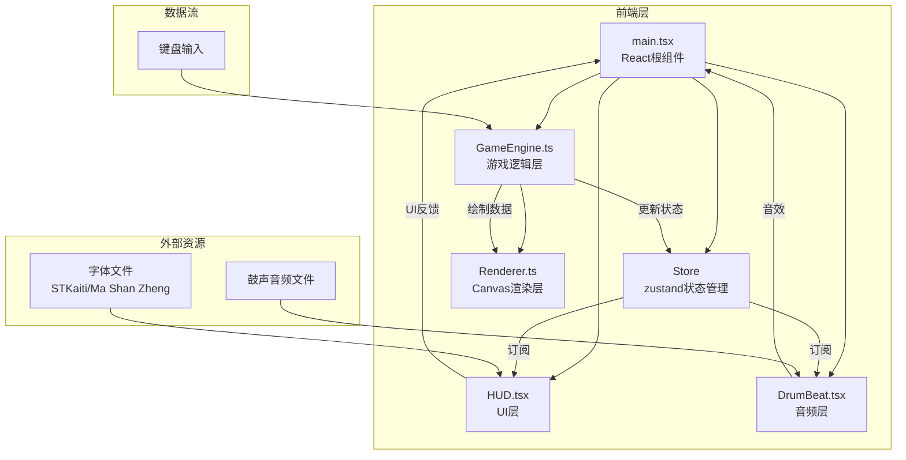

## 1. 架构设计



## 2. 技术栈说明

- **前端框架**：React@18 + TypeScript
- **构建工具**：Vite@5 + @vitejs/plugin-react
- **状态管理**：zustand@4
- **动画库**：framer-motion@11
- **渲染方式**：Canvas 2D API
- **音频处理**：Web Audio API

## 3. 项目文件结构

| 文件路径 | 职责说明 | 调用关系 |
|----------|----------|----------|
| `package.json` | 项目依赖配置 | 无 |
| `vite.config.js` | Vite构建配置 | 无 |
| `tsconfig.json` | TypeScript配置 | 无 |
| `index.html` | 入口HTML | 加载Canvas和UI |
| `src/main.tsx` | React根组件 | 创建Store，挂载GameCanvas、HUD、DrumBeat |
| `src/store/gameStore.ts` | Zustand状态管理 | 存储游戏状态，被GameEngine更新，被UI订阅 |
| `src/game/GameEngine.ts` | 核心游戏逻辑 | 更新球员位置、球轨迹、比分，回调更新Store |
| `src/game/Renderer.ts` | Canvas渲染 | 接收GameEngine数据绘制球场、球员、马球 |
| `src/game/types.ts` | 类型定义 | 定义Player、Ball、GameState等接口 |
| `src/ui/HUD.tsx` | 游戏UI组件 | 订阅Store显示比分、倒计时、体力条等 |
| `src/ui/DrumBeat.tsx` | 鼓乐组件 | 播放鼓声音频，显示鼓点节奏 |
| `src/ui/GameCanvas.tsx` | Canvas容器 | 初始化Renderer，绑定GameEngine |

## 4. 数据模型定义

### 4.1 核心类型

```typescript
// 球队类型
type Team = 'left' | 'right';

// 比赛阶段
type GamePhase = 'waiting' | 'first-half' | 'halftime' | 'second-half' | 'finished';

// 球员接口
interface Player {
  id: string;
  team: Team;
  x: number;
  y: number;
  angle: number;        // 朝向角度（弧度）
  speed: number;        // 当前速度
  maxSpeed: number;     // 最大速度
  stamina: number;      // 体力 0-100
  isUserControlled: boolean;
  hasBall: boolean;
  goals: number;        // 进球数
}

// 马球接口
interface Ball {
  x: number;
  y: number;
  vx: number;           // x方向速度
  vy: number;           // y方向速度
  isHeld: boolean;      // 是否被持有
  holderId: string | null;
}

// 球门接口
interface Goal {
  team: Team;
  x: number;
  y: number;
  width: number;
  height: number;
}

// 鼓手接口
interface Drummer {
  x: number;
  y: number;
  side: 'top' | 'bottom';
  isPlaying: boolean;
  rippleRadius: number; // 光环扩散半径
}

// 游戏状态接口
interface GameState {
  phase: GamePhase;
  timeLeft: number;     // 当前剩余时间（秒）
  score: { left: number; right: number };
  possession: Team | null;
  players: Player[];
  ball: Ball;
  goals: Goal[];
  drummers: Drummer[];
  bpm: number;          // 当前鼓点BPM
  showGoalAnimation: boolean;
  goalTeam: Team | null;
  mvpPlayer: Player | null;
  chargeLevel: number;  // 蓄力等级 0-1
  passLine: { from: {x: number; y: number}; to: {x: number; y: number} } | null;
}
```

### 4.2 数据流向

1. **输入层**：键盘事件 → `GameEngine.handleInput()` → 更新玩家球员状态
2. **逻辑层**：`GameEngine.update()` 每帧60次 → 计算AI行为、碰撞检测、进球判定 → 更新状态
3. **状态层**：`GameEngine` → `useGameStore.setState()` → 触发UI更新
4. **渲染层**：`Renderer.render(state)` → Canvas绘制游戏画面
5. **UI层**：`HUD` 和 `DrumBeat` 通过 `useGameStore()` 订阅状态 → React重渲染

## 5. 核心算法

### 5.1 AI寻路算法
- 使用空间哈希（Spatial Hash）优化邻近球员查询
- 队友AI：向空当区域移动，避开对方球员，保持传球距离
- 对方AI：防守时盯防持球球员，距持球球员40px内尝试抢断
- 射门判定：持球球员距球门≤200px时触发射门

### 5.2 碰撞检测
- 球员与球：圆形碰撞检测（球员半径15px，球半径3px）
- 球员与球员：圆形碰撞检测，碰撞后分离
- 球与球门：轴对齐包围盒（AABB）检测，球完全进入球门计分
- 球与边界：反弹处理

### 5.3 鼓点BPM动态调整
- 基础BPM：80
- 控球时：+20 BPM
- 距球门≤300px时：+40 BPM
- 进球时：3声急促重音（160 BPM）

## 6. 性能优化

1. **空间哈希**：将球场划分为网格（100x100px），碰撞检测仅查询相邻网格
2. **对象池**：球员和球对象复用，避免频繁GC
3. **Canvas离屏渲染**：草地纹理预渲染到离屏Canvas
4. **requestAnimationFrame**：固定60fps游戏循环，使用deltaTime平滑运动
5. **音频预加载**：鼓点样本在页面加载时解码缓存
