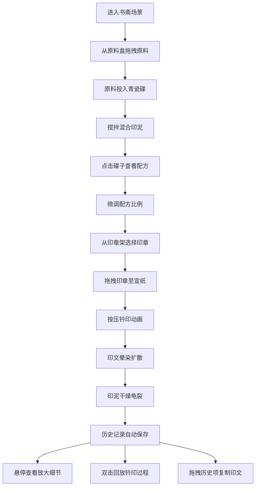

## 1. 产品概述

古代印泥调制与钤印拓片效果模拟 Web 应用，让用户体验明代文人书斋中调配朱砂印泥、试印并观察拓片在不同纸张材质上的渗透与干燥效果。通过高度还原的视觉和交互体验，传承中华传统篆刻艺术。

- 核心价值：将传统文房四宝艺术数字化，提供沉浸式的印泥调制与钤印体验
- 目标用户：篆刻爱好者、传统文化学习者、艺术创作者

## 2. 核心功能

### 2.1 功能模块

1. **印泥调制模块**：从原料架拖拽朱砂、艾绒、蓖麻油到青瓷碟中混合，实时显示配方比例，支持搅拌动画和比例微调
2. **钤印操作模块**：从印章架选择印章（篆书白文/朱文），拖拽至宣纸上按压，模拟印章凹陷和印泥转移动画
3. **拓片展示模块**：根据印泥配方和按压力度计算渲染拓片颜色深浅、晕染扩散和干燥龟裂效果
4. **历史记录模块**：时间轴展示钤印历史，支持回放动画和复制印文
5. **放大镜模块**：鼠标悬停印文显示局部细节，清晰展示龟裂纹理

### 2.2 页面详情

| 页面名称 | 模块名称 | 功能描述 |
|----------|----------|----------|
| 主界面 | 标题栏 | 置顶固定，深色背景，楷体标题，高60px |
| 主界面 | 印章架 | 左侧35%区域，紫檀木三层印章架，每层三枚不同材质印章 |
| 主界面 | 书案区域 | 中间50%区域，花梨木书案，青瓷碟，青花小匙，宣纸 |
| 主界面 | 原料架 | 右侧15%区域，三只抽屉状原料盒（朱砂、艾绒、蓖麻油） |
| 主界面 | 历史面板 | 底部可折叠，默认展开200px，时间轴展示50条记录 |
| 主界面 | 配方面板 | 点击青瓷碟弹出，显示精确配方比例，滑块微调 |
| 主界面 | 放大镜 | 鼠标悬停印文时显示，直径80px，2倍放大 |

## 3. 核心流程

用户进入应用后，首先从右侧原料盒拖拽原料到青瓷碟中调制印泥，通过搅拌获得均匀的正红色印泥。然后从左侧印章架选择一枚印章，拖拽到下方宣纸上按压钤印。钤印后印文逐渐干燥，产生龟裂效果。用户可重复钤印多枚印章，所有操作记录在历史面板中，支持回放和复制。

## 4. 用户界面设计

### 4.1 设计风格

- **主色调**：暖黄色 #f5efdf（仿古宣纸色），花梨木 #a0764a，紫檀木 #5d3a1a
- **强调色**：朱砂红 #c41e3a、青瓷绿 #c4d4c0、青花蓝 #2a5a7a
- **原料标识**：朱砂 #d32f2f、艾绒 #4caf50、蓖麻油 #ffc107
- **字体**：标题使用楷体，正文使用优雅的衬线字体，体现文人气质
- **材质效果**：磨砂玻璃（backdrop-filter: blur(8px)）、木纹纹理、纸质纤维纹理
- **动画风格**：自然缓动（ease-out 开头、ease-in 结尾），过渡时间 0.2-0.6 秒

### 4.2 页面设计概述

| 页面名称 | 模块名称 | UI 元素 |
|----------|----------|----------|
| 主界面 | 标题栏 | 深色背景 #2c1810，白色楷体字，高度60px，居中标题"文房印韵" |
| 主界面 | 印章架 | 半透明磨砂玻璃背景，三层共9枚印章，不同材质颜色，顶部钮式雕刻 |
| 主界面 | 书案 | 花梨木纹理，中央圆形青瓷碟，碟边青花小匙，下方宣纸 |
| 主界面 | 原料盒 | 抽屉式设计，不同色标区分，内部原料动态效果（粉末晃动、纤维、油液流动） |
| 主界面 | 宣纸 | 米白色 #f5efdf，棉纤维纹理，可响应缩放，最小800x600px |
| 主界面 | 历史面板 | 时间轴布局，每项缩略图显示印文、配方、位置，双击回放 |
| 主界面 | 配方面板 | 半透明弹出层，精确数值显示，滑块调节，实时预览 |

### 4.3 响应式设计

- **桌面端（>1024px）**：左右布局，左侧35%印章架，中间50%书案，右侧15%原料盒
- **平板/移动端（≤1024px）**：纵向布局，宣纸纵向铺满，印章架和原料盒横向排列
- **触摸优化**：拖拽区域扩大20px，按压手势识别，双指缩放支持

### 4.4 视觉特效指导

- **环境氛围**：柔和暖光，模拟古代书房油灯照明效果
- **材质表现**：青瓷碟半透明质感，印泥油亮高光，印章石材质感
- **光影设置**：自然光从左上方45度入射，物体投影自然柔和
- **交互动画**：拖拽时缩放+阴影，目标区域高亮闪烁，按压时凹陷位移
- **粒子效果**：朱砂粉尘飘散、油膜涟漪、纤维缠绕纹理
