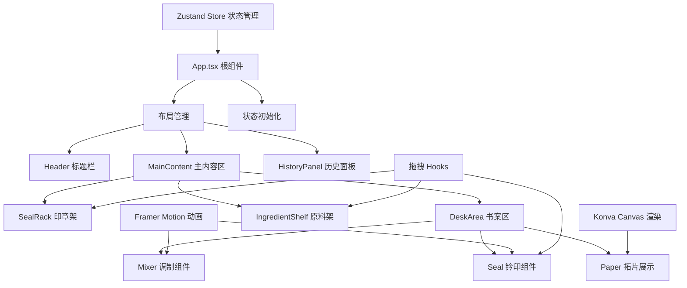

## 1. 架构设计

纯前端单页应用，采用组件化架构，状态集中管理，Canvas 负责高性能渲染。



## 2. 技术描述

- **前端框架**：React 18 + TypeScript 5 + Vite 5
- **构建工具**：Vite 5，@vitejs/plugin-react
- **状态管理**：Zustand 4，集中管理印泥配方、印章状态、钤印历史
- **动画库**：Framer Motion 11，负责组件过渡、拖拽动画、按压效果
- **图形渲染**：Konva 9 + react-konva，高性能 Canvas 渲染拓片、龟裂纹、放大细节
- **拖拽交互**：自定义 useDrag Hook，基于 Pointer Events 实现跨端拖拽
- **样式方案**：CSS Modules + CSS Variables，零第三方 UI 库

## 3. 目录结构

```
src/
├── App.tsx                    # 根组件，布局管理
├── main.tsx                   # 入口文件
├── index.css                  # 全局样式，CSS 变量定义
├── components/
│   ├── Header.tsx             # 标题栏组件
│   ├── SealRack.tsx           # 印章架组件
│   ├── DeskArea.tsx           # 书案区域组件
│   ├── Mixer.tsx              # 印泥调制组件
│   ├── Seal.tsx               # 钤印组件
│   ├── Paper.tsx              # 拓片展示组件
│   ├── IngredientShelf.tsx    # 原料架组件
│   ├── IngredientBox.tsx      # 单个原料盒
│   ├── HistoryPanel.tsx       # 历史面板组件
│   ├── HistoryItem.tsx        # 历史记录项
│   ├── FormulaPanel.tsx       # 配方面板
│   ├── Magnifier.tsx          # 放大镜组件
│   └── SealItem.tsx           # 单个印章
├── store/
│   └── useStore.ts            # Zustand 状态管理
├── hooks/
│   ├── useDrag.ts             # 拖拽 Hook
│   ├── useSealStamp.ts        # 钤印逻辑 Hook
│   ├── useInkMixing.ts        # 印泥混合逻辑 Hook
│   └── useDryingSimulation.ts # 干燥模拟 Hook
├── utils/
│   ├── colorUtils.ts          # 颜色计算工具
│   ├── crackGenerator.ts      # 龟裂生成器
│   ├── formulaUtils.ts        # 配方计算工具
│   └── animationUtils.ts      # 动画工具函数
└── types/
    └── index.ts               # TypeScript 类型定义
```

## 4. 数据模型

### 4.1 核心类型定义

```typescript
// 原料类型
interface Ingredient {
  id: 'cinnabar' | 'moxa' | 'castorOil';
  name: string;
  color: string;
  amount: number;       // 剩余量
  unit: string;         // g / ml
}

// 印泥配方
interface InkFormula {
  cinnabar: number;     // 朱砂克数
  moxa: number;         // 艾绒克数
  castorOil: number;    // 蓖麻油毫升数
  mixed: boolean;       // 是否混合均匀
  color: string;        // 当前颜色
}

// 印章类型
interface Seal {
  id: string;
  name: string;
  material: 'shoushan' | 'qingtian' | 'balin';
  materialColor: string;
  knobType: 'chihu' | 'shuangshi' | 'panlong';
  scriptType: 'baiwen' | 'zhuwen';  // 白文/朱文
  characters: string;   // 篆字内容
  svgPath: string;      // 印面 SVG 路径
}

// 钤印记录
interface StampRecord {
  id: string;
  timestamp: number;
  seal: Seal;
  formula: InkFormula;
  position: { x: number; y: number };
  pressure: number;     // 按压力度 0-1
  color: string;
  diffusionRadius: number;
  dryProgress: number;  // 干燥进度 0-1
  crackDensity: number;
  cracks: Crack[];
}

// 龟裂纹
interface Crack {
  id: string;
  points: { x: number; y: number }[];
  width: number;
  opacity: number;
}
```

### 4.2 Store 状态定义

```typescript
interface AppState {
  // 原料库存
  ingredients: Record<string, Ingredient>;
  // 当前配方
  currentFormula: InkFormula;
  // 印章列表
  seals: Seal[];
  // 选中的印章
  selectedSeal: Seal | null;
  // 钤印记录
  stampRecords: StampRecord[];
  // 正在回放的记录ID
  replayingId: string | null;
  // 配方面板是否打开
  formulaPanelOpen: boolean;
  // 干燥速度倍率
  dryingSpeed: number;
  // 操作方法
  addIngredient: (type: string, amount: number) => void;
  mixInk: () => void;
  adjustFormula: (type: string, value: number) => void;
  selectSeal: (seal: Seal | null) => void;
  addStampRecord: (record: StampRecord) => void;
  updateDryProgress: (id: string, progress: number) => void;
  setReplayingId: (id: string | null) => void;
  toggleFormulaPanel: () => void;
  setDryingSpeed: (speed: number) => void;
}
```

## 5. 核心算法

### 5.1 印泥颜色计算

根据三种原料比例计算印泥颜色：

```typescript
// 朱砂比例影响颜色饱和度和色相
// 艾绒比例影响颜色明度
// 蓖麻油比例影响光泽度和透明度
function calculateInkColor(formula: InkFormula): string {
  const total = formula.cinnabar + formula.moxa + formula.castorOil;
  const cinnabarRatio = formula.cinnabar / total;
  const moxaRatio = formula.moxa / total;
  const oilRatio = formula.castorOil / total;
  
  // 基础朱砂红 #c41e3a
  // 混合后颜色在 #c41e3a 到 #8b0000 之间变化
  const lightness = 30 + cinnabarRatio * 20 - moxaRatio * 10;
  const saturation = 70 + cinnabarRatio * 20 - oilRatio * 10;
  return `hsl(350, ${saturation}%, ${lightness}%)`;
}
```

### 5.2 晕染扩散计算

根据蓖麻油比例计算晕染半径：

```typescript
function calculateDiffusion(castorOilRatio: number): number {
  // 油多则扩散大，范围 3-9px
  return 3 + castorOilRatio * 6;
}
```

### 5.3 龟裂纹生成

使用分形算法生成随机龟裂纹：

```typescript
function generateCracks(
  centerX: number, 
  centerY: number, 
  radius: number, 
  density: number
): Crack[] {
  const cracks: Crack[] = [];
  const crackCount = Math.floor(density * 15);
  
  for (let i = 0; i < crackCount; i++) {
    const angle = (Math.PI * 2 * i) / crackCount + Math.random() * 0.5;
    const startR = radius * 0.3;
    const points: { x: number; y: number }[] = [];
    
    let x = centerX + Math.cos(angle) * startR;
    let y = centerY + Math.sin(angle) * startR;
    points.push({ x, y });
    
    for (let j = 0; j < 5; j++) {
      x += Math.cos(angle + (Math.random() - 0.5)) * (radius * 0.15);
      y += Math.sin(angle + (Math.random() - 0.5)) * (radius * 0.15);
      points.push({ x, y });
    }
    
    cracks.push({
      id: `crack-${i}`,
      points,
      width: 0.5 + Math.random() * 1.5,
      opacity: 0.3 + Math.random() * 0.4,
    });
  }
  
  return cracks;
}
```

## 6. 性能优化策略

1. **Canvas 分层渲染**：宣纸背景层、印文层、龟裂纹层分离，仅重绘变化层
2. **对象池复用**：钤印 Canvas 元素复用，避免频繁创建销毁
3. **requestAnimationFrame 批量更新**：干燥动画和龟裂效果批量计算
4. **虚拟滚动**：历史面板超过20条时启用虚拟滚动
5. **节流防抖**：拖拽位置更新节流（16ms），配方滑块防抖（50ms）
6. **GPU 加速**：CSS transform 和 opacity 动画启用硬件加速
7. **离屏 Canvas**：龟裂纹预渲染到离屏 Canvas，直接贴图
