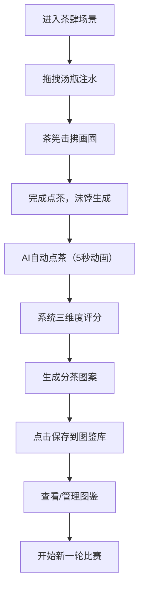

## 1. 产品概述

本项目是一款模拟宋代建安斗茶文化的全栈Web应用，让用户以第一人称视角体验古代点茶、击拂、分茶的完整流程，与AI对手进行茶艺竞技。

- 核心价值：通过沉浸式交互体验传承宋代茶文化，将传统点茶技艺数字化、游戏化
- 目标用户：茶文化爱好者、古风文化爱好者、休闲游戏玩家

## 2. 核心特性

### 2.1 用户角色

| 角色 | 注册方式 | 核心权限 |
|------|----------|----------|
| 普通用户 | 无需注册 | 体验斗茶比赛、保存分茶图案、查看图鉴库 |

### 2.2 功能模块

1. **斗茶主场景**：宋代茶肆CSS绘制、茶具交互（建盏、汤瓶、茶筅）、注水击拂操作
2. **AI对战系统**：AI自动点茶、三维度评分（色泽、持久度、咬盏）、动态分数条展示
3. **分茶系统**：Canvas随机图案生成、图案保存、图鉴库管理
4. **图鉴展示**：缩略图网格、放大预览、诗词题跋

### 2.3 页面详情

| 页面名称 | 模块名称 | 功能描述 |
|----------|----------|----------|
| 主比赛页 | 茶肆场景 | CSS绘制宋代茶肆，竹帘、木格窗、挂轴、黑漆茶案 |
| 主比赛页 | 茶具交互 | 汤瓶注水拖拽、茶筅击拂画圈操作 |
| 主比赛页 | 沫饽动画 | 粒子系统模拟乳白色泡沫，随击拂速度变化 |
| 主比赛页 | 评分系统 | 动态分数条，金色到红色渐变动画 |
| 主比赛页 | 分茶图案 | Canvas绘制松鹤/双蝶/山水/兰竹，白色线条渐变浮现 |
| 侧边栏 | 图鉴库 | 5列缩略图网格，点击放大显示诗词题跋 |

## 3. 核心流程

用户先手操作点茶（注水→击拂），AI后手自动完成，双方完成后系统评分，生成分茶图案，可保存至图鉴库。

## 4. 用户界面设计

### 4.1 设计风格

- **主色调**：暖黄色 `#f5e6d3` 为底，深色茶案 `#2a1a0e` 形成对比
- **建盏**：深褐 `#3a2010` 到金褐 `#c49a3c` 径向渐变模拟兔毫纹
- **汤瓶**：青瓷色 `#7b9a6b`，冰裂纹质感
- **茶筅**：竹黄色 `#d4a76a`，12根帚丝
- **沫饽**：乳白 `#f0d4a0` 到 `#f5f0e0` 渐变
- **分数条**：金色 `#c49a3c` 到红色 `#c0392b` 渐变
- **字体**：标题使用书法感衬线字体，正文使用楷体，墨色 `#2a1a0e`
- **交互效果**：悬停加亮10%，点击弹性缩放动画（scale 0.95→1.0，200ms）

### 4.2 页面设计概述

| 页面名称 | 模块名称 | UI元素 |
|----------|----------|--------|
| 主比赛页 | 茶肆背景 | 竹帘半卷、木格窗棂透入暖光、文人挂轴、暖色调氛围 |
| 主比赛页 | 茶案区域 | 中央黑漆茶案 `#2a1a0e`，建盏、汤瓶、茶筅呈三角形摆放 |
| 主比赛页 | 操作交互 | 汤瓶拖拽注水（角度控制水流，水花粒子），茶筅画圈击拂 |
| 主比赛页 | 评分面板 | 茶案两侧动态分数条，1秒动画从0滚动至最终分数 |
| 主比赛页 | 分茶Canvas | 沫饽上浮现图案，2秒动画，线条粗2px，透明度0→0.7 |
| 侧边栏 | 图鉴库 | 5列80x80px缩略图网格，点击放大320x320px，配诗词题跋 |

### 4.3 响应式设计

- **桌面端**：主比赛区 + 右侧图鉴区 flex 布局
- **移动端**（<768px）：图鉴区折叠为底部抽屉，点击图标展开
- **触摸优化**：注水和击拂操作支持触摸拖拽

### 4.4 动画与性能

- **60fps目标**：沫饽粒子系统使用 requestAnimationFrame
- **加载优化**：首屏加载 <2秒，CSS绘制替代图片资源
- **动画流畅度**：分值条动画、图案生成无明显延迟
