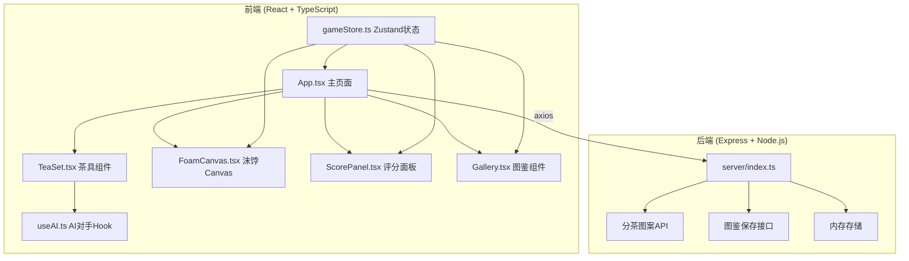
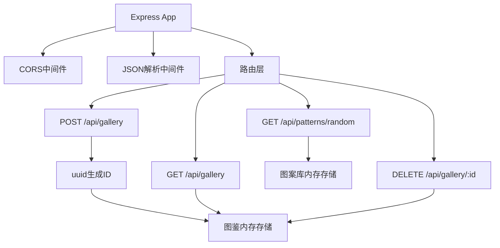
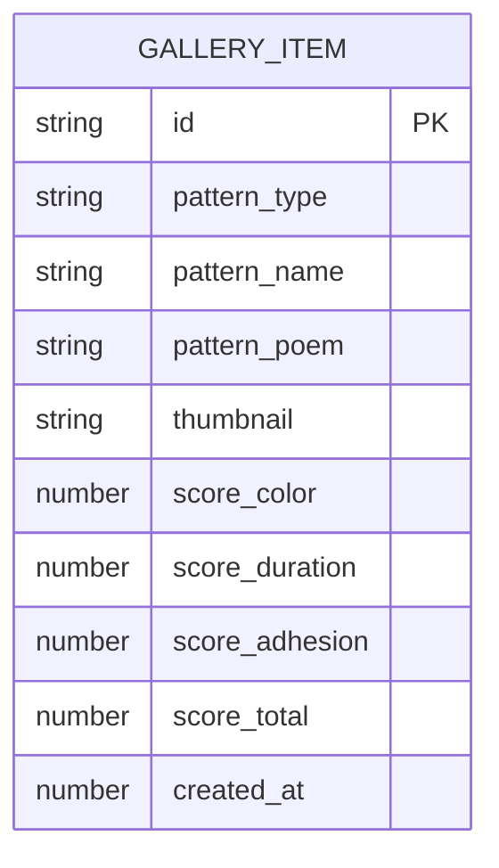

## 1. 架构设计



## 2. 技术栈说明

- **前端框架**：React 18 + TypeScript
- **构建工具**：Vite 5 + @vitejs/plugin-react
- **路由**：react-router-dom
- **状态管理**：zustand
- **动画库**：framer-motion
- **特效**：canvas-confetti
- **HTTP客户端**：axios
- **后端**：Express 4
- **后端依赖**：cors、uuid
- **开发脚本**：`npm run dev` 同时启动前后端

## 3. 路由定义

| 路由 | 用途 |
|------|------|
| `/` | 主比赛页面，包含茶肆场景、茶具交互、评分面板、图鉴库 |

## 4. API 定义

```typescript
// 分茶图案数据结构
interface TeaPattern {
  id: string;
  type: 'pine_crane' | 'butterflies' | 'landscape' | 'orchid_bamboo';
  name: string;
  poem: string;
  paths: Array<{ points: number[][]; strokeWidth: number }>;
}

// 图鉴条目
interface GalleryItem {
  id: string;
  pattern: TeaPattern;
  thumbnail: string; // base64 data URL
  createdAt: number;
  roundScore: {
    color: number;
    duration: number;
    adhesion: number;
    total: number;
  };
}

// GET /api/patterns/random - 获取随机分茶图案
// Response: TeaPattern

// POST /api/gallery - 保存图鉴条目
// Request: Omit<GalleryItem, 'id' | 'createdAt'>
// Response: GalleryItem

// GET /api/gallery - 获取所有图鉴条目
// Response: GalleryItem[]

// DELETE /api/gallery/:id - 删除图鉴条目
// Response: { success: boolean }
```

## 5. 服务端架构图



## 6. 数据模型

### 6.1 数据模型定义



### 6.2 状态管理 (gameStore)

```typescript
interface GameState {
  // 回合状态
  currentRound: number;
  phase: 'idle' | 'pouring' | 'whisking' | 'user_done' | 'ai_playing' | 'scoring' | 'pattern_showing';
  
  // 用户操作数据
  waterAmount: number;
  whiskSpeed: number;
  whiskDuration: number;
  
  // 沫饽数据
  foamThickness: number;
  foamColor: number; // 0-100 白度
  foamDuration: number; // 秒
  foamAdhesion: number; // 0-100 咬盏程度
  
  // 评分
  userScore: { color: number; duration: number; adhesion: number; total: number };
  aiScore: { color: number; duration: number; adhesion: number; total: number };
  
  // 图鉴
  gallery: GalleryItem[];
  currentPattern: TeaPattern | null;
  
  // Actions
  startRound: () => void;
  setWaterAmount: (amount: number) => void;
  setWhiskData: (speed: number, duration: number) => void;
  calculateFoam: () => void;
  calculateUserScore: () => void;
  setAiScore: (score: typeof userScore) => void;
  setCurrentPattern: (pattern: TeaPattern) => void;
  saveToGallery: (item: Omit<GalleryItem, 'id' | 'createdAt'>) => void;
  clearRound: () => void;
}
```

### 6.3 前端性能优化

- **Canvas 渲染**：使用 requestAnimationFrame 进行沫饽粒子系统更新
- **对象池**：粒子对象复用，避免频繁 GC
- **节流**：鼠标移动事件节流，减少重绘
- **CSS 优化**：transform 和 opacity 动画，避免 layout thrashing
- **代码分割**：按需加载非核心组件
