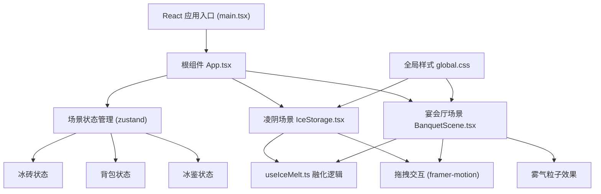
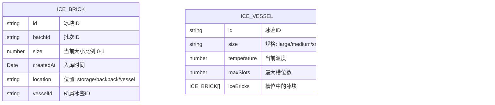

## 1. 架构设计



## 2. 技术描述

* 前端：React 18 + TypeScript + Vite

* 状态管理：zustand

* 动画库：framer-motion

* 样式：原生CSS + CSS变量

* 初始化工具：vite-init

## 3. 路由定义

| 路由 | 用途                |
| -- | ----------------- |
| /  | 主游戏界面（单页应用，无路由切换） |

## 4. 数据模型

### 4.1 数据模型定义



### 4.2 TypeScript 类型定义

```typescript
interface IceBrick {
  id: string;
  batchId: string;
  size: number;
  createdAt: number;
  location: 'storage' | 'backpack' | 'vessel';
  vesselId?: string;
}

interface IceVessel {
  id: string;
  size: 'large' | 'medium' | 'small';
  temperature: number;
  maxSlots: number;
  iceBricks: IceBrick[];
}

interface GameState {
  iceBricks: IceBrick[];
  vessels: IceVessel[];
  currentScene: 'storage' | 'banquet';
  usedCount: number;
  totalMeltLoss: number;
}
```

## 5. 项目结构

```
src/
├── main.tsx          # React应用入口
├── App.tsx           # 主组件，场景切换，全局状态
├── components/
│   ├── IceStorage.tsx    # 凌阴冰砖堆管理
│   └── BanquetScene.tsx # 宴会厅冰鉴界面
├── hooks/
│   └── useIceMelt.ts   # 冰块融化逻辑hook
├── store/
│   └── useGameStore.ts # zustand状态管理
└── styles/
    └── global.css      # 全局样式
```

## 6. 核心技术点

### 6.1 拖拽系统

* 使用framer-motion的drag特性实现冰砖拖拽

* 拖拽时冰砖跟随鼠标并缩放至80%

* 放置时检测目标区域（背包/冰鉴槽位）

### 6.2 粒子系统

* Canvas实现雾气升腾效果

* 粒子直径2-4px，白色半透明

* 升腾速度0.5单位/秒

* 帧率控制在45fps以上

### 6.3 融化系统

* useIceMelt hook 每帧更新冰块大小

* 每5分钟缩小5%

* 小于20%时自动消失并触发水花声

### 6.4 声效系统

* Web Audio API实现水滴声和水花声

* 放置冰砖触发水滴声

* 冰块消失触发水花声

