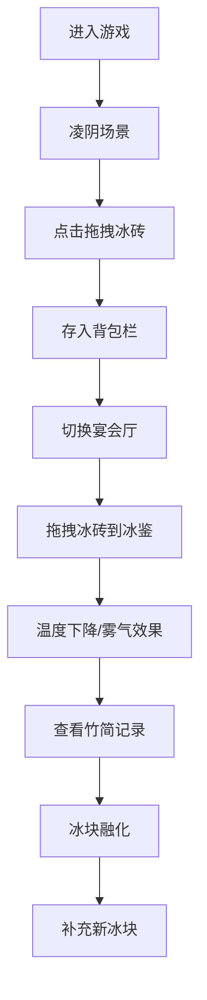

## 1. 产品概述
古代冰鉴储冰与食品冰镇管理互动游戏，让用户扮演周代凌人（掌冰官员），管理冰窖中冬季采储的冰块，调配冰块到不同规格的青铜冰鉴中，为王室宴会提供冰镇酒水和瓜果，并监测冰块的融化和损耗。

- 目标用户：对古代文化、历史互动游戏感兴趣的用户
- 产品价值：通过沉浸式互动体验，让用户了解古代冰鉴文化，同时提供策略性的资源管理玩法

## 2. 核心功能

### 2.1 用户角色
| 角色 | 注册方式 | 核心权限 |
|------|----------|----------|
| 凌人 | 无需注册 | 管理冰窖、调配冰块、监测冰鉴温度 |

### 2.2 功能模块
1. **凌阴场景**：冰砖堆管理，拖拽取冰存入背包
2. **宴会厅场景**：冰鉴放置冰块，温度计算与雾气效果
3. **竹简信息面板**：记录冰块批次、融化状态、损耗统计
4. **背包系统**：存储取出的冰块，最多10块
5. **冰块融化系统**：实时模拟冰块融化过程

### 2.3 页面详情
| 页面名称 | 模块名称 | 功能描述 |
|---------|----------|----------|
| 主界面 | 凌阴场景 | 6x5冰砖堆，点击拖拽取冰，水珠凝结动画 |
| 主界面 | 宴会厅场景 | 三组青铜冰鉴（大/中/小），拖拽放冰，温度显示，雾气粒子效果 |
| 主界面 | 竹简面板 | 冰块批次记录、入库时间、当前大小、使用数量、损耗率 |
| 主界面 | 背包栏 | 右下角背包，最多容纳10块冰砖 |

## 3. 核心流程
用户进入游戏 → 凌阴场景点击冰砖 → 拖拽冰砖到背包 → 切换到宴会厅场景 → 从背包拖拽冰砖到冰鉴槽位 → 监测温度变化和雾气效果 → 查看竹简面板记录冰块信息 → 冰块随时间融化 → 补充新冰块

## 4. 用户界面设计

### 4.1 设计风格
- 主色调：青铜锈色#5d7a5a、竹简色#d4c5a9、朱砂红#c0392b
- 背景：石砌地窖#4a4a4a、青砖地面#6b7b6b、麻布纹理
- 交互元素：悬停放大1.1倍加微光，点击压缩反馈
- 字体：思源宋体
- 布局：左侧70%主操作区，右侧30%信息面板，竹节纹样分隔

### 4.2 页面设计概述
| 页面名称 | 模块名称 | UI元素 |
|---------|----------|---------|
| 主界面 | 凌阴场景 | 30块半透明浅蓝色冰砖，水珠闪烁动画，拖拽跟随效果 |
| 主界面 | 宴会厅场景 | 朱漆食案#8b4513，三组青铜冰鉴，温度数值显示，白色雾气粒子 |
| 主界面 | 竹简面板 | 竹简纹理背景，冰块批次列表，损耗统计图表 |
| 主界面 | 背包栏 | 右下角10格背包，水滴声效，放置动画 |

### 4.3 响应式
- 桌面端：左右两栏布局（70%/30%）
- 宽度小于900px：右侧面板收窄为底部抽屉式，汉堡菜单弹出
- 触屏设备：优化拖拽触控体验

### 4.4 性能要求
- 冰砖拖拽响应时间低于50ms
- 粒子效果帧率稳定在45fps以上
- 冰块融化计算每帧更新
