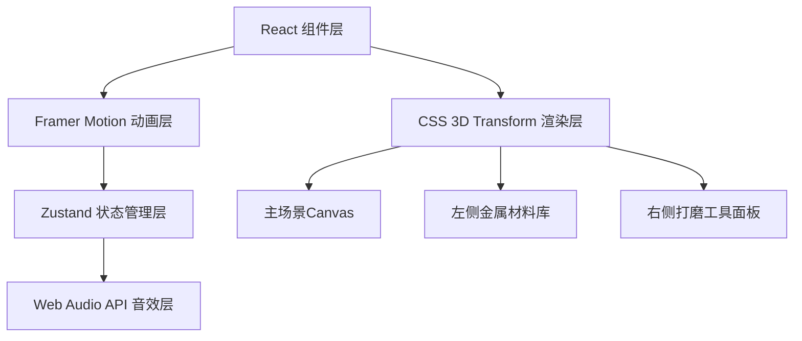

## 1. 架构设计



## 2. 技术描述

- **前端框架**：React 18 + TypeScript + Vite
- **状态管理**：Zustand 4.x
- **动画库**：Framer Motion 11.x
- **音效引擎**：Web Audio API 原生实现
- **3D渲染**：CSS 3D Transform
- **唯一ID生成**：uuid 9.x

**技术栈选择理由**：
- React 18 提供并发渲染，保证 55fps 以上的流畅交互
- Zustand 轻量级状态管理，减少渲染开销
- Framer Motion 处理复杂拖拽动画链，支持触摸设备
- Web Audio API 合成金属摩擦、磨石、火焰三种音效，无需外部音频文件

## 3. 路由定义

| 路由 | 用途 |
|------|------|
| / | 主工坊页面，包含全部交互功能 |

## 4. 数据模型

### 4.1 核心类型定义

```typescript
enum MetalType {
  GOLD = 'gold',
  SILVER = 'silver',
  COPPER = 'copper'
}

enum BurnishGrade {
  COARSE = 100,
  MEDIUM = 400,
  FINE = 1000
}

interface BlockConfig {
  id: string;
  name: string;
  metal: MetalType | null;
  burnishGrade: BurnishGrade | null;
  brightness: number;
  isBurned: boolean;
  clipPath: string;
  position: { top: string; left: string; width: string; height: string };
}

interface ProjectState {
  blocks: BlockConfig[];
  isBurning: boolean;
  isAutoDemo: boolean;
  currentDemoIndex: number;
  rotation: number;
  scale: number;
}

const COMBINE_COLORS: Record<MetalType, string> = {
  [MetalType.GOLD]: '#ffd700',
  [MetalType.SILVER]: '#c0c0c0',
  [MetalType.COPPER]: '#b87333'
};

const BLOCK_NAMES: string[] = [
  '盖顶蟠螭纹',
  '肩部窃曲纹',
  '腹部云雷纹',
  '圈足垂鳞纹',
  '双耳兽面纹',
  '提梁弦纹'
];
```

### 4.2 Zustand Store 设计

```typescript
interface StoreState {
  blocks: BlockConfig[];
  selectedBlockId: string | null;
  isBurning: boolean;
  isAutoDemo: boolean;
  currentDemoIndex: number;
  rotation: number;
  scale: number;
  projectHistory: ProjectState[];
  
  setBlockMetal: (blockId: string, metal: MetalType) => void;
  setBlockBurnish: (blockId: string, grade: BurnishGrade, brightness: number) => void;
  selectBlock: (blockId: string | null) => void;
  startBurning: () => void;
  finishBurning: () => void;
  startAutoDemo: () => void;
  stopAutoDemo: () => void;
  setRotation: (rotation: number) => void;
  setScale: (scale: number) => void;
  saveProject: () => void;
  loadProject: (state: ProjectState) => void;
}
```

## 5. 文件结构

```
src/
├── types.ts              # 类型定义与常量
├── store.ts              # Zustand 全局状态
├── App.tsx               # 主布局组件
├── main.tsx              # 入口文件
├── index.css             # 全局样式
├── components/
│   ├── CenterCanvas.tsx  # 中央铜壶3D场景
│   ├── LeftPanel.tsx     # 左侧金属材料库
│   ├── RightPanel.tsx    # 右侧打磨工具面板
│   ├── Header.tsx        # 顶部标题栏
│   ├── BronzePot.tsx     # 铜壶组件
│   ├── DecorationBlock.tsx # 纹饰区块组件
│   ├── MetalBar.tsx      # 金属条组件
│   └── BurnishStone.tsx  # 磨石组件
└── hooks/
    └── useSoundEngine.ts # Web Audio API 音效 Hook
```

## 6. 性能优化策略

1. **组件拆分**：每个纹饰区块独立组件，局部更新避免全局重渲染
2. **Memo优化**：使用 React.memo 包装纯展示组件
3. **动画优化**：Framer Motion 使用 transform 而非 layout 属性
4. **拖拽计算**：requestAnimationFrame 优化吸附计算，延迟控制在 50ms 以内
5. **状态粒度**：Zustand 使用 selectors 精确订阅所需状态
6. **CSS优化**：使用 will-change 和 transform 提升渲染性能
7. **帧率监控**：保证动画帧间隔 ≤16ms，刷新率 ≥55fps
