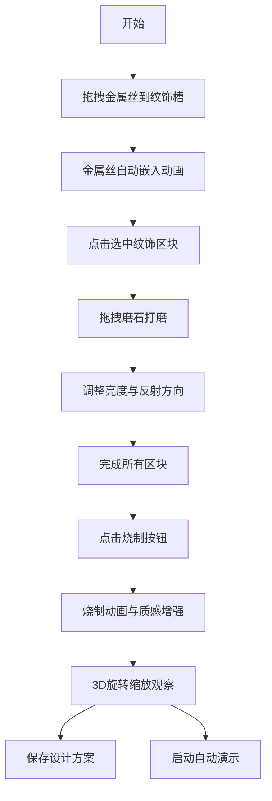

## 1. 产品概述

古代错金银纹饰设计工坊是一款在浏览器中模拟传统金属装饰工艺的交互应用，解决匠人在动手前难以直观预览和反复调整不同金属材料镶嵌效果的问题。

- **核心目标**：为传统工艺爱好者和匠人提供数字化的错金银纹饰设计与预览工具
- **目标用户**：文物修复师、传统工艺匠人、工艺美术学习者
- **市场价值**：传承非物质文化遗产，降低传统工艺学习成本，提升设计效率

## 2. 核心功能

### 2.1 用户角色
| 角色 | 注册方式 | 核心权限 |
|------|----------|----------|
| 普通用户 | 无需注册 | 使用全部设计功能、保存/加载设计方案 |

### 2.2 功能模块
1. **主场景**：虚拟战国青铜器作坊，3D铜壶展示，纹饰区块交互
2. **金属材料库**：金、银、红铜三种金属丝拖拽嵌入
3. **打磨工具面板**：100/400/1000目磨石，从哑光到镜面的渐变打磨
4. **烧制系统**：一键烧制，增强金属质感与氧化效果
5. **存档读档**：JSON格式的设计方案保存与恢复
6. **自动演示**：5个经典错金银器物的自动演示流程

### 2.3 页面详情
| 页面名称 | 模块名称 | 功能描述 |
|----------|----------|----------|
| 主工坊 | 3D铜壶场景 | 可旋转缩放的铜壶，6个纹饰区块点击交互 |
| 主工坊 | 左侧金属材料库 | 拖拽金属丝到纹饰槽，自动弯曲贴合动画 |
| 主工坊 | 右侧打磨工具面板 | 拖拽不同目数磨石到选中区块，动态改变亮度和反射方向 |
| 主工坊 | 烧制按钮 | 触发烧制动画，增强金属对比度和饱和度 |
| 主工坊 | 存档/读档按钮 | JSON格式导出导入设计方案 |
| 主工坊 | 演示/停止按钮 | 5个经典器物的自动演示流程控制 |

## 3. 核心流程

用户从金属材料库拖拽金属丝到铜壶表面的纹饰槽中，金属丝自动沿槽路径弯曲嵌入。点击选中纹饰区块后，从右侧面板拖拽磨石进行打磨，通过不同目数磨石控制金属表面亮度。完成所有区块后点击烧制按钮，触发烧制动画增强金属质感。用户可360度旋转和缩放铜壶观察最终效果，随时保存或加载设计方案，或启动自动演示观看经典器物的制作流程。

## 4. 用户界面设计

### 4.1 设计风格
- **主色调**：暖木色 #7a5a3a 与冷青铜色 #4a2e1b 形成对比，背景土黄色 #d4a76a
- **点缀色**：金色 #ffd700、银色 #c0c0c0、红铜色 #b87333
- **按钮样式**：圆角矩形配微妙阴影，悬停放大与脉冲动画
- **字体**：使用 "Ma Shan Zheng" 书法字体作为标题，"Noto Serif SC" 作为正文，营造古典氛围
- **布局风格**：左中右三栏布局，侧边面板可折叠，中央铜壶为视觉焦点
- **图标风格**：线性简约图标，融合青铜器纹饰元素

### 4.2 页面设计概述
| 页面名称 | 模块名称 | UI 元素 |
|----------|----------|----------|
| 主工坊 | 3D铜壶场景 | CSS 径向渐变锈蚀质感，6个纹饰区块用 clip-path 勾勒 |
| 主工坊 | 左侧金属材料库 | 立体金属条带线性渐变光泽，拖拽吸附辅助线 |
| 主工坊 | 右侧打磨工具面板 | 三种目数磨石的灰度渐变，进度条显示打磨程度 |
| 主工坊 | 烧制按钮 | 半透明圆形火苗图标，悬停脉冲闪烁 |
| 主工坊 | 存档读档按钮 | 古典卷轴样式按钮 |
| 主工坊 | 演示按钮 | 橙黄色圆角矩形，悬停高亮 |

### 4.3 响应性
- 桌面端优先设计，左侧和右侧面板各占15%宽度，中央铜壶占50%
- 面板可折叠隐藏，点击侧边三角按钮实现平滑动画
- 支持触摸设备拖拽交互，适配移动设备触控
- 拖拽时显示吸附对齐辅助线（半透明白色虚线）
- 有效拖入区域显示绿色高亮边框，无效区域红色闪烁警告

### 4.4 3D场景指引
- **环境**：虚拟战国青铜器作坊，青石地面 #7a8a7a，土墙背景 #d4a76a，木案 #7a5a3a
- **光照**：暖色调环境光，铜壶表面使用径向渐变模拟金属锈蚀质感
- **相机**：绕Y轴旋转0-360度，滚轮缩放1-3倍
- **交互**：鼠标拖拽旋转，滚轮缩放，点击选中区块
- **动画**：金属嵌入0.8秒动画，烧制3秒红光动画，打磨亮度渐变动画
- **后期**：金属高光渐变，烧制后对比度+20%，饱和度+15%，边缘氧化线
