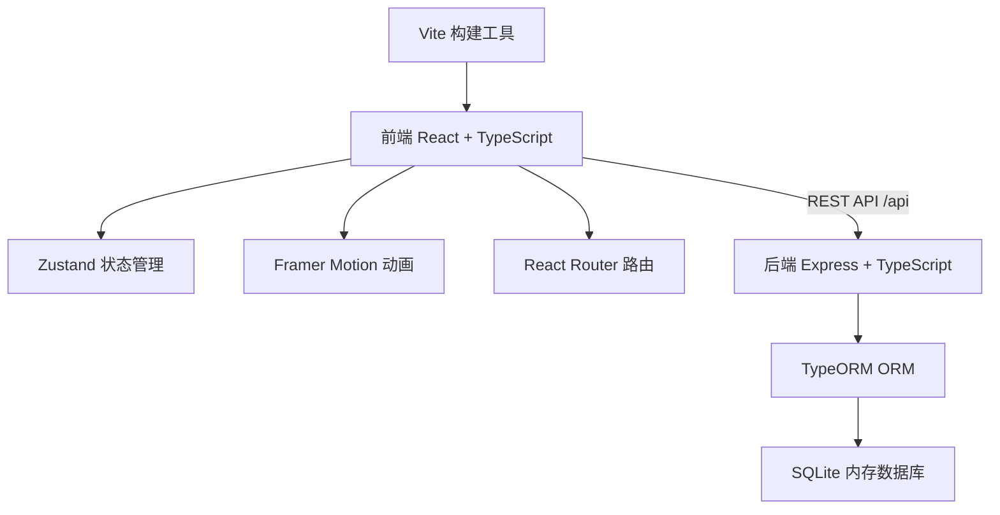
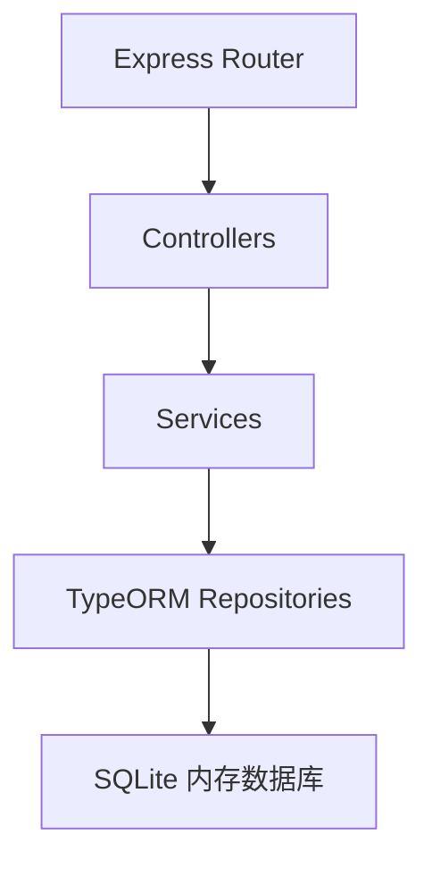
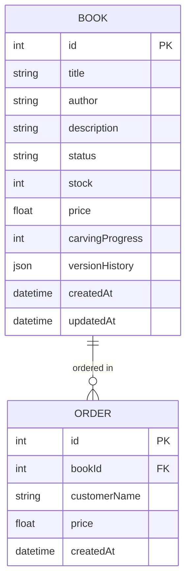

## 1. 架构设计



## 2. 技术描述

* 前端：React\@18 + TypeScript + Vite

* 动画：framer-motion

* 状态管理：zustand

* 路由：react-router-dom

* HTTP客户端：axios

* 后端：Express\@4 + TypeScript

* ORM：TypeORM

* 数据库：SQLite（内存模式，使用sql.js驱动）

* 代理：Vite dev server proxy 将 /api 转发到后端 3001 端口

## 3. 路由定义

| 路由        | 用途                 |
| --------- | ------------------ |
| /         | 重定向到 /workshop     |
| /workshop | 工坊视图 - 刻印工坊场景和书籍管理 |
| /shop     | 店面视图 - 门面柜台和顾客交互   |

## 4. API 定义

### 类型定义

```typescript
type BookStatus = 'pending' | 'carving' | 'completed';

interface Book {
  id: number;
  title: string;
  author: string;
  description: string;
  status: BookStatus;
  stock: number;
  price: number;
  carvingProgress: number;
  versionHistory: string[];
  createdAt: Date;
  updatedAt: Date;
}

interface Customer {
  id: number;
  name: string;
  robeColor: string;
  interestedBookId: number | null;
  status: 'walking_in' | 'browsing' | 'deciding' | 'purchasing' | 'leaving' | 'left';
}

interface Order {
  id: number;
  bookId: number;
  customerName: string;
  price: number;
  createdAt: Date;
}
```

### API 端点

| 方法   | 路径                    | 描述          | 请求体                                   | 响应      |
| ---- | --------------------- | ----------- | ------------------------------------- | ------- |
| GET  | /api/books            | 获取所有书籍列表    | -                                     | Book\[] |
| POST | /api/books            | 创建新书籍       | { title, author, description, price } | Book    |
| PUT  | /api/books/:id/status | 更新书籍状态和刻印进度 | { status, carvingProgress?, stock? }  | Book    |
| POST | /api/orders           | 创建新订单       | { bookId, customerName, price }       | Order   |

## 5. 服务端架构图



## 6. 数据模型

### 6.1 ER 图



### 6.2 TypeORM 实体定义

```typescript
@Entity()
class Book {
  @PrimaryGeneratedColumn()
  id: number;

  @Column()
  title: string;

  @Column()
  author: string;

  @Column('text')
  description: string;

  @Column({ default: 'pending' })
  status: BookStatus;

  @Column({ default: 0 })
  stock: number;

  @Column('float')
  price: number;

  @Column({ default: 0 })
  carvingProgress: number;

  @Column('simple-json', { default: '[]' })
  versionHistory: string[];

  @CreateDateColumn()
  createdAt: Date;

  @UpdateDateColumn()
  updatedAt: Date;
}

@Entity()
class Order {
  @PrimaryGeneratedColumn()
  id: number;

  @ManyToOne(() => Book)
  book: Book;

  @Column()
  bookId: number;

  @Column()
  customerName: string;

  @Column('float')
  price: number;

  @CreateDateColumn()
  createdAt: Date;
}
```

## 7. 项目文件结构

```
auto82/
├── package.json
├── vite.config.js
├── tsconfig.json
├── index.html
└── src/
    ├── server/
    │   └── index.ts          # Express后端 + TypeORM实体 + API
    └── client/
        ├── App.tsx           # 根组件 + Zustand store + 路由
        ├── Workshop.tsx      # 工坊视图
        ├── Shop.tsx          # 店面视图
        └── styles.css        # 全局样式
```

## 8. 性能要求

* 界面动画帧率稳定在 50fps 以上

* 工坊区库存变化的内存占用稳定在 80MB 以内

* 使用 CSS 动画优先，减少 JS 动画开销

* 状态更新批量处理，避免频繁重渲染

