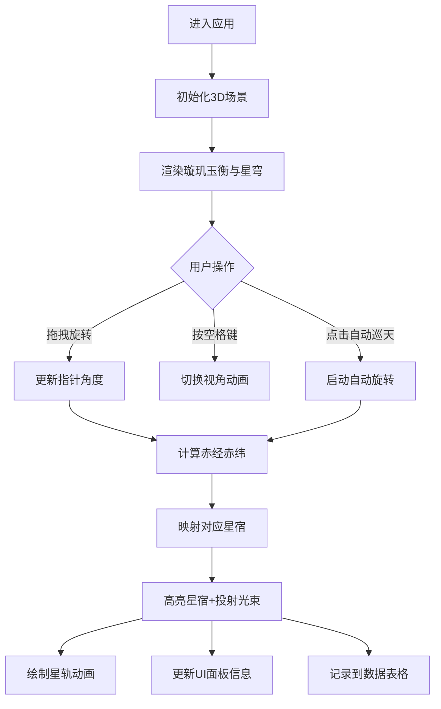

## 1. 产品概述

璇玑玉衡天文模拟系统是一款基于浏览器的3D交互可视化应用，让用户以汉代太史令的视角，在虚拟灵台上操作古代天文仪器"璇玑玉衡"，通过调整玉衡指针锁定特定星宿，实时追踪其在天球上的运行轨迹，并生成对应的星图与节气标注。

- 主要用途：天文教育、历史文化体验、星宿观测模拟
- 目标用户：天文爱好者、历史文化研究者、学生群体
- 产品价值：将古代天文仪器与现代3D技术结合，提供沉浸式的古代天文观测体验

## 2. 核心功能

### 2.1 用户角色

| 角色 | 注册方式 | 核心权限 |
|------|----------|----------|
| 访客用户 | 无需注册 | 完整使用所有观测功能、自动巡天模式、视角切换 |

### 2.2 功能模块

1. **璇玑玉衡3D场景**：环形支架、可旋转玉衡指针、28星宿标记点、名称标签显示、光束投射
2. **天球星轨面板**：半球形穹顶、星点粒子、黄道轨迹曲线、星宿连线、节气标记、粒子流动画
3. **天文计算引擎**：指针角度转赤经赤纬、星宿映射、节气区间计算、亮度等级判定
4. **交互控制面板**：拖拽旋转、视角切换、自动巡天、星宿信息展示、星轨数据表格

### 2.3 页面详情

| 页面名称 | 模块名称 | 功能描述 |
|----------|----------|----------|
| 主观测台 | 3D仪器场景 | 青铜色外环、赤铜色内环、玉色指针、28星宿标记点、悬停显示名称、选中投射光束 |
| 主观测台 | 天球星轨穹顶 | 半透明深蓝色半球、闪烁星点粒子、黄道渐变曲线、节气虚线标记、轨迹动画 |
| 主观测台 | 顶部时间面板 | 汉代二十八宿纪日法显示、当前星宿日、节气后第N日 |
| 主观测台 | 右侧星宿信息面板 | 五行属性符号、亮度等级条状图、所属分野信息 |
| 主观测台 | 底部数据表格 | 最近5个选中星宿的名称、赤经、赤纬、节气对应关系 |
| 主观测台 | 控制按钮 | 自动巡天模式开关、视角切换提示 |

## 3. 核心流程

用户进入应用后，首先看到璇玑玉衡仪器和星轨穹顶。用户可以：

1. 鼠标拖拽旋转玉衡指针（精度0.5度），指针沿环面平滑跟随
2. 指针指向星宿时，该星宿高亮闪烁（2Hz，色温从#ffdd88到#ffffff）
3. 穹顶显示赤经赤纬数字，右侧面板展示星宿详情
4. 自动绘制星宿沿黄道运行至下一个节气的弧形轨迹（3秒动画）
5. 按空格键切换俯视/鸟瞰视角（0.8秒过渡动画）
6. 点击"自动巡天"按钮，指针以每秒3度自动旋转一周（120秒），每经过星宿停顿2秒

## 4. 用户界面设计

### 4.1 设计风格

- **主色调**：暗蓝星空背景 #0a0e1a、青铜色 #b87333、赤铜色 #c49a6c、玉色 #d0e0c0、暗金色 #f5d742、铜绿色 #2e8b57
- **按钮样式**：半透明毛玻璃效果，圆角8px，悬停放大1.05倍，点击动画0.3秒
- **字体**：标题使用具有古典气质的衬线字体，正文使用清晰易读的无衬线字体，数字使用等宽字体
- **布局风格**：桌面端左右分栏（7:3比例），中等屏幕上下布局，移动端居中显示
- **视觉元素**：汉代帛画星象元素、铜绿色发光边缘、拖尾光晕效果、毛玻璃UI面板

### 4.2 页面设计概述

| 页面名称 | 模块名称 | UI元素 |
|----------|----------|--------|
| 主观测台 | 3D仪器场景 | 青铜外环、赤铜内环、玉色指针带拖尾光晕、星宿标记点带悬停标签、选中投射光束到穹顶 |
| 主观测台 | 星轨穹顶 | 半透明深蓝半球、闪烁粒子星点、白到浅金渐变黄道曲线、节气点状虚线、粒子流沿轨迹流逝 |
| 主观测台 | 时间面板 | 左上角半透明面板、古典字体显示"角宿日 雨水后第十日" |
| 主观测台 | 星宿信息面板 | 右侧毛玻璃面板、五行属性彩色圆点、亮度等级横向条状图、分野文字 |
| 主观测台 | 数据表格 | 右下角浅色半透明表格、支持滚动、5条记录 |
| 主观测台 | 帧率显示 | Stats组件实时显示帧率 |

### 4.3 响应式

- **桌面端（>1024px）**：左右布局，星穹占70%，仪器和UI占30%
- **中等屏幕（768px-1024px）**：上下布局，仪器在上，星图在下
- **移动端（<768px）**：仪器自适应缩小至屏幕中央，隐藏部分数字标签，简化UI
- **触摸优化**：支持触摸拖拽旋转，按钮尺寸适配触摸操作

### 4.4 3D场景指导

- **环境与氛围**：深邃星空背景，微弱环境光，重点光源照亮仪器，营造神秘庄重的古代天文台氛围
- **光照设置**：主光源从右上方45度照射，模拟月光效果；环形支架边缘带铜绿色自发光；玉衡指针带金色拖尾光晕
- **相机设置**：默认视角为正面俯视，距离仪器30单位；鸟瞰视角从穹顶正上方，距离60单位；切换动画0.8秒
- **构图与焦点**：璇玑玉衡位于左侧/上侧视觉中心，星穹为背景；选中星宿时通过光束和高亮引导视觉焦点
- **交互与动画**：指针拖尾光晕30px；星宿高亮闪烁2Hz；星轨动画3秒；视角切换用framer-motion平滑过渡
- **后期处理**：轻微泛光效果增强光晕，色彩分级强化暗金和深蓝色调，维持60fps帧率
- **性能预算**：每帧计算量<2ms，内存<200MB，帧率≥50fps@60Hz

## 5. 性能要求

- 帧率：≥50fps @ 60Hz屏幕
- 计算性能：指针旋转和粒子流模拟每帧计算量≤2ms
- 内存占用：≤200MB
- 使用Stats组件实时显示帧率监控
