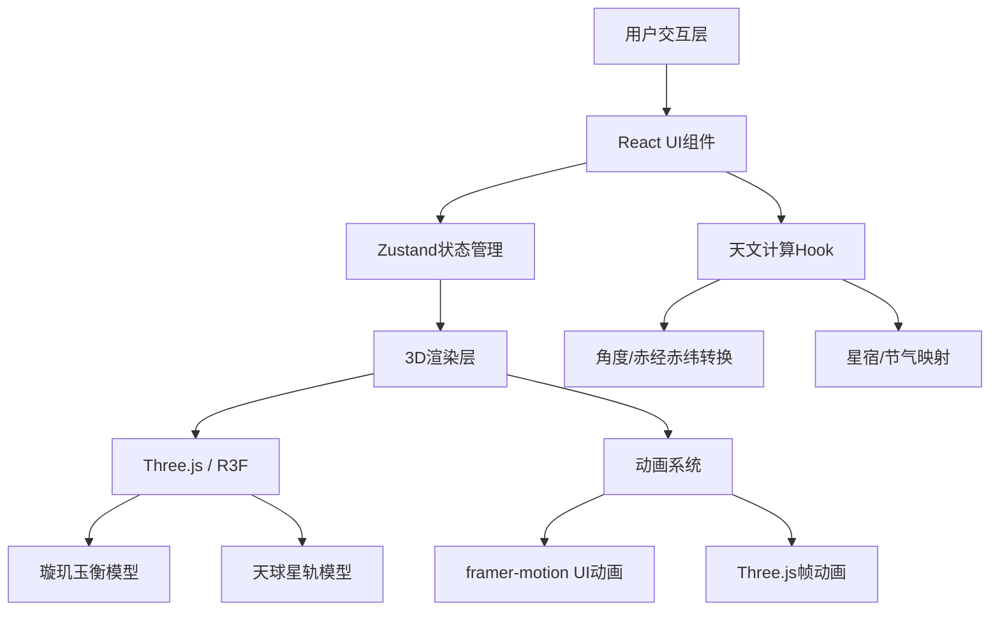
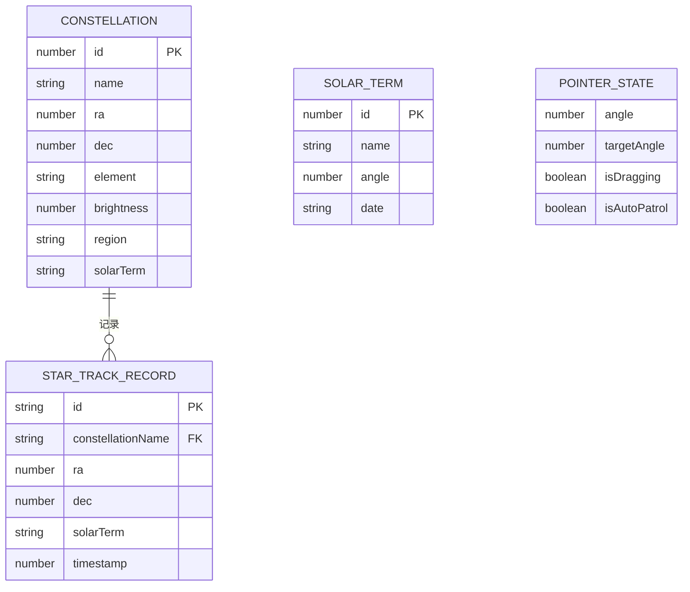

## 1. 架构设计

本项目为纯前端3D交互应用，采用React + TypeScript + Vite技术栈，结合Three.js实现天文仪器的3D可视化。



## 2. 技术描述

- **前端框架**：React 18 + TypeScript 5 + Vite 5
- **3D引擎**：Three.js 0.160 + @react-three/fiber 8.15 + @react-three/drei 9.92
- **状态管理**：Zustand 4.4
- **动画库**：framer-motion 10.16
- **工具库**：d3-scale 7.8
- **初始化工具**：vite-init (react-ts模板)
- **后端**：无（纯前端应用）
- **数据库**：无（使用内置天文数据）

## 3. 路由定义

| 路由 | 用途 |
|------|------|
| / | 主观测台页面，包含璇玑玉衡3D场景与所有UI面板 |

## 4. API定义

本项目为纯前端应用，无需后端API。所有天文数据内置为TypeScript常量。

### 核心数据类型定义

```typescript
// 星宿数据
interface Constellation {
  id: number;
  name: string;        // 星宿名称：角、亢、氐、房...
  ra: number;          // 赤经（度）
  dec: number;         // 赤纬（度）
  element: '木' | '火' | '土' | '金' | '水';  // 五行属性
  brightness: number;  // 亮度等级 1-6
  region: string;      // 所属分野
  solarTerm: string;   // 对应节气
}

// 节气数据
interface SolarTerm {
  id: number;
  name: string;        // 立春、雨水、春分...
  angle: number;       // 黄道经度
  date: string;        // 大致日期
}

// 指针状态
interface PointerState {
  angle: number;       // 当前角度（0-360度）
  targetAngle: number; // 目标角度
  isDragging: boolean;
  isAutoPatrol: boolean;
}

// 星轨记录
interface StarTrackRecord {
  id: string;
  constellationName: string;
  ra: number;
  dec: number;
  solarTerm: string;
  timestamp: number;
}

// 视角状态
type ViewMode = 'front' | 'birdseye';
```

## 5. 项目文件结构

```
auto83/
├── package.json              # 项目依赖与脚本
├── vite.config.js            # Vite构建配置
├── tsconfig.json             # TypeScript配置
├── index.html                # HTML入口
├── .trae/
│   └── documents/
│       ├── PRD.md
│       └── Technical_Architecture.md
└── src/
    ├── main.tsx              # React应用入口
    ├── App.tsx               # 主应用组件
    ├── styles/
    │   └── global.css        # 全局样式
    ├── components/
    │   ├── Instrument.tsx    # 璇玑玉衡3D组件
    │   └── StarMap.tsx       # 天球星轨面板
    ├── hooks/
    │   └── useCelestialMath.ts  # 天文计算Hook
    ├── store/
    │   └── useAppStore.ts    # Zustand状态管理
    ├── data/
    │   ├── constellations.ts # 28星宿数据
    │   └── solarTerms.ts     # 24节气数据
    └── utils/
        └── celestialUtils.ts # 天文计算工具函数
```

## 6. 数据模型

### 6.1 数据模型定义



### 6.2 内置数据

#### 28星宿数据（constellations.ts）

包含28星宿的完整信息：名称、赤经、赤纬、五行属性、亮度等级、所属分野、对应节气。

#### 24节气数据（solarTerms.ts）

包含24节气的名称、黄道经度、大致日期。

## 7. 核心模块设计

### 7.1 天文计算模块（useCelestialMath.ts）

- `angleToRADec(angle: number)`：将仪器环面角度转换为天球赤经赤纬
- `getConstellationAtAngle(angle: number)`：根据角度获取对应星宿
- `getSolarTermInterval(ra: number)`：获取赤经所属节气区间
- `getBrightnessLevel(dec: number)`：根据赤纬计算亮度等级
- `getNextSolarTerm(angle: number)`：获取下一个节气位置

### 7.2 状态管理（useAppStore.ts）

- 指针角度状态与更新方法
- 当前选中星宿信息
- 视角模式状态
- 自动巡天状态
- 星轨记录列表
- 星宿高亮闪烁状态

### 7.3 3D组件设计

#### Instrument.tsx
- 外环（TorusGeometry，青铜色#b87333，边缘发光#2e8b57）
- 内环（TorusGeometry，赤铜色#c49a6c）
- 玉衡指针（CylinderGeometry，玉色#d0e0c0，带拖尾光晕）
- 28星宿标记点（SphereGeometry，悬停显示名称标签）
- 光束投射（LineGeometry，选中时显示到穹顶）

#### StarMap.tsx
- 天球穹顶（SphereGeometry，半球，半透明深蓝#0a1128）
- 星点粒子（Points，随机位置，闪烁动画）
- 黄道轨迹（CatmullRomCurve3，颜色渐变#ffffff到#f5d742）
- 星宿运行轨迹（TubeGeometry，半透明#aaccff，粒子流动画）
- 节气标记（Points，点状虚线）

### 7.4 性能优化策略

- 使用InstancedMesh渲染多个星宿标记点和星点粒子
- 指针旋转动画使用lerp平滑插值，每帧计算量<2ms
- 粒子系统使用BufferGeometry减少draw call
- UI面板使用CSS will-change优化动画性能
- 避免在useFrame中创建新对象，复用已有对象
- 使用React.memo优化组件重渲染
