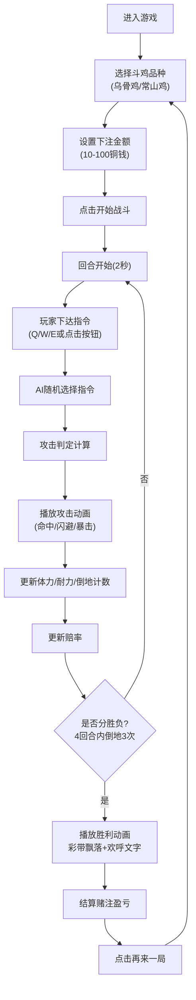

## 1. 产品概述

唐代西市斗鸡竞技模拟游戏，让用户扮演唐代西市斗鸡裁判，操控乌骨鸡与常山鸡进行回合制格斗，同时体验古代赌注策略互动。

- 核心玩法：回合制斗鸡战斗 + 赌注赔率策略
- 目标用户：喜欢策略模拟和历史题材的游戏玩家
- 产品价值：沉浸式体验唐代市井文化，结合策略决策与实时动画反馈

## 2. 核心功能

### 2.1 用户角色

| 角色 | 注册方式 | 核心权限 |
|------|----------|----------|
| 游戏玩家 | 无需注册，直接进入 | 选择斗鸡品种、下达战斗指令、下注赌博、观看战斗动画 |

### 2.2 功能模块

1. **战斗系统**：回合制战斗、三种攻击指令、体力/耐力/倒地判定
2. **赌注系统**：动态赔率计算、下注金额调节、盈亏结算
3. **动画系统**：斗鸡角色动画、攻击特效、观众助威、胜负庆典
4. **音效系统**：Web Audio API实现市井叫卖、鸡鸣、铜钱碰撞声

### 2.3 页面详情

| 页面名称 | 模块名称 | 功能描述 |
|----------|----------|----------|
| 主战斗界面 | 品种选择 | 用户选择乌骨鸡或常山鸡，点击开始战斗 |
| 主战斗界面 | 圆形斗笼 | 300px直径战斗场地，CSS径向渐变模拟沙土，木栏边缘 |
| 主战斗界面 | 斗鸡角色 | CSS绘制两只斗鸡，乌骨鸡黑羽绿辉红冠，常山鸡白羽黄尾 |
| 主战斗界面 | 指令按钮 | 猛啄(Q)、飞踢(W)、蓄力(E)三个攻击指令 |
| 主战斗界面 | 状态显示 | 体力条、耐力条、倒地计数 |
| 赌注面板 | 赔率显示 | 基于双方状态动态计算1:1到1:5的赔率 |
| 赌注面板 | 下注交互 | 滑条选择10-100铜钱下注，确认后锁定 |
| 赌注面板 | 结算记录 | 显示历史赌局和当前总铜钱数 |
| 主战斗界面 | 观众动画 | 斗笼边缘胡商汉商小人随战况欢呼/叹气 |
| 主战斗界面 | 胜负结算 | 彩带飘落、欢呼文字、再来一局按钮 |

## 3. 核心流程

## 4. 用户界面设计

### 4.1 设计风格

- **主色调**：土黄 #d4a76a（沙地）、朱红 #c0392b（赌桌）、墨黑 #1a1a1a（文字边框）
- **按钮风格**：仿古木质按钮，朱红底色，金色边框，悬停时微微上浮
- **字体**：使用Google Fonts的"Ma Shan Zheng"（马善政楷体）作为标题字体，"Noto Serif SC"作为正文字体
- **布局风格**：左侧60%战斗区域，右侧35%赌注面板，底部5%指令栏
- **视觉细节**：斗笼径向渐变沙土质感，木栏重复线性渐变木纹，斗鸡用radial-gradient绘制羽毛光泽

### 4.2 页面设计概述

| 页面名称 | 模块名称 | UI元素 |
|----------|----------|--------|
| 主战斗界面 | 品种选择 | 大型卡片展示两只斗鸡属性，选中状态金色光晕 |
| 主战斗界面 | 斗笼区域 | 300px直径圆形，沙土径向渐变，木纹边框，内部两只斗鸡 |
| 主战斗界面 | 状态条 | 绿色体力条（满格→红色），耐力条左右摆动CSS动画 |
| 主战斗界面 | 指令栏 | 三个大按钮，图标+文字+快捷键提示，悬停缩放效果 |
| 赌注面板 | 赔率显示 | 大号数字显示当前赔率，背景根据优势方变色 |
| 赌注面板 | 下注滑条 | 自定义样式滑块，铜钱图标，实时显示金额 |
| 赌注面板 | 记录列表 | 仿古卷轴样式，显示历史赌局结果 |
| 主战斗界面 | 观众区 | 斗笼周围一圈CSS小人，随战况上下跳动 |
| 主战斗界面 | 胜利弹窗 | 彩带粒子动画，金色边框，欢呼文字逐字显示 |

### 4.3 响应式设计

- 桌面优先设计，支持1920x1080和1440x900分辨率
- 使用CSS变量和相对单位确保布局缩放
- 战斗区域保持60%/35%/5%的比例分配
- 最小支持宽度1280px，低于此宽度显示滚动条

### 4.4 动画特效

- **猛啄**：鸡头快速前伸，对角线轨迹，framer-motion keyframes实现
- **飞踢**：全身旋转360度后蹬腿，使用rotate和translate组合
- **蓄力**：鸡身上下起伏1.5秒，释放时金色闪光扩散
- **命中**：被击中鸡身爆出金色粒子，使用framer-motion的AnimatePresence
- **闪避**：显示虚影位移，opacity和blur动画
- **倒地**：鸡身倾斜倒下，旋转90度，眩晕星星动画
- **观众欢呼**：小人上下跳动，手臂挥舞，颜色变亮
- **胜利庆典**：彩色纸屑飘落，使用CSS动画的多组粒子
