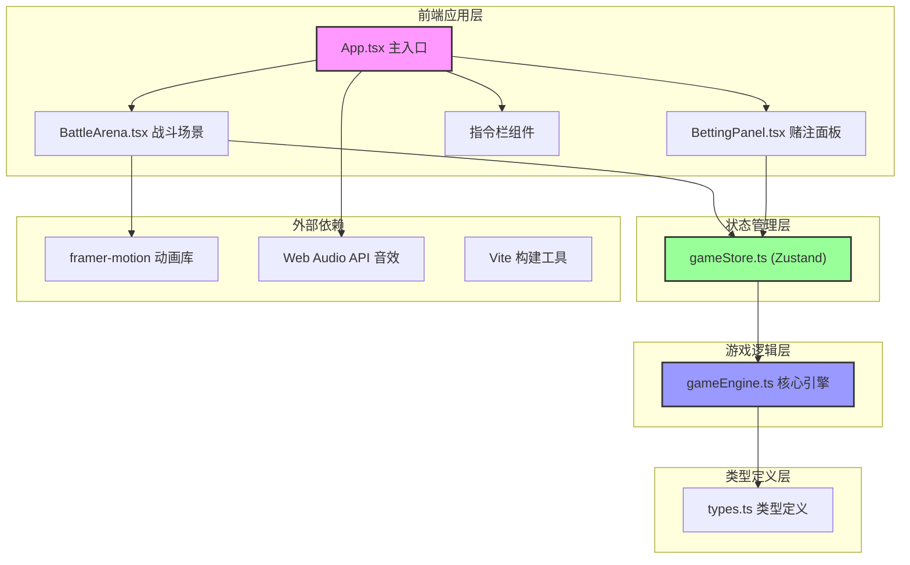
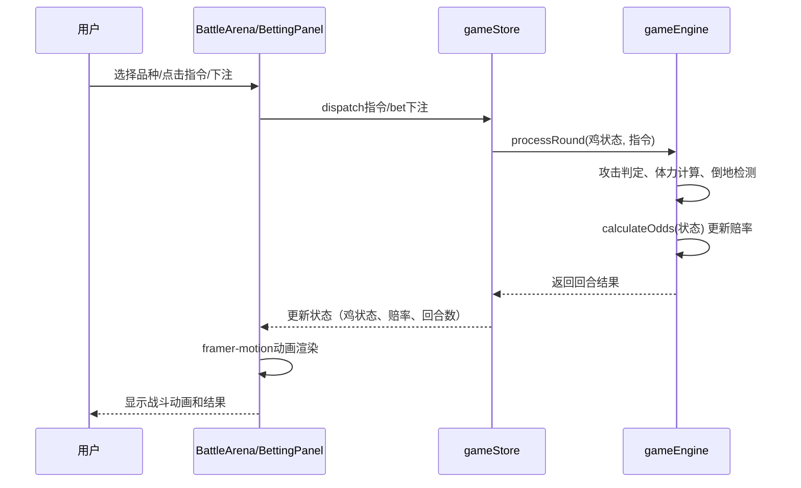
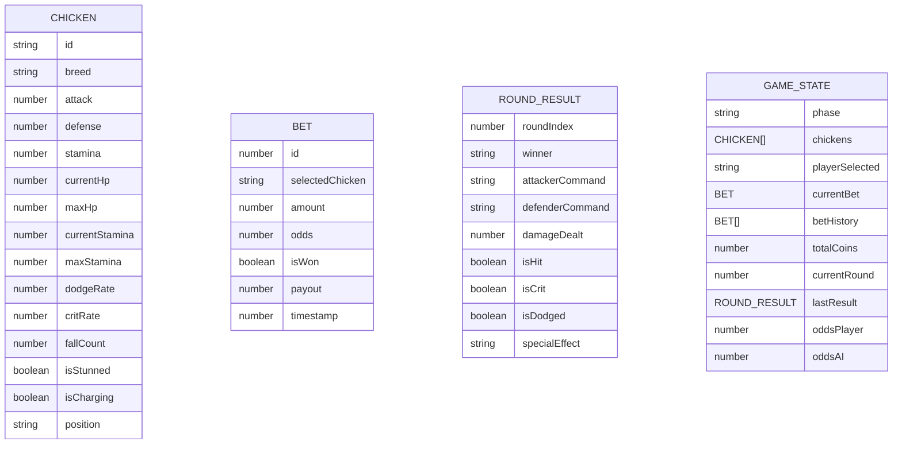

## 1. 架构设计



## 2. 技术描述

* **前端框架**: React\@18 + TypeScript\@5

* **构建工具**: Vite\@5 + @vitejs/plugin-react\@4

* **状态管理**: zustand\@4

* **动画库**: framer-motion\@11

* **路由**: react-router-dom\@6

* **CSS方案**: 原生CSS + CSS变量 + CSS动画

* **初始化工具**: vite-init

* **后端**: 无（纯前端应用）

* **数据库**: 无（使用localStorage持久化铜钱和记录）

### 依赖版本说明

```json
{
  "react": "^18.2.0",
  "react-dom": "^18.2.0",
  "typescript": "^5.4.0",
  "vite": "^5.2.0",
  "@vitejs/plugin-react": "^4.2.0",
  "framer-motion": "^11.0.0",
  "zustand": "^4.5.0",
  "react-router-dom": "^6.22.0"
}
```

## 3. 路由定义

| 路由 | 目的                |
| -- | ----------------- |
| /  | 主游戏界面，包含战斗场景和赌注面板 |

## 4. 模块调用关系与数据流向

### 4.1 文件结构

```
src/
├── types.ts           # 类型定义（被所有文件引用）
├── gameEngine.ts      # 游戏核心逻辑（被store调用）
├── store/
│   └── gameStore.ts   # Zustand状态管理（被组件调用）
├── components/
│   ├── BattleArena.tsx    # 战斗场景组件
│   ├── BettingPanel.tsx   # 赌注面板组件
│   ├── Chicken.tsx        # 斗鸡角色组件
│   ├── CommandBar.tsx     # 指令栏组件
│   ├── StatusBar.tsx      # 状态条组件
│   ├── Spectators.tsx     # 观众组件
│   └── VictoryModal.tsx   # 胜利弹窗组件
├── utils/
│   └── audio.ts           # Web Audio API音效工具
├── App.tsx            # 主应用组件
├── main.tsx           # 应用入口
└── index.css          # 全局样式
```

### 4.2 数据流向图



### 4.3 模块职责说明

| 文件名              | 职责                  | 输入                 | 输出                                             | 依赖                          |
| ---------------- | ------------------- | ------------------ | ---------------------------------------------- | --------------------------- |
| types.ts         | 定义所有接口、枚举、类型别名      | 无                  | Chicken, Command, RoundResult, Bet, GamePhase等 | 无                           |
| gameEngine.ts    | 战斗逻辑计算、赔率计算、胜负判定    | chickens状态数组, 双方指令 | RoundResult对象, 新的chickens状态                    | types.ts                    |
| gameStore.ts     | 全局状态管理，暴露action方法   | 用户action（指令、下注、重置） | 状态更新                                           | types.ts, gameEngine.ts     |
| BattleArena.tsx  | 渲染斗笼、斗鸡、攻击特效、观众     | store中的游戏状态        | 派发用户指令                                         | gameStore.ts, framer-motion |
| BettingPanel.tsx | 渲染赔率、下注控件、历史记录      | store中的赌注状态        | 派发下注action                                     | gameStore.ts                |
| audio.ts         | 封装Web Audio API播放音效 | 音效类型               | 音频播放                                           | 无                           |

## 5. 核心数据模型

### 5.1 数据模型定义



### 5.2 TypeScript类型定义（核心）

```typescript
// 斗鸡品种
export type ChickenBreed = 'wu-gu' | 'chang-shan';

// 攻击指令
export type CommandType = 'peck' | 'kick' | 'charge';

// 游戏阶段
export type GamePhase = 'select' | 'betting' | 'fighting' | 'round-end' | 'game-over';

// 回合结果特效
export type SpecialEffect = 'none' | 'crit' | 'dodge' | 'stun' | 'fall';

// 斗鸡属性接口
export interface Chicken {
  id: string;
  breed: ChickenBreed;
  name: string;
  attack: number;
  defense: number;
  maxHp: number;
  currentHp: number;
  maxStamina: number;
  currentStamina: number;
  dodgeRate: number;
  critRate: number;
  fallCount: number;
  isStunned: boolean;
  isCharging: boolean;
  chargeBonus: number;
}

// 回合结果接口
export interface RoundResult {
  roundIndex: number;
  attackerId: string;
  defenderId: string;
  attackerCommand: CommandType;
  defenderCommand: CommandType;
  damageDealt: number;
  isHit: boolean;
  isCrit: boolean;
  isDodged: boolean;
  specialEffect: SpecialEffect;
  attackerFell: boolean;
  defenderFell: boolean;
}

// 赌注接口
export interface Bet {
  id: number;
  selectedChickenId: string;
  amount: number;
  odds: number;
  isWon: boolean | null;
  payout: number;
  timestamp: number;
}

// 游戏状态接口
export interface GameState {
  phase: GamePhase;
  chickens: [Chicken, Chicken];
  playerChickenId: string | null;
  currentBet: Bet | null;
  betHistory: Bet[];
  totalCoins: number;
  currentRound: number;
  lastResult: RoundResult | null;
  odds: { player: number; ai: number };
}
```

## 6. 核心算法

### 6.1 攻击判定算法

```
输入：攻击方指令、防守方指令、双方属性
输出：伤害值、是否命中、是否暴击、是否闪避

1. 基础伤害 = 攻击方攻击力 × 指令系数
   - 猛啄(peck): 1.5倍，闪避率+20%
   - 飞踢(kick): 1.0倍，闪避率+10%
   - 蓄力(charge): 0.3倍，下回合暴击率+30%

2. 闪避判定：
   闪避概率 = 防守方闪避率 + 攻击方指令闪避惩罚
   若随机数 < 闪避概率 → 闪避成功，伤害=0

3. 暴击判定：
   暴击概率 = 攻击方暴击率 + 蓄力加成
   若随机数 < 暴击概率 → 暴击，伤害×2

4. 伤害计算：
   最终伤害 = 基础伤害 × (1 - 防守方防御力/200)
   向下取整，最小为1

5. 倒地判定：
   若防守方当前HP - 最终伤害 <= 0 → 倒地计数+1
   若倒地计数 >= 3 → 游戏结束
   否则HP恢复到最大值的30%，耐力-30%，眩晕1回合
```

### 6.2 赔率计算算法

```
输入：双方当前状态（HP、耐力、倒地次数、蓄力状态）
输出：玩家赔率、AI赔率（范围1:1 ~ 1:5）

1. 计算双方战斗力评分：
   评分 = (当前HP/最大HP)×40 + (当前耐力/最大耐力)×30 
        + (3-倒地计数)×20 + 蓄力加成×10

2. 计算胜率比：
   玩家胜率 = 玩家评分 / (玩家评分 + AI评分)

3. 赔率转换：
   基础赔率 = (1 - 胜率) / 胜率
   最终赔率 = clamp(基础赔率, 1, 5)
   保留1位小数
```

## 7. 性能优化方案

### 7.1 动画性能

* 使用framer-motion的transform和opacity属性动画，避免触发重排

* 攻击粒子使用will-change提示浏览器优化

* 限制同时存在的粒子数量不超过20个

* 使用AnimatePresence管理组件进入/离开动画

### 7.2 计算性能

* 攻击判定算法时间复杂度O(1)，单次计算<5ms

* 使用useMemo缓存斗鸡状态计算结果

* 状态更新批量处理，避免频繁重渲染

* 使用React.memo包裹纯展示组件

### 7.3 内存管理

* 粒子动画结束后立即清理

* 历史记录最多保留20条

* 音效播放完成后释放AudioContext资源

* 组件卸载时清理所有定时器和事件监听器

