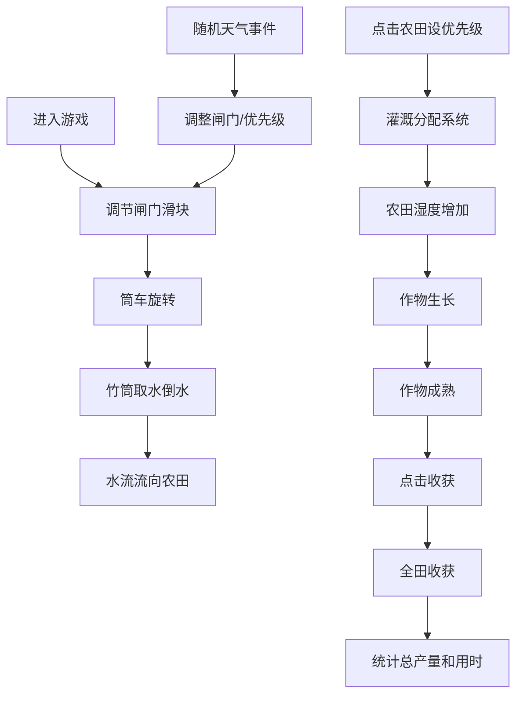

## 1. 产品概述

唐代水车灌溉系统互动模拟游戏，通过可视化机械传动和水流动力与作物生长的实时联动，让用户直观体验古代农业灌溉智慧。

- 核心问题：传统农业模拟游戏缺乏直观的机械传动可视化和水流动力与作物生长的实时联动反馈
- 目标用户：对古代农业科技、历史文化感兴趣的教育和娱乐用户
- 市场价值：融合历史文化与互动游戏，具有教育意义和趣味性

## 2. 核心功能

### 2.1 用户角色
| 角色 | 注册方式 | 核心权限 |
|------|----------|----------|
| 玩家 | 无需注册，直接进入 | 完整游戏体验，调节闸门、分配灌溉优先级、观察天气变化 |

### 2.2 功能模块
1. **主场景**：唐代关中平原田间、巨型木质筒车、引水渠、8x8方格农田
2. **交互控制系统**：闸门滑块调节水流、农田点击设定优先灌溉
3. **天气系统**：随机天气事件（雷雨、暴晒、旱风）影响水位和湿度
4. **作物生长系统**：4阶段生长周期、收获机制、产量统计
5. **可视化效果**：筒车旋转动画、水花粒子、水滴抛物线、颜色渐变

### 2.3 页面详情
| 页面名称 | 模块名称 | 功能描述 |
|----------|----------|----------|
| 游戏主页面 | 顶部天气指示区 | 显示当前天气图标和剩余持续时间 |
| 游戏主页面 | 中部主场景区 | 水车旋转动画、水渠水流、农田网格灌溉可视化 |
| 游戏主页面 | 底部控制区 | 闸门滑块（调节水流速度0-100%）、优先灌溉面板 |

## 3. 核心流程

用户进入游戏 → 拖动闸门滑块调节水流 → 筒车旋转带动竹筒取水 → 水流沿渡槽流向农田 → 点击农田设定优先灌溉 → 天气事件随机触发 → 根据天气调整策略 → 作物成熟后点击收获 → 全田收获后统计总产量和用时

## 4. 用户界面设计

### 4.1 设计风格
- **主色调**：青绿#5b8a5b、土黄#c49a6c、瓦灰#8b9a8b
- **辅色**：木质#6b4e3a、竹筒#a67c52、水渠蓝#3a7bd5、干裂黄土#d4a76a、湿润深褐#4a2e1b、浅绿#6b8e23、深绿#2e7d32
- **按钮风格**：木质纹理、圆角、按压效果
- **字体**：采用唐风古典风格，标题使用有衬线字体，正文清晰可读
- **布局**：上中下三段式，桌面端横向布局，移动端纵向堆叠
- **视觉风格**：唐风田园、古朴雅致、自然质感

### 4.2 页面设计概述
| 页面名称 | 模块名称 | UI元素 |
|----------|----------|--------|
| 游戏主页面 | 天气指示区 | 天气图标（雷雨云/太阳/风）、倒计时进度条、状态文字 |
| 游戏主页面 | 主场景区 | 筒车（28辐条、16竹筒）、水渠（半透明蓝色）、渡槽（白色半透明）、农田网格（8x8，40px每格，2px浅黑边框） |
| 游戏主页面 | 控制区 | 木质滑块（带刻度）、优先级面板（显示已选农田格子坐标）、总产量显示 |

### 4.3 响应式
- **桌面端**（>768px）：筒车外径300px，横向布局，水车在中左，农田在右
- **移动端**（≤768px）：筒车缩小为180px，纵向堆叠布局，所有字体等比缩小，保持可读

### 4.4 动画与交互效果
- 筒车旋转：根据水流速度实时计算角度
- 水花粒子：辐条经过水面时产生白色粒子（最多20个，0.3秒消失）
- 水滴效果：竹筒倒水时半透明蓝色水滴沿抛物线下落
- 农田颜色渐变：干裂黄→湿润深褐→浅绿→深绿，平滑过渡
- 收获动画：果实向上弹起分裂成3个小点飞向累计器，数字弹跳动画
- 交互反馈：所有操作100ms内给出视觉反馈（颜色/位置/透明度变化）
