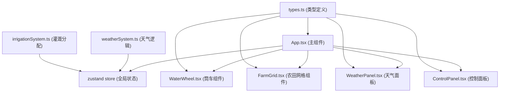

## 1. 架构设计



## 2. 技术描述

- **前端框架**：React 18 + TypeScript
- **构建工具**：Vite 5
- **状态管理**：zustand 4
- **动画库**：framer-motion 11
- **样式方案**：原生CSS + CSS变量（无Tailwind，按需求自定义样式）
- **渲染方式**：Client-side rendering (CSR)

## 3. 目录结构

```
src/
├── components/
│   ├── WaterWheel.tsx      # 筒车组件（旋转动画、粒子效果）
│   ├── FarmGrid.tsx        # 农田网格组件（湿度、生长、收获）
│   ├── WeatherPanel.tsx    # 天气指示面板
│   └── ControlPanel.tsx    # 控制面板（闸门滑块、优先级显示）
├── types.ts                # 共享类型定义
├── weatherSystem.ts        # 天气事件生成逻辑
├── irrigationSystem.ts     # 灌溉分配算法
├── App.tsx                 # 主应用组件
└── main.tsx                # React入口
```

## 4. 数据模型定义

### 4.1 核心类型

```typescript
// 天气类型
type WeatherType = 'normal' | 'thunderstorm' | 'scorching' | 'drywind';

// 作物生长阶段
type GrowthStage = 'seed' | 'sprout' | 'leaf' | 'flower' | 'fruit';

// 农田格子状态
interface TileState {
  id: number;
  humidity: number;           // 0-100
  growthStage: GrowthStage;
  growthProgress: number;     // 0-100
  isPriority: boolean;
  harvestReady: boolean;
  harvested: boolean;
}

// 游戏全局状态
interface GameState {
  waterFlow: number;          // 0-100
  tiles: TileState[];
  priorities: number[];       // 优先灌溉的格子ID
  currentWeather: WeatherType;
  weatherDuration: number;    // 剩余持续时间(秒)
  totalYield: number;
  gameTime: number;           // 游戏已运行时间(秒)
  roundComplete: boolean;
}

// 粒子状态
interface Particle {
  id: number;
  x: number;
  y: number;
  vx: number;
  vy: number;
  opacity: number;
  life: number;
}
```

## 5. 性能要求与实现策略

### 5.1 帧率优化
- 使用 `requestAnimationFrame` 驱动动画循环
- 粒子数量限制最多20个，每帧清理过期粒子
- 农田格子使用 `React.memo` + `useRef` 缓存DOM节点
- 颜色渐变每帧变化不超过5色值，平滑过渡

### 5.2 响应时间
- 闸门拖拽：水流速度和筒车转速50ms内同步
- 天气事件触发：湿度计算10ms内完成
- 所有交互：100ms内视觉反馈

### 5.3 加载性能
- 纯前端实现，无后端依赖
- 不使用外部图片资源，全部CSS绘制
- 目标初始加载时间 < 2秒

## 6. 关键算法

### 6.1 灌溉分配算法
1. 按优先级排序，优先级高的格子先获得灌溉
2. 每秒总灌溉量 = 水流速度 × 天气修正系数
3. 每个格子每秒最多增加5%湿度（平滑渐变限制）
4. 已收获格子不参与分配

### 6.2 天气事件系统
1. 每15-30秒随机触发天气事件
2. 雷雨：水位上升50px，筒车转速×150%
3. 暴晒：农田湿度消耗×2（每秒下降1.5%）
4. 旱风：水流速度×80%

### 6.3 作物生长逻辑
1. 湿度≥70%时，每秒增加生长进度
2. 连续保持10秒（进度≥100）进入下一生长阶段
3. 共4阶段：发芽→抽叶→开花→结实
4. 结实后可收获，获得产量
