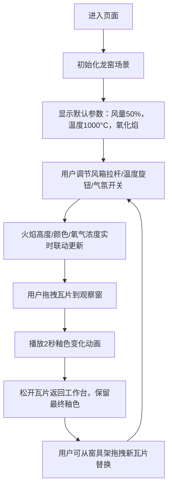

## 1. 产品概述

本项目是一个古代琉璃瓦烧制窑炉的3D交互可视化应用，让用户化身明代官窑窑工，在虚拟龙窑前通过操控鼓风机风量、炉膛温度和窑内气氛，实时观察窑内火焰形态变化与琉璃瓦釉色从素胚到成品的渐变过程。

- 主要用途：陶瓷烧制工艺教学、传统文化数字化展示、交互式艺术体验
- 目标用户：历史文化爱好者、陶瓷工艺学习者、博物馆参观者
- 市场价值：通过沉浸式交互体验传承中国传统陶瓷烧制技艺，让用户直观理解温度、气氛对釉色变化的影响

## 2. 核心功能

### 2.1 用户角色
本项目为单用户体验型应用，无需注册登录。

| 角色 | 注册方式 | 核心权限 |
|------|----------|----------|
| 体验用户 | 无需注册 | 完整操作所有交互功能，调节窑炉参数，观察釉色变化 |

### 2.2 功能模块
1. **主场景模块**：CSS 3D构建的龙窑3D模型、火焰粒子系统、观察窗高温透视效果
2. **控制面板模块**：鼓风机拉杆、温度环形旋钮、气氛切换开关、物理参数仪表盘
3. **工作台模块**：三片待烧瓦片展示、拖拽交互、釉色变化动画
4. **窑具架模块**：三层木架瓦片选择、悬停预览、替换样本功能

### 2.3 页面详情
| 页面名称 | 模块名称 | 功能描述 |
|----------|----------|----------|
| 主页面 | 龙窑场景 | 依山而建的长条形斜坡窑体，青砖色材质，投柴孔橘红光晕，窑头鼓风机，窑尾烟囱冒烟 |
| 主页面 | 控制面板 | 仿古铜质底色，浮雕效果按钮，风箱拉杆控制风量(0-100%)，环形旋钮调节温度(800-1300°C)，气氛切换(氧化焰/还原焰) |
| 主页面 | 仪表盘 | 指针式温度表(红色警戒区1300°C以上闪烁)，氧气浓度条(深红到亮蓝渐变)，火焰高度数码管显示 |
| 主页面 | 工作台 | 三片素胚瓦片展示，拖拽到观察窗显示釉色变化，松开返回保留最终颜色 |
| 主页面 | 窑具架 | 三层木架，每层不同器型(筒瓦、板瓦、滴水瓦)，悬停放大1.2倍显示名称标签 |

## 3. 核心流程

用户进入页面后，首先看到依山而建的龙窑主场景和控制面板。用户可以：
1. 拖拽风箱拉杆调节风量，观察火焰高度和烟囱冒烟量变化
2. 旋转温度旋钮调节炉膛温度，观察火焰颜色从橙红变为白蓝
3. 切换氧化焰/还原焰按钮，观察氧气浓度和釉色变化趋势
4. 从工作台拖拽瓦片到观察窗，实时观察釉色变化动画
5. 从窑具架拖拽新瓦片到工作台替换当前样本，重置观察流程

## 4. 用户界面设计

### 4.1 设计风格
- **主色调**：青砖灰瓦底色#8b9a8b，窑体青砖色#6b4e3a，木质风箱#8b6f47，烟囱青灰色#7a8a7a
- **强调色**：火焰橙红#ff6600，高温白蓝#aaccff，绿釉#2e8b57，黄釉#d4a017，孔雀蓝#008b8b
- **控制面板**：仿古铜质肌理#b87333，浮雕效果box-shadow模拟凹凸感
- **按钮样式**：3D浮雕按钮，悬停时轻微上浮，点击时下压
- **字体**：仿宋字体用于数字和文字，楷体用于瓦片名称标签，墨色#2a1a0e
- **布局风格**：左侧龙窑主体，右侧控制面板和工作台，中间拖拽交互区
- **图标风格**：复古手绘风格，与明代工艺美学统一

### 4.2 页面设计概述
| 页面名称 | 模块名称 | UI元素 |
|----------|----------|----------|
| 主页面 | 龙窑场景 | CSS 3D变换构建长条形斜坡窑体，投柴孔径向渐变光晕，鼓风机压缩动画，烟囱粒子烟雾 |
| 主页面 | 控制面板 | 仿古铜质面板，风箱拉杆滑块，环形旋钮(CSS扇形渐变刻度)，三个联动仪表盘 |
| 主页面 | 观察窗 | 圆形直径80px，双层半透明渐变(内层火光#ff4500，外层backdrop-filter: blur(2px)) |
| 主页面 | 瓦片拖拽 | 半透明虚线轨迹，跟随光标无延迟，悬停放大1.2倍，2秒釉色渐变动画 |
| 主页面 | 仪表盘 | 指针摆动动画，数字滚动0.5s过渡，LED数码管样式火焰高度，红色警戒区闪烁 |

### 4.3 响应式
- 桌面端(1440x900及以上)：左侧窑炉+右侧控制面板标准布局
- 平板端：控制面板压缩宽度，保持双栏布局
- 移动端：控制面板折叠为底部抽屉，窑炉场景全屏展示，点击抽屉按钮展开控制
- 触摸优化：拖拽区域增大，按钮最小48x48px

### 4.4 3D场景指导
- **环境**：明代官窑风格，依山傍水，远山淡墨背景，地面青石板纹理
- **灯光**：暖色调环境光，窑炉内部点光源随温度变化颜色和强度，投柴孔橘红色聚光
- **相机**：OrbitControls支持旋转缩放，初始角度45°俯视，距离适中可观察全貌
- **构图**：龙窑沿对角线从左下到右上延伸，视觉引导到窑头控制区
- **交互**：拖拽风箱拉杆时风箱压缩动画，出风粒子效果联动，火焰高度和颜色实时响应
- **后处理**：观察窗区域使用bloom效果增强高温辉光，轻微色差模拟热浪扭曲
- **性能**：火焰粒子系统控制在50-100个粒子，使用instanced mesh，釉色变化用material.color.lerp过渡

## 5. 动画与性能要求

| 动画项 | 性能指标 | 技术方案 |
|--------|----------|----------|
| 火焰跳动 | 60fps | CSS动画圆锥形径向渐变+模糊滤镜，周期0.3s |
| 拖拽响应 | <16ms | PointerEvents + requestAnimationFrame，状态更新批量处理 |
| 釉色变化 | ≥30fps | Three.js material color lerp，每帧更新一次，低端设备降级为CSS背景渐变 |
| 数字滚动 | 0.5s过渡 | framer-motion animate数值插值 |
| 指针摆动 | 流畅 | CSS transform rotate，使用will-change优化 |
