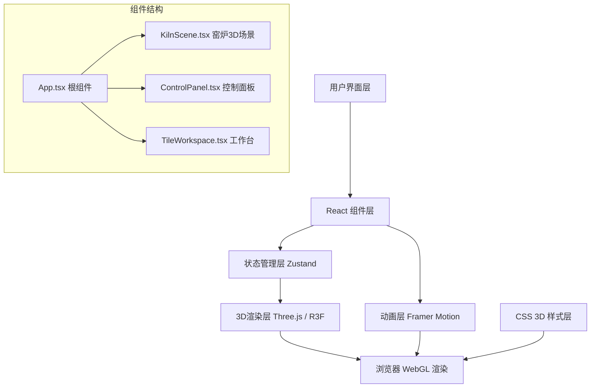

## 1. 架构设计

本项目为纯前端3D交互应用，采用React + TypeScript + Three.js技术栈，使用zustand进行状态管理，framer-motion实现动画效果。



## 2. 技术描述

* **前端框架**: React 18 + TypeScript 5 + Vite 5

* **3D渲染**: Three.js + @react-three/fiber + @react-three/drei

* **状态管理**: Zustand 4

* **动画库**: Framer Motion 11

* **样式方案**: CSS Modules + CSS Variables + 内联样式

* **构建工具**: Vite 5，配置React插件和路径别名

* **初始化方式**: vite-init react-ts 模板

## 3. 目录结构

```
src/
├── components/
│   ├── KilnScene.tsx        # 窑炉3D场景组件
│   ├── ControlPanel.tsx     # 控制面板组件
│   └── TileWorkspace.tsx    # 工作台组件
├── types.ts                 # 类型定义
├── store.ts                 # Zustand状态管理
├── App.tsx                  # 根组件
├── main.tsx                 # 入口文件
└── index.css                # 全局样式
```

## 4. 核心数据模型

### 4.1 类型定义 (types.ts)

```typescript
// 窑炉气氛类型
export type AtmosphereType = 'oxidizing' | 'reducing';

// 釉色类型
export type GlazeColorType = 'green' | 'yellow' | 'peacock_blue' | 'raw';

// 瓦片器型
export type TileShapeType = 'pipe' | 'plate' | 'eaves';

// 瓦片数据接口
export interface TileData {
  id: string;
  shape: TileShapeType;
  name: string;
  currentColor: string;
  targetColor: string;
  glazeProgress: number; // 0-1，釉色变化进度
  isInKiln: boolean;
}

// 窑炉状态接口
export interface KilnState {
  airFlow: number; // 0-100 风量百分比
  temperature: number; // 800-1300 温度°C
  atmosphere: AtmosphereType;
  oxygenLevel: number; // 0-21 氧气浓度%
  flameHeight: number; // 火焰高度cm
  flameColor: string;
}

// 拖拽状态接口
export interface DragState {
  isDragging: boolean;
  draggedTileId: string | null;
  dragPosition: { x: number; y: number };
}
```

### 4.2 釉色变化逻辑

| 温度范围        | 氧化焰        | 还原焰          |
| ----------- | ---------- | ------------ |
| 800-950°C   | 黄釉 #d4a017 | 浅绿 #3cb371   |
| 950-1100°C  | 绿釉 #2e8b57 | 孔雀蓝 #008b8b  |
| 1100-1300°C | 亮黄 #ffd700 | 深孔雀蓝 #006666 |

### 4.3 火焰颜色映射

| 温度     | 火焰颜色        |
| ------ | ----------- |
| 800°C  | #ff6600 橙红  |
| 950°C  | #ff8c00 深橙  |
| 1100°C | #ffd700 金黄  |
| 1200°C | #fffacd 浅黄白 |
| 1300°C | #aaccff 白蓝  |

## 5. 状态管理设计 (store.ts)

```typescript
import { create } from 'zustand';
import { KilnState, TileData, DragState, AtmosphereType, TileShapeType } from './types';

interface KilnStore extends KilnState, DragState {
  tiles: TileData[];
  shelfTiles: TileData[];
  
  // 参数更新方法
  setAirFlow: (value: number) => void;
  setTemperature: (value: number) => void;
  setAtmosphere: (atmosphere: AtmosphereType) => void;
  
  // 拖拽方法
  startDrag: (tileId: string, x: number, y: number) => void;
  updateDragPosition: (x: number, y: number) => void;
  endDrag: (dropInKiln: boolean) => void;
  
  // 瓦片管理
  updateTileGlaze: (tileId: string, progress: number) => void;
  replaceTile: (workspaceIndex: number, shelfTileId: string) => void;
  resetTileGlaze: (tileId: string) => void;
  
  // 计算派生状态
  calculateFlameColor: () => string;
  calculateOxygenLevel: () => number;
  calculateFlameHeight: () => number;
  calculateTargetGlazeColor: () => string;
}
```

## 6. 组件设计

### 6.1 KilnScene.tsx (窑炉3D场景)

* 使用@react-three/fiber构建3D场景

* 龙窑模型：长条形BoxGeometry，角度倾斜15°

* 火焰粒子系统：InstancedMesh，50-100个粒子

* 观察窗：圆形透明平面，双层半透明材质

* OrbitControls：支持场景旋转缩放

### 6.2 ControlPanel.tsx (控制面板)

* 风箱拉杆：framer-motion拖拽滑块，带压缩动画

* 温度旋钮：CSS conic-gradient刻度，drag旋转

* 气氛切换：toggle按钮，浮雕效果

* 三个仪表盘：指针式温度表、条形氧气浓度、数码管火焰高度

### 6.3 TileWorkspace.tsx (工作台)

* 三片瓦片展示：3D网格排列

* 窑具架：三层木架，每层不同器型

* 拖拽逻辑：PointerEvents，半透明虚线轨迹

* 釉色动画：useFrame更新material.color.lerp

## 7. 性能优化策略

1. **火焰动画**：使用CSS动画而非JS驱动，60fps稳定
2. **拖拽响应**：PointerEvents + requestAnimationFrame，状态防抖
3. **釉色变化**：Three.js material.lerp，每帧更新一次，低端设备降级为CSS transition
4. **状态更新**：Zustand selector避免不必要重渲染
5. **3D渲染**：InstancedMesh批量渲染粒子，共享几何体和材质
6. **内存管理**：组件卸载时dispose所有Three.js资源

## 8. 响应式适配

使用CSS media queries实现：

* ≥1440px: 左侧60%窑炉，右侧40%控制面板

* 1024-1440px: 左侧55%，右侧45%

* 768-1024px: 上下布局，上60%窑炉，下40%控制面板

* <768px: 控制面板折叠为底部抽屉，使用framer-motion AnimatePresence

## 9. 动画性能保障

| 优化项  | 技术手段                                                   |
| ---- | ------------------------------------------------------ |
| 火焰跳动 | CSS @keyframes，transform: scaleY()，opacity，开启GPU加速     |
| 拖拽跟随 | PointerEvents + transform translate，避免layout thrashing |
| 釉色渐变 | Three.js Color.lerp，在useFrame中每帧更新                     |
| 数字滚动 | framer-motion animate，数值插值                             |
| 指针摆动 | CSS transform: rotate()，will-change: transform         |

