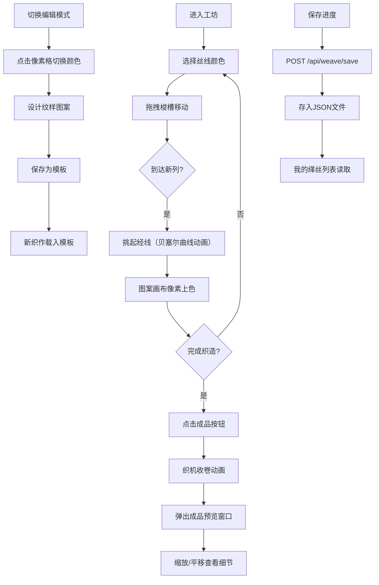

## 1. 产品概述

本项目是一个模拟宋代苏州缂丝织造工艺的交互式Web应用，让用户化身古代匠人，在虚拟织机前体验从挑经、引纬到成品展示的完整织造流程。通过数字化手段还原「通经断纬」的传统工艺，传承非物质文化遗产。

- **核心价值**：以游戏化互动方式普及传统缂丝工艺，降低文化体验门槛
- **目标用户**：手工艺爱好者、文化学习者、教育工作者

## 2. 核心功能

### 2.1 用户角色
| 角色 | 注册方式 | 核心权限 |
|------|----------|----------|
| 普通用户 | 无需注册，本地存储 | 完整织造体验、保存/加载进度、图样编辑 |

### 2.2 功能模块
1. **工坊主页面**：织机交互区、色卡选择区、图案预览区、操作控制区
2. **织机组件**：木制织架渲染、120根经线模拟、梭槽拖拽、挑经动画
3. **图案画布**：逐像素缂丝纹样渲染、实时织造进度显示
4. **色卡组件**：8种传统丝线颜色选择
5. **图样编辑器**：预定义经纬穿插规则、块面纹样设计
6. **成品展示**：织机收卷动画、三分之二屏预览、缩放平移交互
7. **进度管理**：织造存档、历史记录读取、模板保存/载入
8. **我的缂丝列表**：已保存作品展示与载入

### 2.3 页面详情
| 页面名称 | 模块名称 | 功能描述 |
|----------|----------|----------|
| 工坊主页面 | 织机交互区 | 展示宋代织机，支持梭槽拖拽、经线挑起动效、逐列织造 |
| 工坊主页面 | 色卡选择区 | 8种传统丝线颜色点击选择，梭子实时变色 |
| 工坊主页面 | 图案预览区 | 实时显示织造进度，支持图样编辑模式 |
| 工坊主页面 | 操作控制区 | 保存进度、查看成品、切换编辑模式按钮 |
| 成品预览页 | 织物展示 | 三分之二屏宽展示，滚轮缩放(50%-200%)、拖拽平移 |
| 我的缂丝页 | 作品列表 | 展示已保存织造记录，支持载入继续创作 |

## 3. 核心流程

### 3.1 织造流程
用户进入工坊 → 从色卡选择丝线颜色 → 拖拽梭槽横向移动 → 每移动一列经线被挑起 → 图案画布对应像素上色 → 重复操作直至完成 → 点击「成品」查看完整织物 → 可保存进度或导出

### 3.2 图样编辑流程
切换到编辑模式 → 点击图案画布像素格切换颜色 → 设计块面纹样（花瓣、叶片等）→ 保存为模板 → 新织作中载入模板

### 3.3 流程图

## 4. 用户界面设计

### 4.1 设计风格
- **主色调**：米白底色 `#fdf5e6`，檀木色 `#8b6f47`，营造温润工坊氛围
- **织机配色**：木制框架 `#6b4e3a`，经线银灰 `#c0c0c0`，梭槽 `#8b6f47`，梭子 `#a0522d`
- **丝线色卡**：朱红 `#c0392b`、石青 `#2c3e50`、藤黄 `#f1c40f`、艾青 `#7d8a6b`、象牙白 `#f5f5dc`、檀木 `#b87333`、藕荷 `#c9a0dc`、墨黑 `#1a1a1a`
- **按钮样式**：圆角矩形，悬停放大 `scale 1.05`，点击涟漪扩散效果
- **字体**：选用具有书法韵味的宋体类字体搭配现代无衬线字体，体现古今融合
- **布局风格**：桌面端织机居左60%，右侧色卡和预览35%；移动端垂直单列布局

### 4.2 页面设计概述
| 页面名称 | 模块名称 | UI元素 |
|----------|----------|----------|
| 工坊主页面 | 织机交互区 | 木制织架、120根垂直线条、可拖拽梭槽、梭子、挑经贝塞尔曲线动画 |
| 工坊主页面 | 色卡选择区 | 8个圆形色卡按钮，选中状态高亮边框 |
| 工坊主页面 | 图案画布 | 240x240像素画布（2x2px每格），织造进度实时渲染 |
| 工坊主页面 | 操作控制区 | 「保存进度」「成品」「编辑模式」按钮组 |
| 成品预览页 | 织物展示 | 三分之二屏宽画布，缩放控件，位置指示器 |

### 4.3 响应式设计
- **桌面端（≥768px）**：织机居左占60%宽度，右侧垂直排列色卡和预览面板（占35%）
- **移动端（<768px）**：垂直单列布局，织机宽度占100%，色卡和预览置于织机下方
- **触控优化**：梭槽拖拽区域扩大，色卡点击热区≥44x44px

### 4.4 动画设计
- **梭槽移动**：平滑线性过渡 `transition: transform 0.2s ease-out`
- **经线挑起**：弹性阻尼效果 `cubic-bezier(0.34, 1.56, 0.64, 1)`，弧高20px
- **按钮交互**：悬停放大 `scale 1.05`，点击涟漪从 `#8b6f47` 到透明扩散
- **成品收卷**：已完成织物从底部缓慢向上滚动，模拟布面从卷轴拉出
- **像素渲染**：`requestAnimationFrame` 控制≥30fps更新频率

## 5. 性能指标
- 拖拽梭槽时PatternCanvas渲染帧率≥30fps
- 保存/加载API响应时间≤200ms
- 单次保存数据量<50KB
