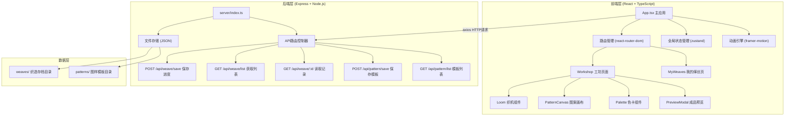
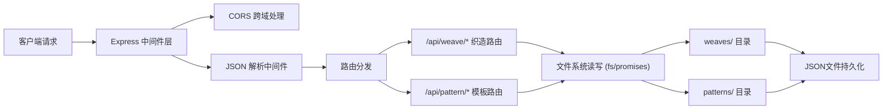
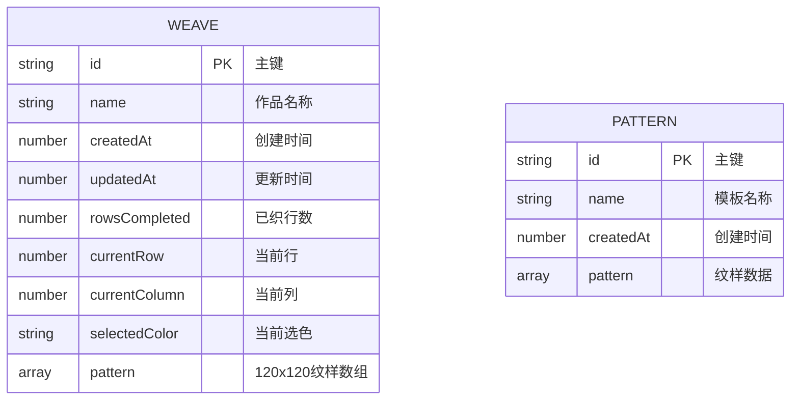

## 1. 架构设计



## 2. 技术描述

- **前端框架**：React@18 + TypeScript@5 + Vite@5
- **构建工具**：Vite@5 + @vitejs/plugin-react@4
- **状态管理**：zustand@4（轻量级全局状态）
- **路由管理**：react-router-dom@6
- **动画库**：framer-motion@11
- **HTTP客户端**：axios@1
- **后端框架**：Express@4
- **后端语言**：TypeScript + ts-node
- **数据存储**：本地JSON文件（无需数据库）

## 3. 目录结构

```
auto87/
├── package.json              # 依赖配置
├── vite.config.js            # Vite构建配置
├── tsconfig.json             # TypeScript配置（严格模式）
├── index.html                # 入口HTML
├── src/
│   ├── App.tsx               # 主应用（路由+状态）
│   ├── main.tsx              # 应用入口
│   ├── store/
│   │   └── useWeaveStore.ts  # zustand全局状态
│   ├── components/
│   │   ├── Loom.tsx          # 织机组件
│   │   ├── PatternCanvas.tsx # 图案画布
│   │   ├── Palette.tsx       # 色卡组件
│   │   └── PreviewModal.tsx  # 成品预览弹窗
│   ├── pages/
│   │   ├── Workshop.tsx      # 工坊主页
│   │   └── MyWeaves.tsx      # 我的缂丝列表
│   ├── types/
│   │   └── index.ts          # TypeScript类型定义
│   └── utils/
│       └── api.ts            # API请求封装
└── server/
    ├── index.ts              # Express服务器入口
    ├── routes/
    │   ├── weave.ts          # 织造相关路由
    │   └── pattern.ts        # 模板相关路由
    ├── data/
    │   ├── weaves/           # 织造存档JSON
    │   └── patterns/         # 图样模板JSON
    └── tsconfig.json         # 后端TS配置
```

## 4. 路由定义

| 前端路由 | 页面组件 | 功能描述 |
|----------|----------|----------|
| `/` | Workshop | 工坊主页面，织造交互核心 |
| `/my-weaves` | MyWeaves | 我的缂丝作品列表 |

## 5. API定义

### 5.1 TypeScript类型定义

```typescript
// 丝线颜色类型
type ThreadColor = 
  | '#c0392b'  // 朱红
  | '#2c3e50'  // 石青
  | '#f1c40f'  // 藤黄
  | '#7d8a6b'  // 艾青
  | '#f5f5dc'  // 象牙白
  | '#b87333'  // 檀木
  | '#c9a0dc'  // 藕荷
  | '#1a1a1a'; // 墨黑

// 织造数据类型
interface WeaveData {
  id: string;
  name: string;
  createdAt: number;
  updatedAt: number;
  rowsCompleted: number;           // 已织行数
  currentRow: number;              // 当前行
  currentColumn: number;           // 当前列
  selectedColor: ThreadColor;      // 当前选色
  pattern: (ThreadColor | null)[][]; // 120x120 二维数组
}

// 图样模板类型
interface PatternTemplate {
  id: string;
  name: string;
  createdAt: number;
  pattern: (ThreadColor | null)[][];
}
```

### 5.2 接口详情

| 方法 | 路径 | 请求体 | 响应 | 说明 |
|------|------|--------|------|------|
| POST | `/api/weave/save` | `WeaveData` | `{ success: boolean; id: string }` | 保存织造进度 |
| GET | `/api/weave/list` | - | `WeaveData[]` | 获取所有存档列表 |
| GET | `/api/weave/:id` | - | `WeaveData` | 读取单个存档 |
| POST | `/api/pattern/save` | `PatternTemplate` | `{ success: boolean; id: string }` | 保存图样模板 |
| GET | `/api/pattern/list` | - | `PatternTemplate[]` | 获取模板列表 |
| GET | `/api/pattern/:id` | - | `PatternTemplate` | 读取单个模板 |

## 6. 服务器架构图



## 7. 数据模型

### 7.1 实体关系图



### 7.2 JSON存储格式示例

**织造存档 (weaves/{id}.json):**
```json
{
  "id": "weave_20260609_123456",
  "name": "牡丹图",
  "createdAt": 1717934400000,
  "updatedAt": 1717938000000,
  "rowsCompleted": 45,
  "currentRow": 45,
  "currentColumn": 78,
  "selectedColor": "#c0392b",
  "pattern": [
    [null, null, "#c0392b", ...],
    ["#f5f5dc", "#c0392b", null, ...],
    ...
  ]
}
```

## 8. 性能优化方案

### 8.1 前端性能
- **Canvas渲染优化**：使用 `requestAnimationFrame` 批量更新像素，避免每列单独重绘
- **状态更新节流**：拖拽梭槽时使用 `requestAnimationFrame` 合并状态更新
- **组件懒渲染**：使用 React.memo 包裹 PureComponent，避免不必要重渲染
- **经线动画优化**：仅对当前列经线应用贝塞尔曲线动画，而非全部120根

### 8.2 后端性能
- **文件读写缓存**：最近访问的存档/模板缓存在内存中，LRU策略淘汰
- **异步文件操作**：使用 `fs/promises` 异步API，不阻塞事件循环
- **数据压缩**：120x120数组使用行内压缩存储，相同颜色连续列使用计数表示

## 9. 核心技术实现要点

### 9.1 织机组件 (Loom.tsx)
- 120根经线使用绝对定位的div元素，初始状态垂直直线
- 挑经效果使用CSS `border-radius` 或 SVG 贝塞尔曲线实现弧形
- 梭槽拖拽使用 `onPointerDown`/`onPointerMove`/`onPointerUp` 事件
- 当前列检测：`Math.floor((clientX - loomLeft) / columnWidth)`

### 9.2 图案画布 (PatternCanvas.tsx)
- 使用 HTML5 Canvas 2D API 渲染，每像素格2x2px，总尺寸240x240px
- 织造模式：根据当前行列和选色调用 `fillRect(x, y, 2, 2)`
- 编辑模式：监听 `onClick` 事件，计算点击位置对应的网格坐标
- 性能：脏矩形渲染，仅重绘变化的像素区域

### 9.3 成品预览 (PreviewModal.tsx)
- 使用 Canvas `scale()` 和 `translate()` 实现缩放平移
- 滚轮事件监听，限制缩放范围 0.5 - 2.0
- 拖拽平移：记录拖拽偏移量，应用到 `context.translate()`

### 9.4 全局状态 (zustand)
```typescript
interface WeaveState {
  pattern: (ThreadColor | null)[][];
  currentRow: number;
  currentColumn: number;
  selectedColor: ThreadColor;
  isEditMode: boolean;
  setColor: (color: ThreadColor) => void;
  weaveColumn: (col: number) => void;
  toggleEditMode: () => void;
  setPixel: (row: number, col: number, color: ThreadColor | null) => void;
  resetWeave: () => void;
}
```
