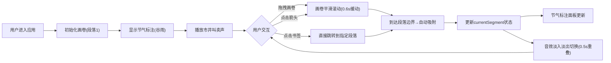

## 1. 产品概述

《南都繁会图》画卷互动展示应用，让用户以明代金陵茶馆掌柜的视角，通过虚拟转轴分段浏览明代市井长卷，同时同步感受当时的市井声景与节气文化。

- 核心价值：将静态古画转化为可交互的沉浸式文化体验，融合视觉、听觉双重感官
- 目标用户：文化爱好者、博物馆访客、教育工作者及对明代历史感兴趣的大众用户

## 2. 核心功能

### 2.1 用户角色
| 角色 | 注册方式 | 核心权限 |
|------|----------|----------|
| 访客用户 | 无需注册 | 浏览画卷、触发音效、调节音量、切换段落 |

### 2.2 功能模块
1. **画卷交互区**：横向长卷分段渲染、鼠标拖拽滚动、转轴点击控制
2. **节气标注面板**：右侧展示当前段落节气信息、书法字体显示
3. **声景同步引擎**：Web Audio API生成市井音效、段落切换时淡入淡出
4. **段落导航系统**：底部书签圆点、直接跳转功能
5. **音量控制组件**：主音量滑块调节

### 2.3 页面详情
| 页面名称 | 模块名称 | 功能描述 |
|----------|----------|----------|
| 主页面 | 画卷交互区 | Canvas绘制长卷分段，支持鼠标拖拽滚动，0.6秒缓动效果，段落边界自动吸附 |
| 主页面 | 节气标注面板 | 根据当前段落索引显示节气名称和简要解说，楷体文字，宣纸纹理背景 |
| 主页面 | 声景同步引擎 | 切换段落时自动触发对应音效混合，0.5秒交错重叠，音量可调节 |
| 主页面 | 段落导航系统 | 底部缩略书签圆点，当前段落金色高亮，点击直接跳转 |
| 主页面 | 音量控制 | 滑块控制主音量0-100% |

## 3. 核心流程

用户进入应用 → 看到初始画卷段落（第一段落）+ 对应节气标注 + 自动播放起始音效 → 用户通过拖拽画卷/点击转轴箭头/点击底部书签 → 画卷平滑滚动到下一段落 → 节气标注更新 → 对应音效淡入 → 继续交互浏览所有段落

## 4. 用户界面设计

### 4.1 设计风格
- **设计理念**：明代美学风格，典雅古朴，还原传统书画装裱形式
- **主色调**：米白 #f5e6d3（宣纸底色）、深褐 #4a2e1b（红木框）、黄褐色 #c49a6c（竹制转轴）、金色 #d4a017（高亮）
- **辅助色**：红木 #8b4513（轴头）、暗金 #b8860b（按钮）、墨色 #2a1a0e（文字）、米色 #d9c9b9（画卷底色）
- **按钮样式**：圆形暗金色按钮，悬停时放大1.1倍并轻微旋转3度，点击时scale 0.95过渡0.1s
- **字体**：标题隶书、正文楷体、节气标注书法字体
- **布局风格**：中心画卷为主，右侧信息面板，顶部题跋，底部署名栏，仿传统装裱格局
- **特殊效果**：木纹渐变边框、宣纸纹理背景、悬停淡入微光box-shadow

### 4.2 页面设计概述
| 页面名称 | 模块名称 | UI元素 |
|----------|----------|--------|
| 主页面 | 顶部题跋区 | 隶书标题"南都繁会图"，墨色 #2a1a0e，仿古籍题跋样式 |
| 主页面 | 画卷容器 | 红木框边框（深褐 #4a2e1b + 浅色木纹渐变），画卷绢本底色 #d9c9b9 |
| 主页面 | 竹制转轴 | 黄褐色 #c49a6c，两端红木轴头 #8b4513 径向渐变 |
| 主页面 | 左右箭头按钮 | 圆形暗金 #b8860b，悬停放大1.1倍+旋转3度，点击按压效果 |
| 主页面 | 节气标注面板 | 右侧宣纸纹理背景 #f5e6d3，楷体文字，节气书法大字 |
| 主页面 | 底部书签导航 | 小圆点，当前金色 #d4a017，其余米色 #d9c9b9 |
| 主页面 | 音量控制 | 滑块控件，主音量0-100%调节 |
| 主页面 | 底部署名栏 | 仿宣纸纹理，落款样式 |
| 主页面 | 节气符号叠加 | 画卷上方半透明节气图案（CSS伪元素绘制） |

### 4.3 响应式设计
- **桌面端（≥1024px）**：画卷居中，右侧节气面板固定，整体布局宽松
- **平板端（600px-1024px）**：节气面板宽度收窄，画卷自适应缩放
- **移动端（<600px）**：右侧面板折叠为顶部标签页，画卷占满全宽，底部书签保留
- **画卷自适应**：最小宽度320px，最大1200px，画幅比1:4，高度按比例缩放
- **触摸优化**：移动端支持触摸滑动，增加点击热区

### 4.4 动画与交互规范
- **画卷滚动**：0.6秒缓动效果（ease-in-out），段落边界自动吸附
- **音效切换**：0.5秒交错淡入淡出，避免突兀
- **按钮悬停**：放大1.1倍 + 旋转3度 + 淡入微光box-shadow
- **按钮点击**：scale 0.95过渡0.1秒
- **节气符号**：半透明叠加，随段落切换淡入淡出
- **整体加载**：元素依次显现，创造古韵仪式感

## 5. 性能约束
- **帧率要求**：画卷滚动和音效切换稳定在50fps以上
- **音频延迟**：音频播放启动延迟低于50ms
- **交互响应**：鼠标拖拽时视图更新延迟不超过100ms
- **内存管理**：音效生成后及时释放，避免内存泄漏
