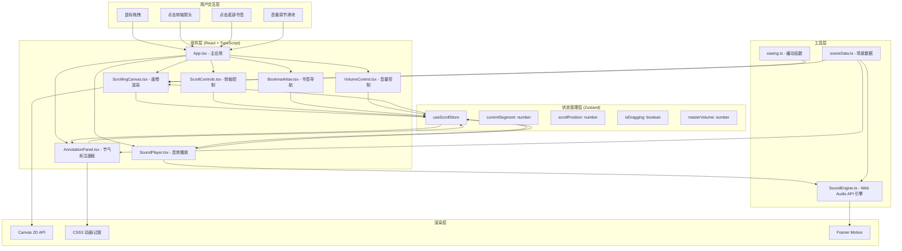
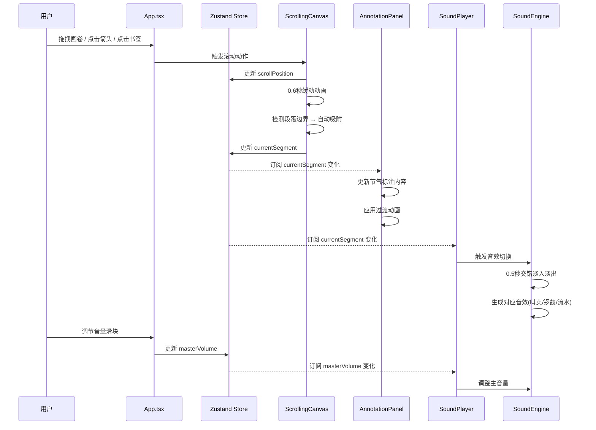

## 1. 架构设计



## 2. 技术描述

* **前端框架**：React 18 + TypeScript 5（严格模式）

* **构建工具**：Vite 5 + @vitejs/plugin-react

* **状态管理**：Zustand 4（轻量级状态管理）

* **动画库**：Framer Motion 11（UI动画、过渡效果）

* **音频引擎**：Web Audio API（原生实现，无第三方依赖）

* **渲染技术**：Canvas 2D API（画卷渲染）+ CSS3（UI样式）

* **初始化工具**：vite-init

### 项目依赖

| 包名                   | 版本      | 用途      |
| -------------------- | ------- | ------- |
| react                | ^18.2.0 | 核心框架    |
| react-dom            | ^18.2.0 | DOM渲染   |
| typescript           | ^5.0.0  | 类型系统    |
| vite                 | ^5.0.0  | 构建工具    |
| @vitejs/plugin-react | ^4.2.0  | React支持 |
| framer-motion        | ^11.0.0 | 动画效果    |
| zustand              | ^4.4.0  | 状态管理    |

## 3. 数据流向图



## 4. 核心数据模型

### 4.1 段落数据结构

```typescript
interface SceneSegment {
  id: number;
  title: string;           // 段落标题
  solarTerm: string;       // 对应节气
  description: string;     // 简要解说
  sceneType: 'tea_house' | 'wine_flag' | 'acrobatics' | 'cargo_boat' | 'market';
  soundType: 'call' | 'gong_drum' | 'water' | 'mixed';
  symbol: string;          // 节气符号CSS类名
  colors: {
    primary: string;
    secondary: string;
  };
}
```

### 4.2 Zustand Store 状态

```typescript
interface ScrollState {
  // 状态
  currentSegment: number;      // 当前段落索引
  scrollPosition: number;      // 滚动位置(像素)
  isDragging: boolean;         // 是否正在拖拽
  masterVolume: number;        // 主音量 0-1
  isAnimating: boolean;        // 是否正在动画中
  
  // 动作
  setCurrentSegment: (index: number) => void;
  setScrollPosition: (pos: number) => void;
  setIsDragging: (dragging: boolean) => void;
  setMasterVolume: (volume: number) => void;
  scrollToSegment: (index: number) => void;
  nextSegment: () => void;
  prevSegment: () => void;
}
```

### 4.3 配置常量

```typescript
// 画卷配置
const SCROLL_CONFIG = {
  SEGMENT_COUNT: 6,           // 总段落数
  SEGMENT_WIDTH: 800,         // 每段宽度(像素)
  SCROLL_DURATION: 600,       // 滚动时长(ms)
  EASING: 'easeInOutCubic',   // 缓动函数
  SNAP_THRESHOLD: 0.3,        // 吸附阈值(30%段落宽度)
};

// 音效配置
const SOUND_CONFIG = {
  FADE_DURATION: 500,         // 淡入淡出时长(ms)
  CROSSFADE_OVERLAP: 500,     // 交叉重叠时长(ms)
  CALL_FREQUENCY: 200,        // 叫卖声基频(Hz)
  GONG_FREQ: 500,             // 锣鼓声中心频率(Hz)
};

// 响应式配置
const RESPONSIVE_CONFIG = {
  MIN_WIDTH: 320,
  MAX_WIDTH: 1200,
  ASPECT_RATIO: 0.25,         // 高:宽 = 1:4
  MOBILE_BREAKPOINT: 600,
};

// 颜色常量
const COLORS = {
  PAPER: '#f5e6d3',
  SCROLL_BG: '#d9c9b9',
  BAMBOO: '#c49a6c',
  ROSEWOOD: '#8b4513',
  FRAME: '#4a2e1b',
  GOLD: '#d4a017',
  DARK_GOLD: '#b8860b',
  INK: '#2a1a0e',
  BEIGE: '#d9c9b9',
};
```

## 5. 模块调用关系

| 模块                  | 依赖模块                                                                                                      | 调用方式           | 用途      |
| ------------------- | --------------------------------------------------------------------------------------------------------- | -------------- | ------- |
| App.tsx             | ScrollingCanvas, AnnotationPanel, SoundPlayer, ScrollControls, BookmarkNav, VolumeControl, useScrollStore | 组件组合           | 主应用协调   |
| ScrollingCanvas.tsx | useScrollStore, sceneData, easing, framer-motion                                                          | 调用store动作、导入数据 | 画卷渲染与交互 |
| AnnotationPanel.tsx | useScrollStore, sceneData, framer-motion                                                                  | 订阅store状态      | 节气标注展示  |
| SoundPlayer.tsx     | useScrollStore, SoundEngine, sceneData                                                                    | 订阅store、调用引擎   | 音效播放控制  |
| ScrollControls.tsx  | useScrollStore                                                                                            | 调用store动作      | 转轴按钮控制  |
| BookmarkNav.tsx     | useScrollStore, sceneData                                                                                 | 订阅+调用store     | 书签导航    |
| VolumeControl.tsx   | useScrollStore                                                                                            | 订阅+调用store     | 音量调节    |
| SoundEngine.ts      | 无（原生Web Audio API）                                                                                        | 类实例化调用         | 音效生成引擎  |
| sceneData.ts        | 无（静态数据）                                                                                                   | 导入使用           | 场景段落数据  |
| easing.ts           | 无（纯函数）                                                                                                    | 导入调用           | 缓动计算    |

## 6. 性能优化方案

### 6.1 Canvas 渲染优化

* 使用 `requestAnimationFrame` 进行帧同步

* 实现离屏Canvas缓存静态内容

* 只重绘可视区域，避免全量重绘

* 拖拽时降低绘制复杂度，释放后还原

### 6.2 音频性能优化

* 预创建AudioContext，懒加载音频节点

* 复用振荡器和滤波器节点，避免频繁创建销毁

* 使用增益节点实现平滑淡入淡出

* 限制同时发声的音频节点数量

### 6.3 React 渲染优化

* 使用 `useMemo` 和 `useCallback` 缓存计算结果和回调

* 使用 Zustand 的 selector 避免不必要重渲染

* 组件拆分，单一职责，减少重渲染范围

* 使用 `React.memo` 包裹纯展示组件

### 6.4 动画性能优化

* 使用 CSS transform 和 opacity 实现硬件加速动画

* 避免在动画中修改 layout 相关属性

* 使用 Framer Motion 的 layout 动画优化

* 拖拽时使用 will-change 提示浏览器优化

## 7. 文件结构

```
project/
├── package.json
├── vite.config.js
├── tsconfig.json
├── index.html
├── src/
│   ├── App.tsx                    # 主组件
│   ├── main.tsx                   # 入口文件
│   ├── index.css                  # 全局样式
│   ├── components/
│   │   ├── ScrollingCanvas.tsx    # 画卷渲染组件
│   │   ├── AnnotationPanel.tsx    # 节气标注面板
│   │   ├── SoundPlayer.tsx        # 音效播放组件
│   │   ├── ScrollControls.tsx     # 转轴控制按钮
│   │   ├── BookmarkNav.tsx        # 书签导航
│   │   └── VolumeControl.tsx      # 音量控制
│   ├── store/
│   │   └── useScrollStore.ts      # Zustand状态管理
│   ├── utils/
│   │   ├── SoundEngine.ts         # Web Audio API音效引擎
│   │   ├── sceneData.ts           # 场景段落数据
│   │   └── easing.ts              # 缓动函数
│   └── types/
│       └── index.ts               # TypeScript类型定义
└── .trae/
    └── documents/
        ├── PRD.md
        └── TechArch.md
```

## 8. 路由定义

本项目为单页应用，无多路由配置。

| 路由 | 用途             |
| -- | -------------- |
| /  | 主页面，包含完整画卷交互体验 |

## 9. 初始化与启动

### 开发环境

```bash
npm install
npm run dev
```

### 生产构建

```bash
npm run build
npm run preview
```

