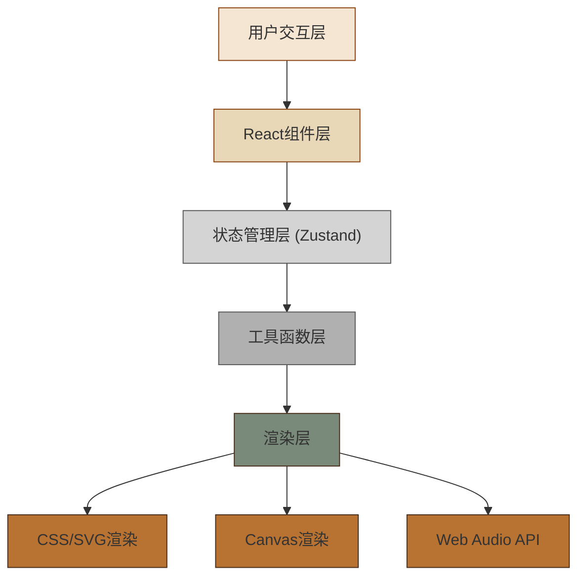

## 1. 架构设计



## 2. 技术描述
- **前端框架**：React@18 + TypeScript@5
- **构建工具**：Vite@5 + @vitejs/plugin-react@4
- **状态管理**：Zustand@4
- **动画库**：framer-motion@11
- **音频库**：tone@14
- **样式方案**：CSS Modules + CSS Variables
- **渲染方式**：CSS 3D变换 + SVG + Canvas 2D

## 3. 目录结构
```
src/
├── components/
│   ├── Mirror.tsx          # 铜镜组件（镜面渲染、纹饰、划痕）
│   ├── GrindingStone.tsx   # 磨石组件（拖拽、研磨交互）
│   ├── DeerSkin.tsx        # 鹿皮组件（抛光交互）
│   ├── OilLamp.tsx         # 油灯组件（光源控制）
│   ├── ProgressPanel.tsx   # 进度面板（数据展示）
│   └── Workshop.tsx        # 工坊场景容器
├── store/
│   └── useGrindingStore.ts # 全局状态管理
├── utils/
│   ├── audio.ts            # 音频工具
│   └── grinding.ts         # 研磨算法工具
├── types/
│   └── index.ts            # 类型定义
├── App.tsx                 # 根组件
└── main.tsx                # 入口文件
```

## 4. 状态管理设计

使用Zustand管理全局状态：

```typescript
interface GrindingState {
  // 研磨进度 0-100
  grindingProgress: number;
  // 研磨均度 0-100
  uniformity: number;
  // 镜面反射率 20-95
  reflectivity: number;
  // 纹饰清晰度 0-100
  patternClarity: number;
  // 划痕数量
  scratchCount: number;
  // 当前使用的磨石目数
  currentGrit: 120 | 400 | 1200 | null;
  // 是否正在使用鹿皮
  isPolishing: boolean;
  // 光源角度（度数）
  lightAngle: number;
  // 镜面是否受损
  isDamaged: boolean;
  
  // Actions
  startGrinding: (grit: number) => void;
  updateGrinding: (force: number, direction: number) => void;
  stopGrinding: () => void;
  startPolishing: () => void;
  updatePolishing: (force: number) => void;
  stopPolishing: () => void;
  setLightAngle: (angle: number) => void;
  addScratch: () => void;
  fixScratch: () => void;
  reset: () => void;
}
```

## 5. 核心算法

### 5.1 研磨力度计算
```
拖拽速度 = 两点距离 / 时间差
力度 = min(拖拽速度 / 基准速度, 2.0)
研磨效率 = 力度 × 磨石目数系数
  - 粗磨(120目): 系数1.5
  - 中磨(400目): 系数1.0
  - 精磨(1200目): 系数0.6
划痕概率 = 力度 > 1.5 ? (力度 - 1.5) × 0.3 : 0
```

### 5.2 反射率计算
```
反射率 = 20 + 研磨进度 × 0.5 + 抛光进度 × 0.25
最终反射率 = min(反射率, 95)
```

### 5.3 纹饰清晰度分级
| 清晰度范围 | 文字描述 |
|------------|----------|
| 0-20 | 镜面粗糙，无明显纹饰 |
| 21-40 | 纹路依稀可辨 |
| 41-60 | 缠枝轮廓初现 |
| 61-80 | 葡萄颗颗分明 |
| 81-95 | 纹饰清晰如绘 |
| 96-100 | 光可鉴人，纹饰生动 |

## 6. 性能优化

1. **动画优化**：使用framer-motion的transform和opacity动画，避免触发布局重排
2. **Canvas渲染**：使用requestAnimationFrame批量绘制，节流至60fps
3. **状态更新**：Zustand状态分片更新，避免不必要的重渲染
4. **事件节流**：mousemove/touchmove事件使用throttle优化
5. **资源预加载**：音频上下文提前初始化，避免首次交互延迟
