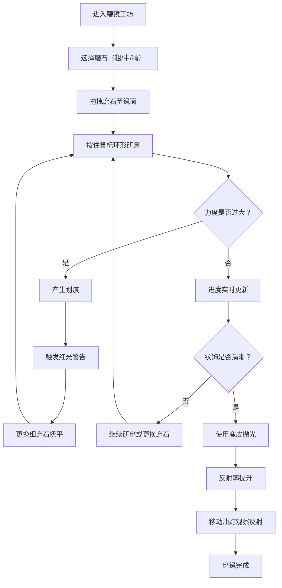

## 1. 产品概述

古代磨镜工坊是一款沉浸式Web交互应用，让用户体验唐代磨镜匠人的工作流程，通过虚拟操作磨石与鹿皮，亲手研磨铜镜并观察镜面反射效果的变化。

- 核心价值：通过高度拟真的交互体验，传承中国传统手工艺文化，让用户在游戏化操作中了解古代铜镜制作工艺
- 目标用户：历史文化爱好者、教育机构、博物馆参观者、对传统工艺感兴趣的大众用户

## 2. 核心功能

### 2.1 用户角色
| 角色 | 注册方式 | 核心权限 |
|------|----------|----------|
| 普通用户 | 无需注册，直接访问 | 完整的磨镜操作体验，所有交互功能 |

### 2.2 功能模块
1. **磨镜工坊主场景**：CSS构建的3D视觉工坊，包含石质磨台、铜镜、磨石架、鹿皮、油灯
2. **研磨交互系统**：拖拽磨石进行环形研磨，力度由速度控制，支持粗/中/精三种目数
3. **抛光交互系统**：使用鹿皮抛光，提升镜面反射率
4. **光源调节系统**：可移动油灯位置，观察不同角度下的镜面反射
5. **进度监控面板**：实时显示研磨均度、反射率、纹饰清晰度
6. **划痕反馈系统**：力度过大产生划痕，触发警告动画
7. **音频反馈系统**：Web Audio API生成金属摩擦沙沙声，随力度变化

### 2.3 页面详情
| 页面名称 | 模块名称 | 功能描述 |
|----------|----------|----------|
| 磨镜工坊主页面 | 工坊场景渲染 | 青石地面、木质墙板、石质磨台的CSS构建 |
| 磨镜工坊主页面 | 铜镜组件 | 镜背缠枝葡萄纹SVG、镜面渐变、Canvas划痕叠加 |
| 磨镜工坊主页面 | 磨石组件 | 三种目数磨石，可拖拽，悬停高亮显示目数 |
| 磨镜工坊主页面 | 鹿皮组件 | 半透明柔软质地，用于抛光 |
| 磨镜工坊主页面 | 油灯组件 | 可点击切换位置，CSS火焰动画 |
| 磨镜工坊主页面 | 进度面板 | 环形进度条、反射率数值、纹饰文字描述 |
| 磨镜工坊主页面 | 音频系统 | 研磨沙沙声、抛光声效 |

## 3. 核心流程

用户进入磨镜工坊，首先看到古朴的唐代作坊场景。从左侧石墙选取磨石拖拽到镜面，按住鼠标进行环形研磨，力度由拖拽速度控制。研磨过程中观察进度面板，待纹饰初步显现后更换细目磨石继续精磨，最后用鹿皮抛光至镜面光亮。完成后可移动油灯观察不同角度下的镜面反射效果和纹饰清晰度。若操作不当产生划痕，需用更细磨石重新抚平。

## 4. 用户界面设计

### 4.1 设计风格
- **主色调**：檀木色#8b4513、宣纸色#f5e6d3、青铜色#b87333、青石色#7a8a7a
- **辅助色**：暗铜#4a2e1b、亮金#b87333、木质墙板#6b4e3a、鹿皮#e8d8b8
- **按钮风格**：圆角矩形，檀木色边框，hover时0.2s缩放1.05倍，颜色渐变
- **字体**：采用具有书法质感的中文字体，标题使用楷体，正文使用宋体
- **布局风格**：场景居中，左侧进度面板，右侧操作区域，边角装饰卷草纹
- **装饰元素**：檀木色边框，宣纸纹理背景，卷草纹边角装饰

### 4.2 页面设计概述
| 页面名称 | 模块名称 | UI元素 |
|----------|----------|--------|
| 磨镜工坊主页面 | 工坊场景 | 青石地面径向渐变、木质墙板纹理、石质磨台3D效果、宣纸背景 |
| 磨镜工坊主页面 | 铜镜组件 | 圆形青铜渐变、SVG缠枝葡萄纹（模糊→清晰）、Canvas划痕层、高光反射 |
| 磨镜工坊主页面 | 磨石组件 | 三种灰度颜色、悬停高亮、目数标签、拖拽阴影 |
| 磨镜工坊主页面 | 鹿皮组件 | 半透明米黄色、柔软边缘、拖拽形变 |
| 磨镜工坊主页面 | 油灯组件 | 青铜灯盏、CSS火焰径向渐变、光晕动画 |
| 磨镜工坊主页面 | 进度面板 | 环形进度条（檀木色）、数值显示、文字描述等级 |

### 4.3 响应式
- **桌面优先**：主场景1200px以上完整展示，进度面板固定左侧
- **平板适配**：768px以上，横竖屏支持，进度面板可折叠
- **触摸优化**：支持触摸拖拽，研磨区域适当放大

### 4.4 性能要求
- 拖拽研磨帧率不低于55FPS
- 动画和音频延迟不超过100ms
- 使用requestAnimationFrame优化动画循环
- Canvas渲染节流，避免频繁重绘
