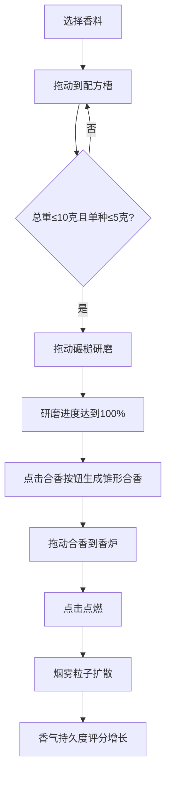

## 1. 产品概述

西市调香坊是一款基于浏览器的互动游戏应用，模拟唐代长安城西市胡商香料铺场景，让用户体验古代调香师的角色，通过拖动香料、研磨、合香、点燃等完整流程，调配独特的复合香并观察烟雾扩散效果。

- 主要用途：文化体验类互动游戏，用户通过沉浸式的调香过程感受唐代香料文化
- 目标用户：对中国传统文化爱好者、互动艺术爱好者、休闲游戏玩家
- 产品价值：将传统文化与现代交互技术结合，提供沉浸式的调香体验

## 2. 核心功能

### 2.1 用户角色

| 角色 | 注册方式 | 核心权限 |
|------|----------|----------|
| 调香师 | 无需注册，直接进入 | 完整的调香、研磨、合香、点燃体验 |

### 2.2 功能模块

1. **主场景**：原料架、乳钵、香炉三大核心区域布局

### 2.3 页面详情

| 页面名称 | 模块名称 | 功能描述 |
|-----------|-------------|---------------------|
| 主场景 | 原料架模块 | 展示3种香料（龙涎、乳香、没药），支持拖动添加到配方槽，实时显示克数和重量条 |
| 主场景 | 乳钵模块 | 鼠标拖动碾槌做圆周运动研磨，环形进度条显示研磨进度 |
| 主场景 | 香炉模块 | 放置合香、点燃、烟雾粒子系统模拟，香气持久度评分 |
| 主场景 | 配方管理模块 | 控制每种香料最多5克，总重不超过10克 |

## 3. 核心流程

## 4. 用户界面设计

### 4.1 设计风格

- **主色调**：暗木纹背景 (#3a2a1a) 搭配金色装饰 (#d4a017)
- **辅助色**：青铜锈色 (#6b8e6b、#8b5e3a)，深灰色 (#3a3a3a)
- **按钮风格**：古典中式风格，圆角金边，悬停时微放大效果
- **字体**：采用古典书法风格字体搭配现代易读字体组合
- **布局风格**：三列对称布局，中央乳钵为视觉中心
- **视觉元素**：木质纹理、青铜质感、金色描边、烟雾粒子效果

### 4.2 页面设计概述

| 页面名称 | 模块名称 | UI 元素 |
|-----------|-------------|-------------|
| 主场景 | 原料架 | 木纹面板 (#6b4e3a)，瓷瓶径向渐变釉面，悬停放大1.08倍，显示气味描述 |
| 主场景 | 乳钵 | CSS 3D透视圆钵，青铜锈色渐变钵壁，环形进度条（#4a2e1b到#d4a017），碾槌拖尾动画 |
| 主场景 | 香炉 | 三足圆鼎，炉盖镂空蟠螭纹（网格线#8b6f47），点燃后背景亮度提升 |
| 主场景 | 烟雾粒子 | 径向渐变半透明圆形，布朗运动随机偏移，基于配方主色 |

### 4.3 响应式设计

- **桌面端**（≥768px）：三列布局，原料架-乳钵-香炉水平排列
- **移动端**（<768px）：单列堆叠布局，乳钵和香炉尺寸缩小50%
- **触摸优化**：增大触控区域，支持触摸拖动操作

### 4.4 交互反馈

- 拖动时：元素增加阴影 box-shadow: 0 4px 12px rgba(0,0,0,0.4)
- 研磨时：碾槌路径留下半透明金色轨迹，2秒后渐隐
- 点燃后：背景滤镜亮度提升至1.05模拟火光映照
