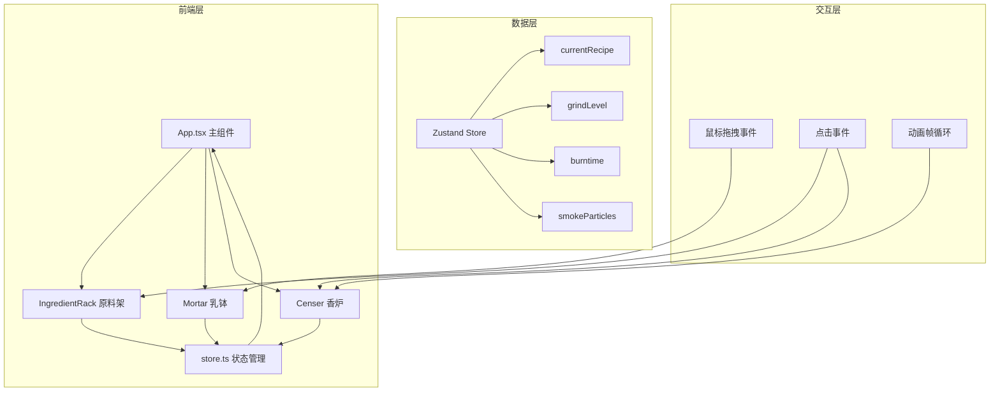

## 1. 架构设计



## 2. 技术栈说明

- **前端框架**：React@18 + TypeScript@5
- **构建工具**：Vite@5 + @vitejs/plugin-react
- **状态管理**：Zustand@4
- **动画库**：framer-motion@11
- **样式方案**：CSS Modules + 内联样式 + CSS 变量
- **初始化方式**：Vite 手动初始化

## 3. 项目结构

```
src/
├── App.tsx                 # 主组件，整体布局与数据流
├── store.ts                # Zustand 状态管理
├── components/
│   ├── IngredientRack.tsx  # 原料架组件
│   ├── Mortar.tsx          # 乳钵组件
│   └── Censer.tsx          # 香炉组件
├── types/
│   └── index.ts            # TypeScript 类型定义
└── utils/
    └── color.ts            # 颜色混合工具函数
```

### 数据流向说明

1. **App.tsx** 初始化 store 并渲染子组件
2. **IngredientRack.tsx** 读取 store.currentRecipe，用户点击/拖动时调用 store.addIngredient
3. **Mortar.tsx** 读取 store.grindLevel，鼠标拖动碾槌时调用 store.setGrind
4. **Censer.tsx** 读取 store.burntime 和 store.smokeParticles，点燃后每100ms调用 store.tick
5. **store.ts** 管理所有核心状态，actions 更新状态后触发组件重新渲染

## 4. 核心数据模型

```typescript
// 原料类型
interface Ingredient {
  name: string;
  color: string;
  description: string;
  maxGrams: number;
}

// 配方项
interface RecipeItem {
  name: string;
  grams: number;
  color: string;
}

// 烟雾粒子
interface SmokeParticle {
  id: number;
  x: number;
  y: number;
  diameter: number;
  opacity: number;
  velocityX: number;
  velocityY: number;
  createdAt: number;
  color: string;
}

// Store 状态
interface StoreState {
  currentRecipe: RecipeItem[];
  grindLevel: number;
  burntime: number;
  smokeParticles: SmokeParticle[];
  isBurning: boolean;
  hasIncense: boolean;
  incenseColor: string;
  addIngredient: (name: string, grams: number, color: string) => void;
  setGrind: (level: number) => void;
  ignite: () => void;
  tick: () => void;
  reset: () => void;
}
```

## 5. 性能优化策略

1. **烟雾粒子控制**：最多200个粒子，超出时回收最早生成的粒子
2. **研磨帧率**：使用 requestAnimationFrame 确保60fps拖拽响应
3. **动画优化**：使用 CSS transform 和 opacity 动画，避免触发重排
4. **状态更新**：Zustand 浅比较减少不必要的重渲染
5. **粒子更新**：批量更新粒子状态，每帧统一计算位置

## 6. 构建配置

| 配置文件 | 关键配置项 |
|----------|------------|
| vite.config.js | 路径别名 @ 指向 src，React 插件 |
| tsconfig.json | strict 模式，esnext 模块，baseUrl + paths |
| package.json | 依赖：react, react-dom, typescript, vite, @vitejs/plugin-react, framer-motion, zustand |
