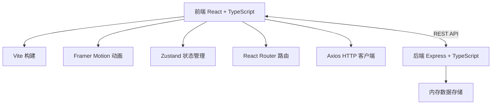
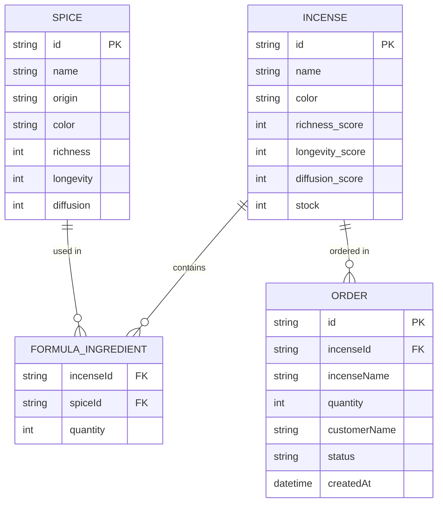

## 1. 架构设计



## 2. 技术描述

* **前端**：React\@18 + TypeScript + Vite\@5

* **状态管理**：Zustand\@4

* **动画库**：Framer Motion\@11

* **路由**：React Router DOM\@6

* **HTTP客户端**：Axios\@1

* **后端**：Express\@4 + TypeScript + ts-node

* **数据存储**：内存数组（开发环境）

## 3. 项目结构

```
├── package.json
├── vite.config.js
├── tsconfig.json
├── index.html
├── src/
│   ├── App.tsx              # 主应用组件，路由与全局状态
│   ├── store/
│   │   └── useStore.ts      # Zustand 状态管理
│   ├── types/
│   │   └── index.ts         # TypeScript 类型定义
│   ├── components/
│   │   ├── Shop.tsx         # 店铺主场景
│   │   ├── MixPanel.tsx     # 调香面板
│   │   ├── Inventory.tsx    # 库存与订单管理
│   │   ├── SpiceBottle.tsx  # 香料瓷瓶组件
│   │   ├── Mortar.tsx       # 乳钵组件
│   │   ├── IncenseBall.tsx  # 合香球组件
│   │   ├── Censer.tsx       # 香炉组件
│   │   ├── TastingPanel.tsx # 品鉴面板
│   │   └── SmokeParticle.tsx# 烟雾粒子组件
│   ├── utils/
│   │   ├── colorUtils.ts    # 颜色混合工具
│   │   └── spiceData.ts     # 香料数据
│   ├── server/
│   │   └── server.ts        # Express 后端
│   └── styles/
│       └── global.css       # 全局样式
```

## 4. 路由定义

| 路由 | 用途                 |
| -- | ------------------ |
| /  | 香铺主场景，包含调香、试香、库存管理 |

## 5. API 定义

### 5.1 TypeScript 类型

```typescript
interface Spice {
  id: string;
  name: string;
  origin: string;
  color: string;
  properties: {
    richness: number;      // 醇厚度属性 0-100
    longevity: number;     // 持久度属性 0-100
    diffusion: number;     // 扩散度属性 0-100
  };
}

interface FormulaIngredient {
  spiceId: string;
  quantity: number;        // 0-10份
}

interface Incense {
  id: string;
  name: string;
  formula: FormulaIngredient[];
  color: string;
  scores: {
    richness: number;
    longevity: number;
    diffusion: number;
  };
  stock: number;           // 库存数量
}

interface Order {
  id: string;
  incenseId: string;
  incenseName: string;
  quantity: number;
  customerName: string;
  status: 'pending' | 'shipped';
  createdAt: string;
}
```

### 5.2 接口列表

| 方法   | 路径                   | 描述     | 请求                                | 响应                                 |
| ---- | -------------------- | ------ | --------------------------------- | ---------------------------------- |
| GET  | /api/spices          | 获取所有香料 | -                                 | Spice\[]                           |
| GET  | /api/inventory       | 获取库存列表 | -                                 | Incense\[]                         |
| POST | /api/inventory       | 新增香品入库 | Incense                           | Incense                            |
| PUT  | /api/inventory/:id   | 更新香品库存 | { stock: number }                 | Incense                            |
| GET  | /api/orders          | 获取订单列表 | -                                 | Order\[]                           |
| POST | /api/orders          | 创建订单   | Omit\<Order, 'id' \| 'createdAt'> | Order                              |
| PUT  | /api/orders/:id/ship | 订单发货   | -                                 | { order: Order, incense: Incense } |

## 6. 数据模型

### 6.1 ER 图



### 6.2 初始香料数据

```typescript
const spices: Spice[] = [
  { id: 's1', name: '龙涎香', origin: '三佛齐', color: '#8b7355', properties: { richness: 90, longevity: 95, diffusion: 60 } },
  { id: 's2', name: '沉香', origin: '真腊', color: '#4a3728', properties: { richness: 85, longevity: 85, diffusion: 70 } },
  { id: 's3', name: '檀香', origin: '天竺', color: '#c19a6b', properties: { richness: 75, longevity: 80, diffusion: 75 } },
  { id: 's4', name: '乳香', origin: '大食', color: '#f5f5dc', properties: { richness: 60, longevity: 65, diffusion: 90 } },
  { id: 's5', name: '安息香', origin: '波斯', color: '#daa520', properties: { richness: 70, longevity: 75, diffusion: 85 } },
  { id: 's6', name: '苏合香', origin: '拜占庭', color: '#8b4513', properties: { richness: 80, longevity: 70, diffusion: 65 } },
  { id: 's7', name: '丁香', origin: '婆利', color: '#8b0000', properties: { richness: 65, longevity: 60, diffusion: 80 } },
  { id: 's8', name: '木香', origin: '昆仑', color: '#228b22', properties: { richness: 55, longevity: 70, diffusion: 70 } },
  { id: 's9', name: '白芷', origin: '大宋', color: '#f0e68c', properties: { richness: 50, longevity: 55, diffusion: 85 } },
  { id: 's10', name: '甘松', origin: '吐蕃', color: '#6b8e23', properties: { richness: 60, longevity: 65, diffusion: 75 } },
  { id: 's11', name: '零陵香', origin: '岭南', color: '#90ee90', properties: { richness: 55, longevity: 60, diffusion: 80 } },
  { id: 's12', name: '藿香', origin: '交趾', color: '#9acd32', properties: { richness: 65, longevity: 55, diffusion: 90 } },
  { id: 's13', name: '麝香', origin: '西域', color: '#8b4513', properties: { richness: 95, longevity: 90, diffusion: 85 } },
  { id: 's14', name: '柏子仁', origin: '大宋', color: '#f5deb3', properties: { richness: 45, longevity: 50, diffusion: 60 } },
  { id: 's15', name: '桂花', origin: '江南', color: '#ffd700', properties: { richness: 70, longevity: 45, diffusion: 95 } },
  { id: 's16', name: '兰花', origin: '荆楚', color: '#9370db', properties: { richness: 65, longevity: 40, diffusion: 85 } },
  { id: 's17', name: '梅花', origin: '江南', color: '#ffc0cb', properties: { richness: 60, longevity: 45, diffusion: 80 } },
  { id: 's18', name: '菊花', origin: '大宋', color: '#ff8c00', properties: { richness: 55, longevity: 50, diffusion: 75 } }
];
```

## 7. 性能优化

### 7.1 前端优化

* **动画性能**：使用 CSS transform 和 opacity 进行动画，开启 GPU 加速

* **requestAnimationFrame**：复杂的研磨动画和烟雾粒子使用 RAF 控制

* **组件优化**：使用 React.memo 避免不必要的重渲染

* **状态管理**：Zustand 轻量级状态管理，避免不必要的订阅

* **粒子复用**：烟雾粒子使用对象池技术，避免频繁创建销毁

### 7.2 后端优化

* **内存存储**：使用数组存储，响应时间 < 200ms

* **CORS 配置**：开发环境开启跨域支持

* **错误处理**：统一错误响应格式

