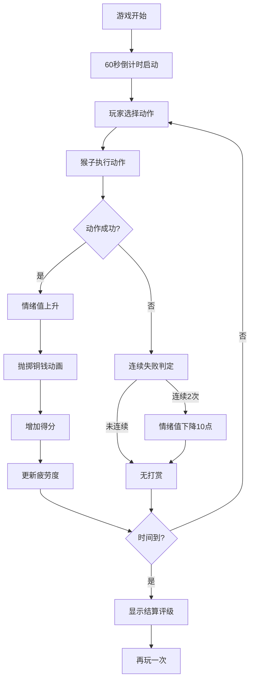

## 1. 产品概述
唐代长安西市百戏杂耍表演与即时打赏互动策略模拟游戏。玩家扮演驯猴艺人，操控猴子完成爬竿、翻筋斗等动作，在60秒内获取尽可能多的打赏金额，同时管理猴子疲劳度和围观者情绪。

- 核心玩法：策略性选择动作平衡收益与风险，通过即时反馈调整策略
- 目标用户：喜欢策略模拟和休闲游戏的玩家
- 市场价值：独特的唐代文化背景，结合即时策略与反应机制，提供沉浸式古代市集体验

## 2. 核心功能

### 2.1 用户角色
| 角色 | 注册方式 | 核心权限 |
|------|----------|----------|
| 玩家 | 无需注册 | 操控猴子表演、选择动作、查看游戏状态 |

### 2.2 功能模块
1. **主舞台**：木竿动画、猴子表演动作、打赏铜钱抛掷动画、围观者角色
2. **动作选择面板**：4-6个表演动作按钮，显示耗时、成功率、冷却倒计时
3. **状态显示面板**：倒计时、得分、疲劳度圆环、情绪值显示
4. **结算界面**：最终打赏金额、评级（铜/银/金）

### 2.3 页面详情
| 页面名称 | 模块名称 | 功能描述 |
|-----------|-------------|---------------------|
| 游戏主页面 | 主舞台 | 猴子表演动作动画、木竿、围观者CSS角色、铜钱抛物动画 |
| 游戏主页面 | 动作面板 | 动作选择按钮、冷却显示、疲劳度颜色渐变 |
| 游戏主页面 | 状态面板 | 60秒倒计时、得分、疲劳度圆环、情绪值进度条 |
| 结算弹窗 | 结果展示 | 最终金额、评级、再玩一次按钮 |

## 3. 核心流程
玩家进入游戏 → 开始60秒倒计时 → 选择表演动作 → 猴子执行动作（成功/失败判定）→ 围观者抛掷铜钱打赏 → 更新得分、疲劳度、情绪值 → 根据铜钱分布选择下一个动作 → 时间结束显示结算结果。

## 4. 用户界面设计

### 4.1 设计风格
- **主色调**：米黄色#f5e6c8背景、青灰砖纹#7a8a7a地面、仿古木纹#8b6f47边框
- **点缀色**：竹黄色#d4a76a（木竿）、书生青色#3a6b8d、胡商红色#c0392b、铜钱渐变#ebb04b到#8b6914
- **按钮风格**：圆角8px，绫绸质感渐变色，悬停缩放1.05，点击下压反弹
- **字体**：使用楷体/宋体风格字体营造古风，标题加粗醒目
- **布局风格**：宽屏三栏布局（左动作面板+中舞台+右状态面板），平板底部横向排列
- **动画风格**：framer-motion平滑过渡，抛物线铜钱，CSS关键帧动作动画

### 4.2 页面设计概述
| 页面名称 | 模块名称 | UI元素 |
|-----------|-------------|-------------|
| 游戏主页面 | 主舞台 | 200px竹黄木竿居中，猴子角色执行CSS动画，围观者围绕舞台边缘，铜钱从围观者抛物线飞向猴子 |
| 游戏主页面 | 动作面板 | 200px宽竖排按钮，每按钮高50px，显示动作名、耗时秒数、成功率百分比，疲劳度≥80%按钮变红 |
| 游戏主页面 | 状态面板 | 180px宽，顶部大号倒计时数字，得分显示，疲劳度圆环进度条绿→红渐变，情绪值进度条 |
| 结算弹窗 | 结果展示 | 半透明遮罩，居中卡片显示"最终打赏：XXX文"，铜/银/金徽章，"再来一局"按钮 |

### 4.3 响应式
- **宽屏(1440px+)**：三栏水平排列，左侧动作面板200px，中间舞台60%宽度，右侧状态面板180px
- **平板(768px)**：面板下移至底部横向排列，舞台占满上部空间，按钮改为横排
- **触摸优化**：按钮最小高度50px，足够的触摸区域，手势反馈

### 4.4 性能优化
- 铜钱同时存在最多20枚，超出移除最早出现的
- 使用transform和opacity属性动画保证GPU加速
- 游戏全程保持30FPS以上
- 组件合理memo避免不必要重渲染
