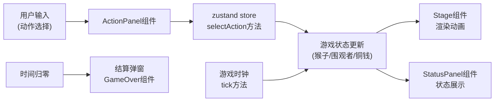

## 1. 架构设计



## 2. 技术描述
- **前端框架**：React@18 + TypeScript + Vite
- **状态管理**：zustand（集中管理游戏时钟、猴子状态、围观状态、铜钱列表）
- **动画库**：framer-motion（动作平滑过渡、铜钱抛物线、按钮交互动画）
- **样式方案**：CSS Modules + CSS变量（主题色统一管理）
- **构建工具**：Vite
- **无后端依赖**，纯前端游戏，本地状态管理

## 3. 目录结构与调用关系
```
src/
├── types.ts          # 类型定义（被所有文件引用）
├── store.ts          # zustand状态管理（被组件调用）
├── App.tsx           # 主应用入口（组合所有组件）
├── main.tsx          # React入口
├── index.css         # 全局样式与CSS变量
├── components/
│   ├── Stage.tsx         # 主舞台（依赖store状态、framer-motion）
│   ├── ActionPanel.tsx   # 动作面板（调用store.selectAction）
│   ├── StatusPanel.tsx   # 状态面板（订阅store状态）
│   ├── Monkey.tsx        # 猴子角色组件（被Stage调用）
│   ├── Audience.tsx      # 围观者组件（被Stage调用）
│   ├── Coin.tsx          # 铜钱组件（被Stage调用）
│   └── GameOver.tsx      # 结算弹窗（被App调用）
└── utils/
    └── gameLogic.ts      # 游戏逻辑工具函数（被store调用）
```

**数据流方向**：
`types.ts` → `store.ts` → `components/*` → `App.tsx`

## 4. 数据模型

### 4.1 核心类型定义

```typescript
// 动作类型
interface Action {
  id: string;
  name: string;
  duration: number;      // 耗时（秒）
  successRate: number;   // 成功率 0-1
  fatigueCost: number;   // 消耗疲劳度
  moodBoost: number;     // 成功后情绪提升
  rewardMultiplier: number; // 打赏倍率
}

// 猴子状态
interface MonkeyState {
  currentAction: Action | null;
  fatigue: number;       // 0-100
  score: number;         // 总打赏金额
  isStunned: boolean;    // 是否罢工
  stunEndTime: number;   // 罢工结束时间戳
  position: { x: number; y: number };
  consecutiveFailures: number;
}

// 围观者状态
interface AudienceState {
  count: number;         // 围观人数
  mood: number;          // 情绪值 0-100
  members: AudienceMember[];
}

interface AudienceMember {
  id: string;
  type: 'scholar' | 'merchant' | 'elder' | 'child';
  color: string;
  position: { x: number; y: number };
}

// 铜钱
interface Coin {
  id: string;
  startPos: { x: number; y: number };
  endPos: { x: number; y: number };
  value: number;
  createdAt: number;
  collected: boolean;
}

// 游戏状态
interface GameState {
  timeLeft: number;      // 剩余时间（秒）
  isPlaying: boolean;
  isGameOver: boolean;
  monkey: MonkeyState;
  audience: AudienceState;
  coins: Coin[];
  actionCooldowns: Record<string, number>;
}
```

### 4.2 Store方法定义
```typescript
interface GameStore extends GameState {
  tick: () => void;                           // 每帧更新
  selectAction: (actionId: string) => void;   // 选择动作
  startGame: () => void;                      // 开始游戏
  resetGame: () => void;                      // 重置游戏
}
```

## 5. 核心算法逻辑

### 5.1 动作成功判定
```typescript
function calculateSuccess(action: Action, fatigue: number): boolean {
  let rate = action.successRate;
  if (fatigue >= 80) rate *= 0.5; // 高疲劳成功率减半
  return Math.random() < rate;
}
```

### 5.2 铜钱数量计算
```typescript
function calculateCoinCount(mood: number): number {
  const base = 2;
  const bonus = Math.floor(mood / 20);
  return Math.min(base + bonus, 8); // 上限8枚
}
```

### 5.3 疲劳度管理
- 翻筋斗：+15
- 爬竿：+10
- 倒立：+12
- 休息：-20
- 疲劳≥100：强制休息3秒，猴子罢工

## 6. 评级阈值
| 评级 | 得分阈值 |
|------|----------|
| 金 | ≥ 300文 |
| 银 | 150-299文 |
| 铜 | < 150文 |

## 7. 性能优化策略
1. **铜钱池管理**：最多20枚同时存在，超出移除最早的
2. **React.memo**：Stage子组件（Monkey、Audience、Coin）使用memo
3. **动画属性**：仅使用transform和opacity做动画
4. **requestAnimationFrame**：游戏主循环使用RAF保证流畅
5. **批量更新**：zustand状态批量更新减少重渲染
