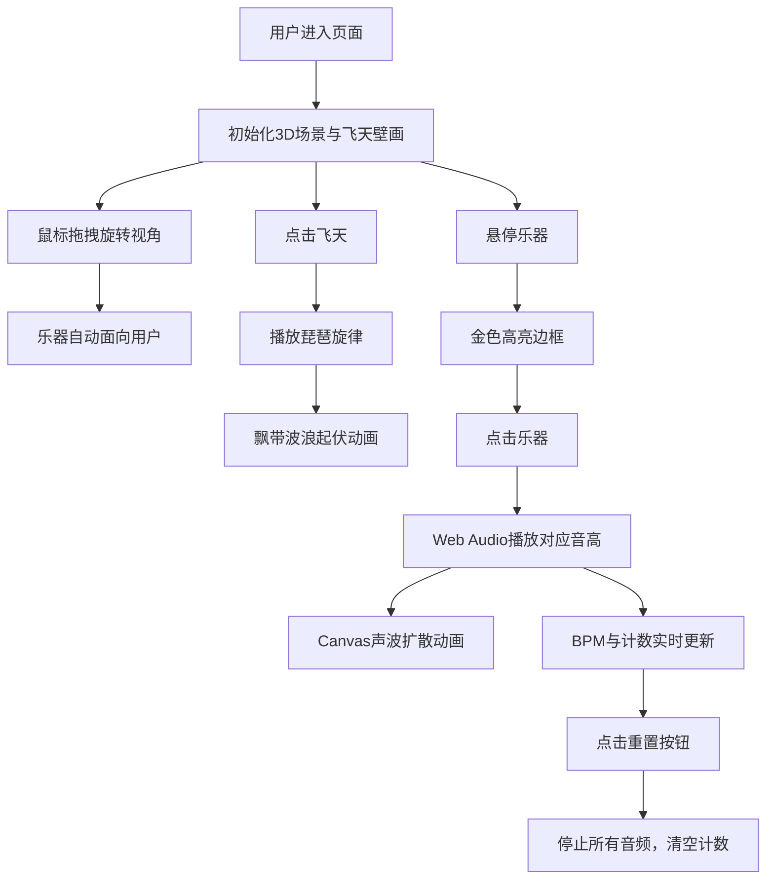

## 1. 产品概述

敦煌飞天声画交互模拟应用，在浏览器中重现莫高窟第112窟南壁"反弹琵琶"飞天壁画的动态韵律。解决传统静态壁画展示无法让观赏者直观感受飞天乐舞流动感与音乐节奏的问题，为文化遗产数字化保护与展示提供创新交互体验。

- 面向文化艺术爱好者、博物馆参观者、教育工作者
- 通过Web技术实现壁画"活态"展示，融合视觉动画与音频交互

## 2. 核心功能

### 2.1 用户角色
| 角色 | 注册方式 | 核心权限 |
|------|----------|----------|
| 访客用户 | 无需注册 | 体验全部交互功能，旋转视角，触发乐器，播放旋律 |

### 2.2 功能模块
1. **主场景模块**：虚拟莫高窟第112窟南壁，含飞天主体、壁画背景、风化纹理
2. **飞天交互模块**：点击播放琵琶旋律，飘带随节拍波浪起伏动画
3. **环绕乐器模块**：5种古代乐器（竖箜篌、筚篥、腰鼓、曲项琵琶、方响），点击发声与声波可视化
4. **3D视角控制模块**：鼠标拖拽旋转，乐器始终面向用户
5. **状态面板模块**：实时显示旋律名称、BPM、触发计数、重置功能

### 2.3 页面详情
| 页面名称 | 模块名称 | 功能描述 |
|----------|----------|----------|
| 主交互页面 | 飞天主体 | 身体45度倾斜，宝冠金色，披帛蓝色渐变，长裙红褐色，反弹琵琶造型 |
| 主交互页面 | 飘带动画 | 正弦波起伏，蓝绿渐变色彩流动，60fps流畅动画 |
| 主交互页面 | 乐器环绕 | 5个乐器以45度间隔分布在半径200px圆周上，悬停高亮，点击发声 |
| 主交互页面 | 声波可视化 | Canvas绘制同心半透明弧，2秒内半径从0扩展到120px并消失 |
| 主交互页面 | 3D视角 | 鼠标拖拽CSS 3D旋转，乐器billboard面向摄像机 |
| 主交互页面 | 状态面板 | 180px宽，半透明背景，毛笔字边框，BPM数字平滑过渡动画 |

## 3. 核心流程

用户进入页面后，看到静态飞天壁画场景。可通过鼠标拖拽旋转视角观察飞天与乐器。点击飞天触发琵琶旋律播放，飘带随音乐节奏动态起伏。点击任意乐器发出对应音高并产生声波扩散效果。右侧面板实时更新BPM和触发计数。点击重置按钮恢复初始状态。

## 4. 用户界面设计

### 4.1 设计风格
- **主色调**：土黄#d4a76a（仿壁画绢本），深褐#5d3a1a（边框描边）
- **强调色**：金色#ffd700（宝冠、高亮边框、声波内层），蓝色#3a6b8d（披帛），绿色#4a8b5a（飘带渐变），红褐色#8b3a3a（长裙）
- **背景**：土黄底色 + CSS噪点微透明层模拟风化斑驳
- **字体**：衬线字体配合毛笔字风格边框，营造古朴典雅氛围
- **动画**：飘带正弦波起伏（requestAnimationFrame），乐器点击缩放反弹，BPM数字平滑过渡，声波Canvas扩散
- **布局**：左侧主场景区，右侧180px状态面板，响应式<800px时面板移至底部

### 4.2 页面设计概述
| 页面名称 | 模块名称 | UI元素 |
|----------|----------|--------|
| 主交互页面 | 飞天主体 | 居中绘制，45度倾斜，多色块组合，6px飘带 |
| 主交互页面 | 乐器组 | 圆周分布，CSS图形绘制，悬停金色边框，点击缩放反弹 |
| 主交互页面 | 声波效果 | 同心半透明弧，外层白内层金，2秒淡出 |
| 主交互页面 | 状态面板 | 半透明#f5e6d0背景，毛笔字#8b5e3a边框，文字从上到下排列 |
| 主交互页面 | 重置按钮 | 深褐边框，悬停变色，点击反馈 |

### 4.3 响应式
- Desktop-first设计，默认桌面端左右分栏布局
- 宽度<800px时，右侧状态面板自动移至页面底部，100%宽度
- 移动端优化触摸交互，增大乐器可点击区域
- 飘带动画始终保持60fps，低频设备自动降级

### 4.4 3D场景指引
- **环境**：虚拟洞窟空间，土黄色背景，噪点纹理模拟岩壁
- **光照**：柔和环境光，金色点光源突出飞天主体
- **相机**：透视相机，初始距离300，中心锁定飞天
- **相机运动**：鼠标拖拽控制X/Y轴旋转，阻尼效果
- **构图**：飞天居中，乐器环绕分布，面板居右
- **交互**：乐器billboard始终面向摄像机，背景平面保持半透明白色
- **后处理**：轻微晕影效果增强洞窟沉浸感
- **性能**：乐器面向用户通过矩阵计算，避免每帧遍历DOM
