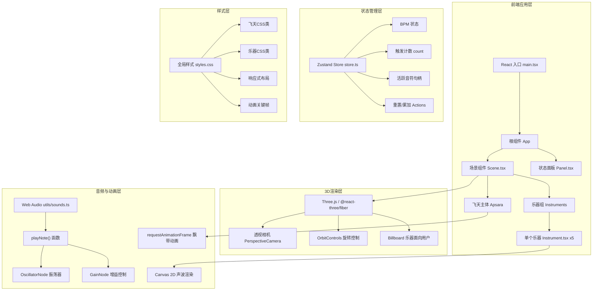
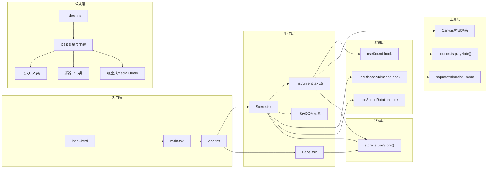

## 1. 架构设计



## 2. 技术描述

* **前端框架**：React\@18 + TypeScript\@5 + Vite\@5

* **3D渲染**：three\@0.160 + @react-three/fiber\@8 + @react-three/drei\@9

* **状态管理**：zustand\@4

* **动画库**：framer-motion\@11

* **音频**：Web Audio API（原生）

* **图形渲染**：Canvas 2D（声波）+ CSS（飞天/乐器）

* **初始化工具**：Vite 脚手架

## 3. 路由定义

| 路由 | 用途          |
| -- | ----------- |
| /  | 主交互页面（唯一页面） |

## 4. 核心数据结构与类型定义

```typescript
// store.ts - Zustand Store
interface AppState {
  bpm: number;
  triggerCount: number;
  activeNotes: Array<{ stop: () => void }>;
  currentMelody: string;
  lastTriggerTime: number;
  
  incrementCount: () => void;
  updateBpm: () => void;
  addActiveNote: (note: { stop: () => void }) => void;
  reset: () => void;
}

// Instrument.tsx - Props
interface InstrumentProps {
  type: 'konghou' | 'bili' | 'yaogu' | 'pipa' | 'fangxiang';
  frequency: number;
  angle: number;
  radius: number;
  color: string;
  onTrigger: () => void;
}

// sounds.ts - 返回类型
interface NoteHandle {
  stop: () => void;
}

// 乐器配置常量
const INSTRUMENTS = [
  { type: 'konghou', frequency: 320, angle: 0, name: '竖箜篌', color: '#8b3a3a' },
  { type: 'bili', frequency: 400, angle: 72, name: '筚篥', color: '#3a6b8d' },
  { type: 'yaogu', frequency: 80, angle: 144, name: '腰鼓', color: '#5d3a1a' },
  { type: 'pipa', frequency: 280, angle: 216, name: '曲项琵琶', color: '#8b5e3a' },
  { type: 'fangxiang', frequency: 1200, angle: 288, name: '方响', color: '#4a8b5a' },
] as const;
```

## 5. 核心模块架构



## 6. 性能优化策略

### 6.1 动画性能

* 飘带动画仅更新CSS transform，避免Layout抖动

* 使用will-change: transform 提升动画层

* requestAnimationFrame 确保60fps同步

* 声波使用单一Canvas 2D渲染，而非DOM元素

### 6.2 内存管理

* Web Audio节点使用后及时disconnect

* 声波Canvas动画完成后清除定时器

* 卸载组件时清理所有animation frame

### 6.3 渲染优化

* 乐器面向用户通过Three.js矩阵计算，避免DOM遍历

* 使用CSS 3D transform开启硬件加速

* 响应式布局使用CSS Media Query而非JS监听

## 7. 项目文件结构

```
d:\Solocoder\VersionFast\tasks\auto95\
├── package.json
├── vite.config.js
├── tsconfig.json
├── index.html
├── src/
│   ├── main.tsx
│   ├── App.tsx
│   ├── components/
│   │   ├── Scene.tsx
│   │   ├── Instrument.tsx
│   │   └── Panel.tsx
│   ├── utils/
│   │   └── sounds.ts
│   ├── hooks/
│   │   ├── useSound.ts
│   │   └── useRibbonAnimation.ts
│   ├── store.ts
│   └── styles.css
└── .trae/
    └── documents/
        ├── PRD.md
        └── TechnicalArchitecture.md
```

