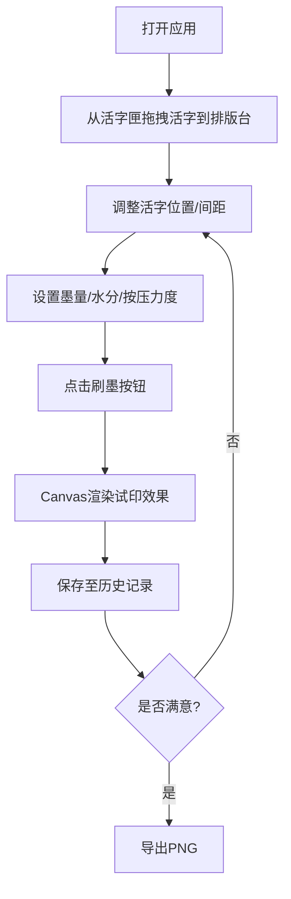

## 1. 产品概述

本项目是一个基于浏览器的古代雕版印刷作坊模拟器，让用户体验宋代毕昇活字印刷的完整流程，从字匣选字、排版调整到墨色校正和试印预览，感受中华传统文化的魅力。

- 核心价值：通过数字化交互方式，还原活字印刷的传统工艺，兼具教育意义与趣味性
- 目标用户：对传统文化感兴趣的大众用户、教育工作者、学生群体

## 2. 核心功能

### 2.1 功能模块

1. **活字匣组件**：展示30+常用汉字，支持拖拽到排版台
2. **排版台组件**：8x8网格布局，支持活字放置、拖动、微调、右键操作
3. **墨色校正面板**：墨量、水分、按压力度三个滑块联动控制
4. **试印预览组件**：Canvas实时渲染印刷效果，支持历史记录
5. **工具栏**：清空排版、导出PNG功能

### 2.3 页面详情

| 页面名称 | 模块名称 | 功能描述 |
|-----------|-------------|---------------------|
| 主页面 | 活字匣 | 展示木色活字方块，支持HTML5原生拖拽，拖拽时半透明并带阴影效果 |
| 主页面 | 排版台 | 8x8网格布局，支持网格吸附、Shift自由放置、方向键微调、右键菜单（删除/复制） |
| 主页面 | 间距控制 | 行间距（0-20px）和字间距（0-10px）滑块，实时影响排版 |
| 主页面 | 墨色校正 | 墨量（0-100%）、水分（0-100%）、按压力度（0-100%）三个滑块，渐变背景显示参数影响 |
| 主页面 | 试印预览 | 300x200px宣纸效果区域，Canvas逐字渲染，考虑墨量灰度、水分晕染、力度粗细 |
| 主页面 | 刷墨按钮 | 点击带水波扩散动画，结果保存至历史记录（最多10条） |
| 主页面 | 历史记录 | 缩略图+参数快照，点击可恢复参数 |
| 主页面 | 工具栏 | 清空排版、导出PNG按钮，仿木刻牌匾样式 |

## 3. 核心流程

用户操作流程：从活字匣拖拽活字 → 在排版台上排列调整 → 调整字距行距 → 设置墨色参数 → 点击刷墨 → 查看试印效果 → 可保存或调整后重印 → 导出PNG或恢复历史记录

## 4. 用户界面设计

### 4.1 设计风格

- **主色调**：土墙色 #d4a76a（背景）、深木色 #6b4e3a（边框）、纸黄色 #d9c9b9（排版台）、米白色 #f5e6d0（宣纸）
- **活字样式**：木色方块 #a67c52，边框 #8b6f47，文字墨黑 #1a1a1a
- **按钮样式**：圆角8px，仿木刻牌匾 #8b6f47，边框 #5d3a1a，悬停变深 #5d3a1a，0.2s缓动过渡
- **字体**：使用楷体/宋体类中文字体，体现古风
- **布局风格**：三栏布局（左活字匣、中排版台、右控制面板），响应式适配
- **动效**：活字拖拽半透明+阴影、刷墨水波扩散、滑块悬停过渡

### 4.2 页面设计概述

| 页面名称 | 模块名称 | UI元素 |
|-----------|-------------|-------------|
| 主页面 | 活字匣 | 灰麻布色背景 #b0a89a，4列网格，活字方块带木质纹理感 |
| 主页面 | 排版台 | 纸黄色背景，8x8网格线 #d4d4d4，每格40px，选中活字高亮 |
| 主页面 | 墨色滑块 | 渐变背景条，分别表示墨色深浅、晕染程度、线条粗细 |
| 主页面 | 试印预览 | 宣纸纹理（CSS噪点滤镜），300x200px，米白色背景 |
| 主页面 | 历史记录 | 横向滚动缩略图列表，每条显示参数标签 |
| 主页面 | 工具栏 | 右上角木刻风格按钮 |

### 4.3 响应式

- 桌面端（>768px）：三栏左右布局，活字匣6列
- 移动端（<768px）：上下布局，活字匣4列，控制面板在底部
- 触摸优化：增大点击区域，支持触摸拖拽

### 4.4 视觉动效

- 活字拖拽：opacity 0.7，box-shadow: -3px 3px 6px rgba(0,0,0,0.4)
- 刷墨动画：@keyframes 圆形从中心扩散，透明度0.5→0
- 滑块悬停：背景过渡，滑块放大
- 页面加载：分区域淡入动画
