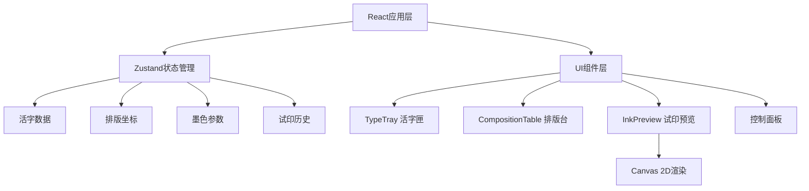

## 1. 架构设计



## 2. 技术描述

* **前端框架**：React\@18 + TypeScript\@5 + Vite\@5

* **状态管理**：zustand\@4（使用shallow selector优化渲染）

* **动画库**：framer-motion\@11（平滑过渡动画）

* **构建工具**：Vite\@5 + @vitejs/plugin-react\@4

* **样式方案**：CSS Modules + 自定义CSS变量

* **渲染技术**：Canvas 2D API（试印效果实时渲染）

* **拖拽实现**：HTML5 Drag and Drop API + 自定义拖拽逻辑

## 3. 项目结构

```
d:\Solocoder\VersionFast\tasks\auto96\
├── index.html
├── package.json
├── vite.config.js
├── tsconfig.json
└── src/
    ├── App.tsx
    ├── store/
    │   └── printStore.ts
    ├── components/
    │   ├── TypeTray.tsx
    │   ├── CompositionTable.tsx
    │   └── InkPreview.tsx
    └── styles/
        └── globals.css
```

## 4. 数据模型

### 4.1 活字类型定义

```typescript
interface MovableType {
  id: string;
  character: string;
  gridX: number;
  gridY: number;
  freeX?: number;
  freeY?: number;
  isFreePlacement: boolean;
}

interface InkParams {
  inkAmount: number;      // 0-100
  moisture: number;       // 0-100
  pressure: number;       // 0-100
}

interface LayoutParams {
  lineSpacing: number;    // 0-20px
  charSpacing: number;    // 0-10px
}

interface PrintHistory {
  id: string;
  thumbnail: string;      // base64
  inkParams: InkParams;
  layoutParams: LayoutParams;
  timestamp: number;
}
```

### 4.2 Zustand Store 接口

```typescript
interface PrintStore {
  // 状态
  movableTypes: MovableType[];
  inkParams: InkParams;
  layoutParams: LayoutParams;
  history: PrintHistory[];
  selectedTypeId: string | null;
  
  // 操作方法
  addType: (type: Omit<MovableType, 'id'>) => void;
  removeType: (id: string) => void;
  duplicateType: (id: string) => void;
  updateTypePosition: (id: string, updates: Partial<MovableType>) => void;
  setInkParams: (params: Partial<InkParams>) => void;
  setLayoutParams: (params: Partial<LayoutParams>) => void;
  selectType: (id: string | null) => void;
  addToHistory: (item: Omit<PrintHistory, 'id' | 'timestamp'>) => void;
  restoreFromHistory: (id: string) => void;
  resetAll: () => void;
}
```

## 5. 核心算法

### 5.1 网格吸附算法

```typescript
function snapToGrid(clientX: number, clientY: number, gridSize: number, rect: DOMRect): { x: number; y: number } {
  const relativeX = clientX - rect.left;
  const relativeY = clientY - rect.top;
  return {
    x: Math.round(relativeX / gridSize) * gridSize,
    y: Math.round(relativeY / gridSize) * gridSize,
  };
}
```

### 5.2 Canvas 渲染算法

```typescript
function renderCharacter(
  ctx: CanvasRenderingContext2D,
  char: string,
  x: number,
  y: number,
  inkParams: InkParams
) {
  const { inkAmount, moisture, pressure } = inkParams;
  
  // 1. 根据墨量计算灰度
  const grayValue = Math.round(10 + (138 - (inkAmount / 100) * 138));
  const fillStyle = `rgb(${grayValue}, ${grayValue}, ${grayValue})`;
  
  // 2. 根据水分计算晕染半径 (5-20px)
  const blurRadius = 5 + (moisture / 100) * 15;
  
  // 3. 根据按压力度计算线条宽度 (1-4px)
  const strokeWidth = 1 + (pressure / 100) * 3;
  
  // 绘制晕染层 + 主文字层
}
```

## 6. 性能优化策略

1. **状态选择优化**：使用zustand的shallow selector避免不必要重渲染
2. **Canvas批量绘制**：一次性绘制所有活字，避免多次重绘
3. **拖拽节流**：使用requestAnimationFrame处理拖拽位置更新，保证60FPS
4. **历史记录优化**：缩略图压缩存储，最多保留10条
5. **React.memo**：对频繁渲染的组件使用memo包裹
6. **事件委托**：在排版台层级处理活字事件，减少事件监听器

## 7. 技术约束

* 使用原生Canvas 2D而非WebGL，保证兼容性

* 不使用额外的UI组件库，完全自定义样式

* Canvas绘制必须在16ms内完成

* 拖拽操作保持60FPS帧率

* 响应式断点：768px

