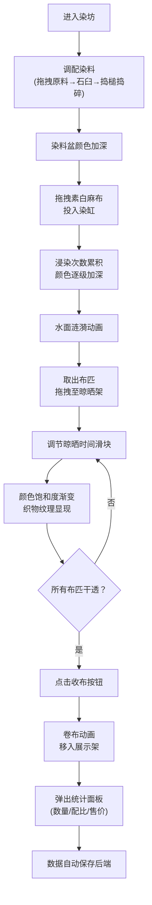

## 1. 产品概述

明代江南染坊模拟器是一款沉浸式古法染布工艺体验Web应用，让用户化身明代染坊主人，亲手操作从植物染料提取、布匹浸染到成品晾晒的完整工艺流程。通过精细的CSS动画和实时交互，重现传统染色技艺的魅力，兼具教育性与趣味性。

- 核心目标：让用户直观体验传统染布工艺，理解植物染料的配比与染色效果
- 目标用户：历史文化爱好者、手工艺术爱好者、教育场景用户

## 2. 核心功能

### 2.1 用户角色
| 角色 | 注册方式 | 核心权限 |
|------|----------|----------|
| 染坊主人 | 无需注册，自动初始化 | 完整操作染坊所有工序，保存/加载配方进度 |

### 2.2 功能模块
1. **染坊主场景**：CSS绘制染坊剖面图，三只粗陶染缸，素白麻布拖拽浸染，水面涟漪动画
2. **晾晒架系统**：方形木质晾晒架，时间滑块控制晾晒时长，布匹颜色饱和度渐变，织物纹理效果
3. **染料调配台**：植物原料拖拽入石臼，捣槌捣碎粒子动画，染料盆颜色逐步加深
4. **成品展示区**：收布卷布动画，五层展示架，色标圆点标识，统计面板显示数量、配比、售价
5. **数据持久化**：Express后端API，配方与进度自动保存，刷新页面不丢失状态

### 2.3 页面详情
| 页面名称 | 模块名称 | 功能描述 |
|----------|----------|----------|
| 主界面 | 染坊主场景 | 青砖地面、木顶横梁，三只染缸（靛蓝、茜草、栀子），拖拽麻布浸染，颜色逐级加深，水面涟漪动画 |
| 主界面 | 晾晒架系统 | 木质框架3×3绳格，拖拽布匹悬挂，时间滑块0-72小时，颜色饱和度渐变，织物经纬线纹理 |
| 主界面 | 染料调配台 | 原料篮（靛蓝草、茜草根、栀子果），石臼捣槌交互，粒子飞溅动画，染料盆颜色累积 |
| 主界面 | 成品展示区 | 收布按钮触发卷布动画，五层木架展示卷轴，色标圆点，统计面板（数量、配比、售价） |
| 主界面 | 全局交互 | 拖拽平滑过渡，按钮hover放大1.05，响应式布局，数据自动同步后端 |

## 3. 核心流程

## 4. 用户界面设计

### 4.1 设计风格
- **主色调**：土黄#d4a76a、青灰#7a8a7a，质朴典雅的明代民间工艺风格
- **辅助色**：靛蓝#1a3a6b、茜草红#8b2e2e、栀子黄#f5d742，对应三种核心染料
- **按钮样式**：木质纹理感，圆角4px，hover时scale 1.05放大，0.3s ease过渡
- **字体**：采用"ZCOOL XiaoWei"（站酷小薇）作为展示字体，搭配"Noto Serif SC"作为正文字体，体现古典韵味
- **布局**：大屏横向全景布局（染坊左、晾晒右、调配底），小屏纵向手风琴折叠
- **装饰元素**：半透明宣纸纹理背景，木质边框，印章式按钮点缀

### 4.2 页面设计概述
| 页面名称 | 模块名称 | UI元素 |
|----------|----------|----------|
| 主界面 | 染坊主场景 | 青砖地面#6b7b6b，木顶横梁#5d3a1a，染缸直径160px径向渐变釉面#c4a882，缸内染料半满，布条长条状初始#f5f0e8 |
| 主界面 | 晾晒架系统 | 木质框架#8b6f47，3×3绳格，布匹自然下垂，CSS半透明线条模拟经纬线纹理 |
| 主界面 | 染料调配台 | 原料篮三列布局，石臼直径80px灰石色#7a8a7a，捣槌木色#8b6f47，粒子飞溅动画 |
| 主界面 | 成品展示区 | 五层隔板木架，卷轴圆柱状，侧边色标圆点，统计面板半透明浮层 |
| 主界面 | 响应式适配 | ≥1024px全景布局，≤768px纵向滚动手风琴折叠，各区域可展开/收起 |

### 4.3 响应式设计
- **桌面端（≥1024px）**：三栏全景布局，左染坊、右晾晒+展示、底调配台
- **平板端（769px-1023px）**：两栏布局，上半部分染坊+晾晒，下半部分调配台+展示
- **移动端（≤768px）**：纵向单列手风琴布局，四大区域可独立展开折叠，触控优化

### 4.4 动画与交互规范
- **染色动画**：每帧≤30ms，采用CSS filter亮度调节实现颜色加深
- **交互响应**：所有拖拽、点击响应时间＜100ms，0.3s ease平滑过渡
- **水面涟漪**：CSS keyframes实现波纹绕圈扩散，opacity从1到0，scale从0.8到1.5
- **粒子飞溅**：framer-motion实现捣槌敲击时的碎末飞溅，粒子颜色对应原料
- **卷布动画**：布匹横向收缩，从长条变为圆柱卷轴，伴随轻微旋转
