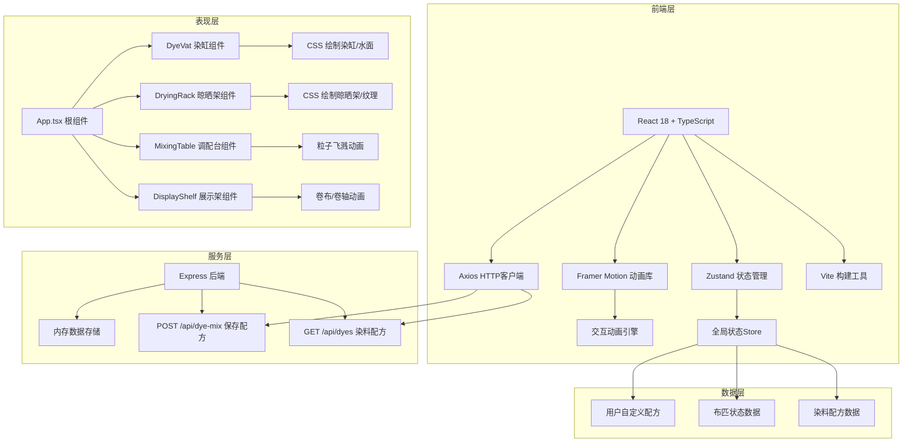
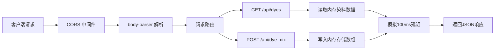
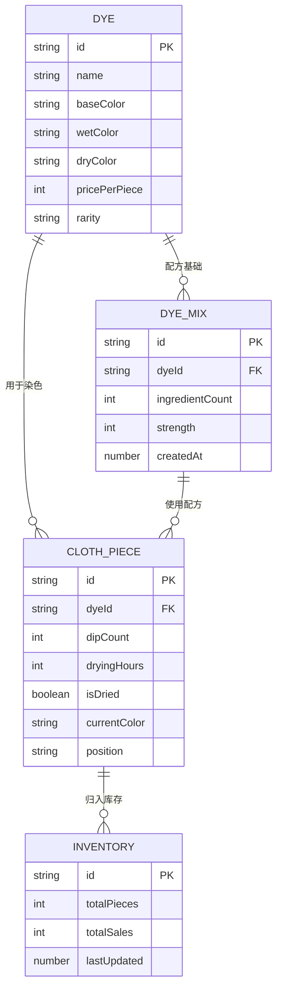

## 1. 架构设计



## 2. 技术描述

* **前端框架**：React\@18 + TypeScript\@5，严格模式，target esnext

* **构建工具**：Vite\@5，配置代理 /api → 后端端口3001

* **状态管理**：Zustand\@4，管理全局布匹状态、染料配方、晾晒进度

* **动画引擎**：Framer Motion\@11，实现拖拽、粒子、卷布等复杂动画

* **HTTP客户端**：Axios\@1，封装API调用

* **样式方案**：纯CSS + CSS Modules，避免引入CSS框架，精准控制每个像素

* **后端服务**：Express\@4 + CORS + body-parser，端口3001

* **数据存储**：内存数组模拟持久化，提供100ms模拟延迟

* **路由方案**：无需多页路由，单页应用足够承载全部功能

## 3. 目录结构

| 路径                          | 用途                |
| --------------------------- | ----------------- |
| `/package.json`             | 项目依赖与启动脚本         |
| `/index.html`               | 入口HTML，挂载div#root |
| `/vite.config.js`           | Vite配置，API代理      |
| `/tsconfig.json`            | TypeScript编译配置    |
| `/server.js`                | Express后端服务       |
| `/src/App.tsx`              | 根组件，布局与状态初始化      |
| `/src/DyeVat.tsx`           | 染缸组件，浸染交互         |
| `/src/DryingRack.tsx`       | 晾晒架组件，晾晒逻辑        |
| `/src/MixingTable.tsx`      | 调配台组件，染料制作        |
| `/src/DisplayShelf.tsx`     | 成品展示架，收布动画        |
| `/src/store/useDyeStore.ts` | Zustand全局状态       |
| `/src/api/dyeApi.ts`        | Axios API封装       |
| `/src/types/index.ts`       | TypeScript类型定义    |
| `/src/styles/global.css`    | 全局样式与CSS变量        |

## 4. API 定义

```typescript
// 染料基础信息
interface Dye {
  id: 'indigo' | 'madder' | 'gardenia';
  name: string;
  baseColor: string;
  wetColor: string;
  dryColor: string;
  pricePerPiece: number;
  rarity: 'rare' | 'uncommon' | 'common';
}

// 布匹状态
interface ClothPiece {
  id: string;
  dyeId: 'indigo' | 'madder' | 'gardenia' | null;
  dipCount: number;
  dryingHours: number;
  isDried: boolean;
  currentColor: string;
  position: 'basket' | 'vat' | 'rack' | 'shelf';
}

// 自定义染料配方
interface DyeMix {
  id: string;
  dyeId: 'indigo' | 'madder' | 'gardenia';
  ingredientCount: number;
  strength: number;
  createdAt: number;
}

// 配方保存请求
interface SaveDyeMixRequest {
  clothPieces: ClothPiece[];
  dyeMixes: DyeMix[];
  totalSales: number;
}

// API响应
interface ApiResponse<T> {
  success: boolean;
  data: T;
  message?: string;
}
```

### 4.1 GET /api/dyes

* **描述**：获取三种基础染料信息

* **响应**：`ApiResponse<Dye[]>`

* **示例数据**：

```json
{
  "success": true,
  "data": [
    {
      "id": "indigo",
      "name": "靛蓝",
      "baseColor": "#1a3a6b",
      "wetColor": "#0d1f3d",
      "dryColor": "#1a3a6b",
      "pricePerPiece": 100,
      "rarity": "rare"
    }
  ]
}
```

### 4.2 POST /api/dye-mix

* **描述**：保存用户自定义配方和布匹状态

* **请求体**：`SaveDyeMixRequest`

* **响应**：`ApiResponse<{ saved: boolean; timestamp: number }>`

## 5. 服务器架构



## 6. 数据模型

### 6.1 实体关系图



### 6.2 初始数据

```javascript
// 初始染料数据
const initialDyes = [
  {
    id: 'indigo',
    name: '靛蓝',
    baseColor: '#1a3a6b',
    wetColor: '#0d1f3d',
    dryColor: '#1a3a6b',
    pricePerPiece: 100,
    rarity: 'rare'
  },
  {
    id: 'madder',
    name: '茜草',
    baseColor: '#8b2e2e',
    wetColor: '#5c1f1f',
    dryColor: '#8b2e2e',
    pricePerPiece: 80,
    rarity: 'uncommon'
  },
  {
    id: 'gardenia',
    name: '栀子',
    baseColor: '#d4a017',
    wetColor: '#a88212',
    dryColor: '#f5d742',
    pricePerPiece: 60,
    rarity: 'common'
  }
];

// 初始布匹（5匹素白麻布）
const initialClothPieces = [
  { id: 'cloth-1', dyeId: null, dipCount: 0, dryingHours: 0, isDried: false, currentColor: '#f5f0e8', position: 'basket' },
  { id: 'cloth-2', dyeId: null, dipCount: 0, dryingHours: 0, isDried: false, currentColor: '#f5f0e8', position: 'basket' },
  { id: 'cloth-3', dyeId: null, dipCount: 0, dryingHours: 0, isDried: false, currentColor: '#f5f0e8', position: 'basket' },
  { id: 'cloth-4', dyeId: null, dipCount: 0, dryingHours: 0, isDried: false, currentColor: '#f5f0e8', position: 'basket' },
  { id: 'cloth-5', dyeId: null, dipCount: 0, dryingHours: 0, isDried: false, currentColor: '#f5f0e8', position: 'basket' }
];
```

## 7. 性能优化策略

1. **动画性能**：使用 `transform` 和 `opacity` 实现动画，避免触发重排重绘
2. **状态更新**：Zustand 选择性订阅，避免不必要的组件重渲染
3. **颜色计算**：缓存已计算的颜色值，避免重复运算
4. **拖拽优化**：使用 Framer Motion 的 drag 组件，内置性能优化
5. **请求防抖**：API 保存操作防抖 500ms，避免频繁请求
6. **CSS 变量**：主题色与动画参数使用 CSS 变量，便于统一管理
7. **代码分割**：Vite 自动按需加载，首屏加载时间优化

